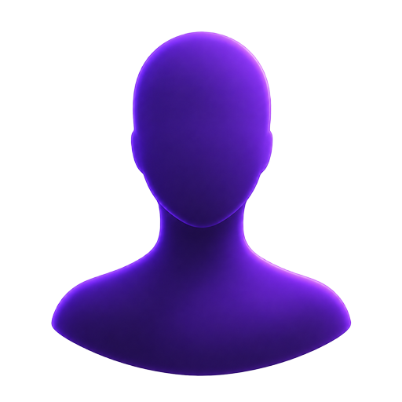

# Vertiege

> A tier-gated social network where every world is a Discord-like server with entry conditions. Built with Flutter + Riverpod + Supabase + Material 3.

<p align="center">
  
  
  
  
  
  
</p>

---

## Features

### World System (Discord-like Servers)
| Feature | Description |
|---------|-------------|
| 17 Worlds | Neon District, Azure Coast, Sovereign City, Golden Estate, Aetheria, Aviation Heights, Medical Nexus, Financial District, Tech Sprawl, Legal Plaza, Arts Pavilion, Crystal Shore, Quantum Core, Silver Page, Crimson Court, Nova Station |
| World Types | Wealth (tier-gated), Profession (role-gated), Dominion (open) |
| Access Control | Tier-based gates + profession verification + wealth world unlocks |
| World Roles | Sovereign → Council → Patron → Elder → Veteran → Contributor → Member → Visitor |
| Prestige System | Worlds level up through activity (P1–P50), unlocking features at thresholds |
| World Settings | Overview (name, description, icon), Channels, Invites, Member Management, Danger Zone |

### Social Feed
| Feature | Description |
|---------|-------------|
| Post Creation | Text + image posts with announcement toggle for sovereign/council |
| Reactions | Fire, Diamond, Trophy, Clap with burst animation and haptic feedback |
| Comments | Modal bottom sheet with threaded comment submission |
| Feed Tabs | All / Following / Announcements with pill-shaped filter chips |
| Post Pinning | Sovereign/council can pin posts to top of feed |
| Announcements | Campaign-badged broadcast posts that float above regular content |
| Delete/Report | PostItem overflow menu: delete (own/any based on standing), report with reason chips |

### Channels
| Feature | Description |
|---------|-------------|
| Default Channels | General, Lounge, Introductions auto-created per world |
| Custom Channels | Create, rename, delete via WorldSettings |
| Channel Types | Text, Announcement, Feed |
| Real-time Messaging | Per-channel messaging with live updates |

### Chat & Communication
| Feature | Description |
|---------|-------------|
| Direct Messages | User-to-user DM rooms with real-time messaging |
| Chat List | All conversations with last message preview, relative timestamps |
| World Channels | Contextual channel messaging within worlds |

### Standing & Permissions
| Standing | Rep | Permissions |
|----------|-----|-------------|
| Visitor | 0 | View only |
| Member | 10 | Post, react, comment |
| Contributor | 50 | Images, polls, delete own posts |
| Veteran | 200 | Lounge access |
| Elder | 500 | Vault, gift |
| Patron | 1,000 | Invite others |
| Council | 5,000 | Moderate (delete any post, mute, ban) |
| Sovereign | — | All permissions + settings, roles, announcements |

### Moderation & Governance
| Feature | Description |
|---------|-------------|
| Mute System | Time-based (1h, 24h) with auto-expiry |
| Ban System | Permanent removal from world, prevents rejoin |
| Moderation Panel | WorldSettings → Member Management with per-member actions |
| Report System | 6 report reasons (spam, harassment, hate speech, NSFW, misinformation, other) |
| Permission Gates | PostInput hidden for Visitors, Settings gated to Council+, Announcements Council+ |

### Member Directory & Social
| Feature | Description |
|---------|-------------|
| Full Directory | Per-world member list with search, rep sorting, sovereign badges |
| Follow/Unfollow | Follow other residents, view following count on Identity |
| WorldResidents | Top 5 by rep with gold/silver/bronze medals and standing titles |
| Resident Profiles | Global stats (XP, tier, badges) + per-world standing context |

### Events
| Feature | Description |
|---------|-------------|
| Create Events | Sovereign/council create titled/described events |
| RSVP System | One-tap RSVP toggle with attendee count |
| Upcoming Filter | Only future events shown, sorted by start time |
| Event Cards | Listed on WorldDetailScreen above channels |

### Gamification
| Feature | Description |
|---------|-------------|
| Daily Quests | 4 rotating tasks (post, react, comment, explore) with XP rewards |
| Claim System | Completed quests claimed for XP with checkmark animation |
| Streak Tracking | Daily check-in streak with tier-based XP bonuses |
| Achievements | 10 categories, submit/verify flow, XP values per achievement |
| Tier System | Hustler → High Roller → Elite → Old Money → Apex (XP-based) |
| Rep System | Per-world reputation (rep) from posts, reactions, comments |

### UI/UX Polish
| Feature | Description |
|---------|-------------|
| FadeIn Animations | All screen content with staggered delays |
| Hero Transitions | World icon (card→detail), Avatar (post→profile) |
| Floating Tab Bar | Pill-shaped bottom nav with animated active indicator |
| Like Burst | Scale bounce animation on reaction chips |
| Send Morph | Send→checkmark icon transition on post |
| Scroll-to-Top | Tab re-tap triggers scroll to top |
| Profile Strength | Progress bar showing profile completion % |
| Pull-to-Refresh | On all list screens |
| Swipe-to-Dismiss | Notifications with archive undo |
| Empty States | Illustrated placeholders for all empty feeds |
| Shimmer Loading | Skeleton shimmer widget for async loads |
| Dark Mode | Full dark theme with surface container colors |

### Navigation
| Tab | Route | Screen |
|-----|-------|--------|
| Nexus | `/` | Home feed with tabs, quests, PostInput |
| Explore | `/explore` | World discovery grid with search + filter |
| Chats | `/chat` | DM list with real-time rooms |
| Identity | `/identity` | Profile, achievements, settings, share card |
| Alerts | `/alerts` | Grouped notifications with archive |

Top-level routes: `/search`, `/settings`, `/achievements`, `/create-world`, `/residents/:id`, `/invite/:code`

---

## Architecture

```
lib/
├── app.dart                    # App entry + store initialization
├── main.dart                   # Supabase init + ProviderScope
├── config/
│   ├── achievements.dart       # Achievement catalog
│   ├── cosmetics.dart          # Avatar frame cosmetics
│   └── tiers.dart              # Standing levels + prestige config
├── models/
│   ├── achievement.dart        # Achievement + UserAchievement
│   ├── channel.dart            # WorldChannel (text/announcement/feed)
│   ├── event.dart              # WorldEvent with RSVP
│   ├── invite.dart             # WorldInvite
│   ├── notification.dart       # AppNotification
│   ├── post.dart               # Post + Comment
│   ├── report.dart             # Report (6 reasons)
│   ├── resident.dart           # Resident + WorldStanding + ResidentTier
│   └── world.dart              # World + DominionWorld + WorldFeatures
├── router/
│   └── app_router.dart         # GoRouter with 5-tab StatefulShellRoute
├── screens/
│   ├── auth/                   # AuthCallbackScreen
│   ├── onboarding/             # OnboardingScreen
│   ├── achievements/           # Index, Category, Submit
│   ├── tabs/
│   │   ├── tab_layout.dart     # Floating pill nav shell
│   │   ├── nexus_screen.dart   # Home feed with tabs
│   │   ├── explore_screen.dart # World discovery grid
│   │   ├── chat_list_screen.dart # DM list
│   │   ├── identity_screen.dart  # Profile + stats
│   │   └── alerts_screen.dart    # Notifications
│   ├── resident_profile_screen.dart
│   ├── world_detail_screen.dart
│   ├── world_channel_screen.dart
│   ├── world_members_screen.dart
│   ├── world_settings_screen.dart
│   ├── chat_room_screen.dart
│   ├── create_world_screen.dart
│   ├── search_screen.dart
│   └── settings_screen.dart
├── services/
│   ├── access_control.dart     # canAccessWorld() entry check
│   ├── auth_service.dart       # Supabase auth
│   ├── backup_service.dart     # Data export/import
│   ├── chat_service.dart       # DM room management
│   ├── invite_service.dart     # Invite CRUD
│   ├── permission_service.dart # Standing-based action gating
│   ├── post_service.dart       # Supabase post operations
│   ├── profile_service.dart    # Profile upsert/search
│   ├── storage_service.dart    # SharedPreferences wrapper
│   ├── supabase.dart           # Supabase client singleton
│   └── world_service.dart      # World + channel CRUD
├── state/
│   ├── achievement_provider.dart # Riverpod StateNotifier
│   ├── channel_provider.dart
│   ├── chat_provider.dart
│   ├── event_provider.dart
│   ├── notification_provider.dart
│   ├── post_provider.dart
│   ├── quest_provider.dart       # Daily quests
│   ├── resident_provider.dart
│   ├── theme_provider.dart
│   └── world_provider.dart
├── theme/
│   ├── app_theme.dart           # Light + dark ThemeData
│   ├── colors.dart              # AppColors palette
│   └── design_system.dart       # Spacing, Radius, FontSizes tokens
├── utils/
│   ├── date_format.dart         # Relative timestamps
│   └── id_generator.dart        # UUID v4 wrapper
└── widgets/
    ├── core/
    │   ├── fade_in.dart          # Staggered entry animation
    │   ├── offline_banner.dart   # Connectivity indicator
    │   ├── skeleton.dart         # Shimmer loading placeholder
    │   └── notification_bell.dart # Unread badge icon
    ├── feed/
    │   ├── post_item.dart        # Post card (modern glass design)
    │   ├── post_input.dart       # Create post with announcement toggle
    │   ├── reaction_bar.dart     # Reaction chips with burst animation
    │   ├── comment_sheet.dart    # Modal bottom sheet
    │   └── post_image.dart       # Network image with skeleton
    ├── worlds/
    │   ├── world_card.dart       # Discovery grid card
    │   ├── world_banner.dart     # SVG banner for detail header
    │   ├── world_icon.dart       # Per-world icon mapping
    │   ├── world_channel_list.dart # Channel tiles
    │   ├── world_residents.dart  # Top 5 with medals
    │   └── world_access_guard.dart # Entry gate UI
    ├── achievements/
    │   ├── achievement_card.dart  # Achievement tile
    │   └── achievement_grid.dart  # Full achievement list
    ├── profile/
    │   ├── cosmetic_avatar.dart   # Tier-framed avatar
    │   ├── name_banner.dart       # Profession-colored name
    │   ├── badge.dart             # Decoration badge chip
    │   ├── badge_display.dart     # Badge wrap
    │   └── share_card.dart        # Exportable profile card
    └── shared/
        ├── tier_icon.dart         # Tier indicator
        └── image_picker_widget.dart
```

**9,758 lines of Dart** across 65+ files.

---

## Tech Stack

| Category | Technology |
|----------|-----------|
| Framework | Flutter 3.x |
| Language | Dart |
| State | Riverpod (StateNotifier + Provider) |
| Routing | GoRouter (StatefulShellRoute with 5 tabs) |
| Backend | Supabase (Auth, Database, Realtime) |
| Storage | SharedPreferences (local), Supabase (remote) |
| UI | Material 3 with Design Tokens |
| Fonts | Google Fonts |
| Images | Cached Network Image |
| SVG | Flutter SVG (world banners) |
| Share | Share Plus (profile card export) |
| ID | UUID v4 |

---

## Getting Started

```bash
# Clone
git clone https://github.com/Immabe96/social-app-flutter.git
cd social-app-flutter

# Install dependencies
flutter pub get

# Run
flutter run
```

### Prerequisites
- Flutter SDK 3.x
- Dart 3.x
- Android Studio / Xcode
- Supabase project (set `SUPABASE_URL` and `SUPABASE_KEY` env vars)

---

## World Icons

| World | Icon | Type | Requirement |
|-------|------|------|-------------|
| Neon District | neon | Wealth | Tier 1 (Hustler) |
| Crystal Shore | crystal | Wealth | Tier 1 |
| Azure Coast | azure | Wealth | Tier 2 (High Roller) |
| Crimson Court | crimson | Wealth | Tier 2 |
| Sovereign City | sovereign | Wealth | Tier 3 (Elite) |
| Golden Estate | golden | Wealth | Tier 4 (Old Money) |
| Aetheria | aetheria | Wealth | Tier 5 (Apex) |
| Nova Station | nova | Wealth | Tier 5 |
| Silver Page | silver | Profession | Artist |
| Arts Pavilion | arts | Profession | Arts |
| Aviation Heights | aviation | Profession | Aviation |
| Quantum Core | quantum | Profession | Engineer |
| Financial District | finance | Profession | Finance |
| Legal Plaza | legal | Profession | Legal |
| Medical Nexus | medical | Profession | Medical |
| Tech Sprawl | tech | Profession | Technology |

---

## Phase History

| Phase | Commit | What |
|-------|--------|------|
| 1 | `c21c760` | World membership + channel data layer |
| 2 | `22a8c9d` | Channel view + routing + messaging |
| 3 | `c4c7183` | Chat provider + real-time + DM |
| 4 | `3c31b35` | World creation |
| 5 | `47c20cf` | Discovery, Invites, World Settings |
| — | `7499588` | Quick wins: pull-to-refresh, swipe-to-dismiss, haptics |
| — | `81f28d4` | Animations: FadeIn, Hero, staggered lists |
| — | `b4c334b` | Analyzer: 132→3 issues |
| — | `79e3e2d` | Roles & Permissions backbone |
| — | `c2af4ad` | Announcements |
| 6 | `52c0e13` | Moderation & Governance |
| 7 | `19dc275` | Member Directory & Social |
| — | `93ad62e` | Events, Quests, Search, Pinning, Design Polish |

---

## License

MIT
