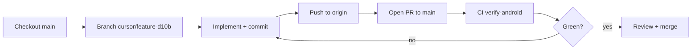

# Cloud Workflow

This document describes how **Cursor Cloud Agents** and **GitHub Actions CI** work together on Vertiege.

## What “cloud workflow” means

1. **Cloud Agent loop** — A Cursor Cloud Agent checks out the repo, creates a `cursor/*` branch, implements changes, commits, pushes, and opens a pull request.
2. **CI verification** — GitHub Actions runs the same checks an agent (or human) would run locally before merge.
3. **Cloud services** — Supabase Edge Functions and Firebase (FCM, etc.) are deployed separately; they are not part of the GitHub Actions workflow.

## Cloud Agent loop



### Branch naming

- Use the prefix `cursor/` (for example `cursor/fix-chat-scroll-d10b`).
- Branch off `main` unless the task says otherwise.
- Push with `git push -u origin <branch-name>`.

### What the agent should run before pushing

These match the CI job in `.github/workflows/ci.yml`:

```bash
flutter pub get
touch .env   # CI uses an empty placeholder; use real values locally
flutter analyze --no-fatal-infos --no-fatal-warnings
flutter test
flutter build apk --release --no-tree-shake-icons
```

JDK 21 (Temurin) and Flutter stable are required for the release APK build.

## GitHub Actions CI

**Workflow file:** `.github/workflows/ci.yml`

**Triggers:**

| Event | Branches |
|-------|----------|
| `push` | `main`, `phase-*`, `fix-*`, `cursor/**` |
| `pull_request` | Target `main` (any source branch) |
| `workflow_dispatch` | Manual run |

**Job `verify-android`:**

1. Checkout, JDK 21, Flutter stable
2. `flutter pub get`
3. Create empty `.env` (no secrets in CI)
4. `flutter analyze --no-fatal-infos --no-fatal-warnings`
5. `flutter test`
6. `flutter build apk --release --no-tree-shake-icons`
7. Upload `app-release.apk` as artifact `vertiege-release-apk-<sha>`

CI does **not** deploy Supabase migrations, Edge Functions, or Firebase config. See [FIREBASE_SUPABASE_HYBRID_SETUP.md](FIREBASE_SUPABASE_HYBRID_SETUP.md) for that.

## Environment and secrets

| Context | `.env` | Supabase / Firebase |
|---------|--------|---------------------|
| Local dev | Copy from `.env.template`, fill `SUPABASE_URL` and `SUPABASE_ANON_KEY` | Full setup per hybrid guide |
| CI | Empty file created in workflow | Not used |
| Cloud Agent VM | Often empty unless secrets are injected | Optional; app builds without real backend keys |

The app must analyze, test, and build without real Supabase credentials. Integration tests that need a live project are out of scope for CI today.

## Supabase / Firebase deploy (manual)

Not automated in CI:

- `scripts/deploy-notification-webhook.ps1` — deploy `send-push` Edge Function
- Supabase Dashboard — webhook for `notifications` inserts
- Firebase Console — FCM, OAuth, service accounts

Use [FIREBASE_SUPABASE_HYBRID_SETUP.md](FIREBASE_SUPABASE_HYBRID_SETUP.md) and [firebase-setup-guide.md](firebase-setup-guide.md).

## Troubleshooting

| Problem | Likely cause |
|---------|----------------|
| CI did not run on push | Branch name not in trigger list; use `cursor/*` or open a PR to `main` |
| CI failed on `flutter build apk` | Kotlin/Gradle or dependency issue; reproduce locally with release build |
| PR has no checks | PR not targeting `main`, or workflow file missing on base branch |
| Agent cannot push | Missing `origin` credentials or branch not created from latest `main` |

Recent successful runs on `main` indicate the workflow itself is healthy; new `cursor/**` pushes will now trigger CI without waiting for a PR.

## Related docs

- [PLAN.md](../PLAN.md) — Phase 13 testing and CI goals
- [REPORT.md](../REPORT.md) — Implementation status and remaining gaps
- [FIREBASE_SUPABASE_HYBRID_SETUP.md](FIREBASE_SUPABASE_HYBRID_SETUP.md) — Hybrid cloud backend setup
