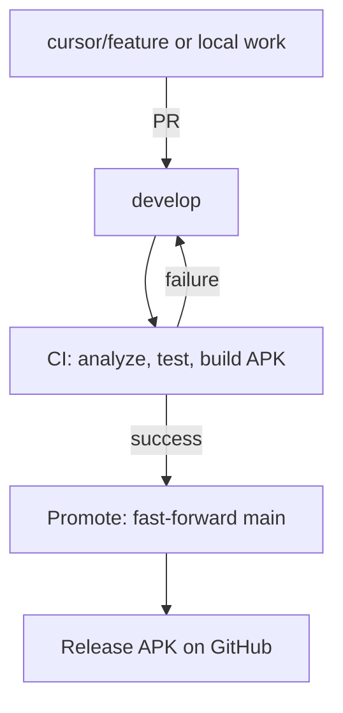

# Cloud development workflow

Develop on **`develop`** in the cloud (Cursor Cloud Agent or GitHub). Your PC only needs a browser. **`main`** stays stable and is updated only after CI produces a buildable APK. Each update to **`main`** publishes a **GitHub Release** with a downloadable APK.

## Branch roles

| Branch | Purpose |
|--------|---------|
| **`develop`** | Day-to-day development. Push here (or merge PRs here). |
| **`cursor/*`** | Short-lived agent branches; open PRs **into `develop`**. |
| **`main`** | Release line. Updated automatically when `develop` passes CI. Never commit directly. |



## Where to download the APK

1. **Latest stable (recommended):** [GitHub Releases](https://github.com/Immabe96/Vertiege/releases) — asset `app-release.apk` on each `main` update.
2. **Latest develop build:** Actions → workflow **CI** → run for branch `develop` → artifact `vertiege-apk-develop-<sha>`.

Releases are permanent. Action artifacts expire after 90 days.

## Cloud Agent steps

1. Check out **`develop`** (not `main`).
2. Create `cursor/<task>-d10b` from `develop`.
3. Implement, commit, push, open a **PR targeting `develop`**.
4. After merge, CI runs on `develop`. If analyze, tests, and APK build pass:
   - **Promote to main** fast-forwards `main` to `develop`.
   - **Release APK** builds again on `main` and creates a GitHub Release.

Manual promote (optional): Actions → **Promote to main** → Run workflow.

## Workflows

| File | Trigger | Result |
|------|---------|--------|
| `.github/workflows/ci.yml` | Push to `develop`, `cursor/**`, `phase-*`, `fix-*`; PRs to `develop` | APK artifact |
| `.github/workflows/promote-to-main.yml` | Successful CI on `develop`; or manual | Updates `main` |
| `.github/workflows/release-apk.yml` | Push to `main` | GitHub Release + APK |

## Commands (match CI)

```bash
flutter pub get
touch .env
flutter analyze --no-fatal-infos --no-fatal-warnings
flutter test
flutter build apk --release --no-tree-shake-icons
```

JDK 21 and Flutter stable are required for the release build.

## Environment

| Context | `.env` |
|---------|--------|
| CI / cloud agent | Empty placeholder is enough to build |
| Local device testing | Copy `.env.template` with real Supabase keys |

Supabase migrations and Edge Functions are deployed manually — see [FIREBASE_SUPABASE_HYBRID_SETUP.md](FIREBASE_SUPABASE_HYBRID_SETUP.md).

## Troubleshooting

| Issue | Fix |
|-------|-----|
| `main` not updating | Check **CI** on `develop` succeeded; check **Promote to main** run |
| No GitHub Release | Check **Release APK** workflow on latest `main` push |
| Promote failed: main ahead of develop | Merge or rebase `main` into `develop`, or reset `main` to match team policy |
| CI failed on develop | Fix analyze/test/build errors on `develop` before `main` can move |

## Repository settings (recommended)

On GitHub → Settings → Branches:

- **Default branch:** `develop`
- **Protect `main`:** require PR or restrict pushes to GitHub Actions only
- **Protect `develop`:** require **CI** workflow to pass before merge (optional but recommended)
