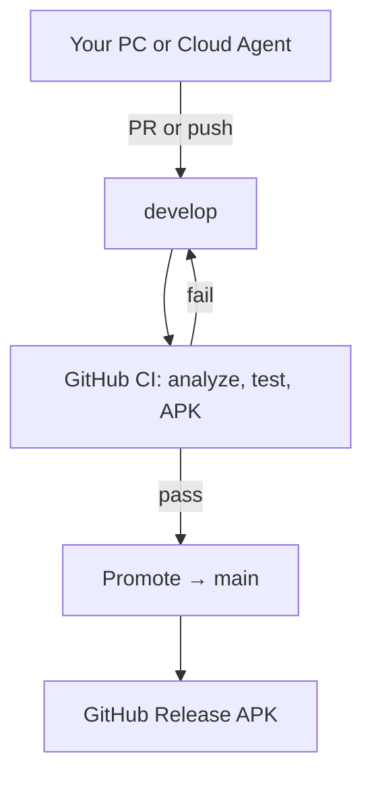

# Development workflow

Same process for **local PC** and **Cursor Cloud**: you write code; **GitHub builds the APK**; **`main` updates only when that build passes**.

## Branch roles

| Branch | Purpose |
|--------|---------|
| **`develop`** | Integration branch — merge your work here |
| **`fix/*`**, **`feature/*`**, **`cursor/*`** | Short-lived branches → open PR into `develop` |
| **`main`** | Release line — updated by automation after green `develop` CI. Do not push here directly |



## Download APK

| Build | Where |
|-------|--------|
| **Stable** | [GitHub Releases](https://github.com/Immabe96/Vertiege/releases) — `app-release.apk` after each `main` update |
| **Latest develop** | Actions → **CI** → artifact `vertiege-apk-develop-<sha>` (90 days) |

---

## Local PC (low RAM friendly)

Use your machine for **editing, `flutter run`, analyze, and tests**. Skip the release APK build locally — GitHub does that.

### One-time setup

```bash
git clone https://github.com/Immabe96/Vertiege.git
cd Vertiege
git checkout develop
cp .env.template .env    # SUPABASE_URL, SUPABASE_ANON_KEY for device testing
flutter pub get
```

### Daily loop

```bash
git checkout develop
git pull origin develop
git checkout -b fix/short-description    # or feature/...

# Edit code, run on phone/emulator
flutter run

# Quick checks (optional but recommended before push)
flutter analyze --no-fatal-infos --no-fatal-warnings
flutter test
# Do NOT run: flutter build apk --release  (uses RAM; CI builds on GitHub)

git add -A && git commit -m "fix: describe change"
git push -u origin fix/short-description
```

Open a **PR into `develop`** on GitHub (or push straight to `develop` if you work alone).

After the PR merges (or you push `develop`):

1. **CI** runs on `develop` (~15 min): analyze → test → APK build → artifact
2. **Promote to main** runs if CI succeeded
3. **Release APK** publishes a new [Release](https://github.com/Immabe96/Vertiege/releases)

### What runs where

| Task | Local PC | GitHub Actions |
|------|----------|----------------|
| Edit code | Yes | — |
| `flutter run` / hot reload | Yes | — |
| `flutter analyze` | Yes (fast feedback) | Yes (gate) |
| `flutter test` | Yes | Yes |
| `flutter build apk --release` | **No** (save RAM) | **Yes** |
| Update `main` | **No** (automated) | Yes |
| Downloadable APK | Releases page | Releases + CI artifact |

---

## Cursor Cloud Agent

Same branches and outcomes; agent runs in the cloud instead of your IDE.

1. Check out **`develop`**
2. Branch `cursor/<task>-d10b`
3. PR into **`develop`**
4. CI → promote → Release (same as local)

---

## GitHub workflows

| Workflow | When | Result |
|----------|------|--------|
| **CI** | Push to `develop`, `fix/*`, `feature/*`, `cursor/**`, …; PRs to `develop` | APK artifact |
| **Promote to main** | After successful CI on `develop` | Merges `develop` → `main` |
| **Release APK** | Push to `main` | GitHub Release + `app-release.apk` |

Manual promote: Actions → **Promote to main** → Run workflow.

---

## Troubleshooting

| Problem | What to do |
|---------|------------|
| `main` did not move | Open Actions → **CI** on `develop` — must be green |
| No new Release | Check **Release APK** on latest `main` push |
| Out of RAM locally | Stop local APK builds; use `flutter run` + GitHub CI only |
| CI failed | Fix analyze/test/build errors on `develop`, push again |

## Recommended GitHub settings

- **Default branch:** `develop`
- **Protect `main`:** block direct pushes (only Actions promote)
- **Protect `develop`:** require **CI** to pass before merge (optional)

Backend deploy (Supabase/Firebase): [FIREBASE_SUPABASE_HYBRID_SETUP.md](FIREBASE_SUPABASE_HYBRID_SETUP.md)
