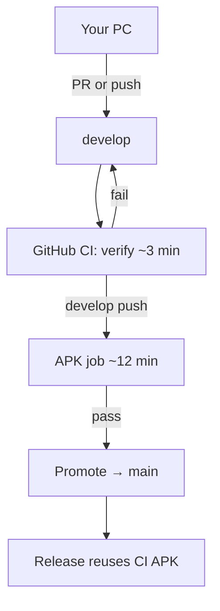

# Development workflow

Local development on your PC: you write code; **GitHub builds the APK**; **`main` updates only when that build passes**.

## Branch roles

| Branch | Purpose |
|--------|---------|
| **`develop`** | Integration branch — merge your work here |
| **`fix/*`**, **`feature/*`** | Short-lived branches → open PR into `develop` |
| **`main`** | Release line — updated by automation after green `develop` CI. Do not push here directly |



## Download APK

| Build | Where |
|-------|--------|
| **Stable** | [GitHub Releases](https://github.com/Immabe96/Vertiege/releases) — `app-release.apk` after each `main` update |
| **Latest develop** | Actions → **CI** → artifact `vertiege-apk-develop-<sha>` (90 days) |

---

## One-time setup

```bash
git clone https://github.com/Immabe96/Vertiege.git
cd Vertiege
git checkout develop
cp .env.template .env    # SUPABASE_URL, SUPABASE_ANON_KEY for device testing
flutter pub get
```

## Daily loop

Use your machine for **editing, `flutter run`, analyze, and tests**. Skip the release APK build locally — GitHub does that (low RAM friendly).

```bash
git checkout develop
git pull origin develop
git checkout -b fix/short-description    # or feature/...

# Edit code, run on phone/emulator
flutter run

# Quick checks (optional but recommended before push)
flutter analyze --no-fatal-infos --no-fatal-warnings
flutter test
# Do NOT run: flutter build apk --release  (uses RAM; CI builds on GitHub)

git add -A && git commit -m "fix: describe change"
git push -u origin fix/short-description
```

Open a **PR into `develop`** on GitHub (or push straight to `develop` if you work alone).

After the PR merges (or you push `develop`):

1. **CI verify** runs on every push/PR (~3 min): analyze → test
2. On **`develop` push only**, **build-apk** runs after verify (~12 min) → artifact
3. **Promote to main** runs if CI succeeded
4. **Release APK** reuses that artifact (no second compile on `main`)

### What runs where

| Task | Local PC | GitHub Actions |
|------|----------|----------------|
| Edit code | Yes | — |
| `flutter run` / hot reload | Yes | — |
| `flutter analyze` | Yes (fast feedback) | Yes (gate) |
| `flutter test` | Yes | Yes |
| `flutter build apk --release` | **No** (save RAM) | **Yes** |
| Update `main` | **No** (automated) | Yes |
| Downloadable APK | Releases page | Releases + CI artifact |

---

## GitHub workflows

| Workflow | When | Result |
|----------|------|--------|
| **CI** `verify` | Push/PR to `develop`, branches, `fix/*`, … | analyze + test (~3 min) |
| **CI** `build-apk` | `develop` push; manual dispatch with **Build APK** checked | APK artifact (secrets `SUPABASE_URL`, `SUPABASE_ANON_KEY`) |
| **Promote to main** | After successful CI on `develop` | Merges `develop` → `main` |
| **Release APK** | After successful develop CI | GitHub Release (downloads CI APK, no rebuild) |

Manual promote: Actions → **Promote to main** → Run workflow.

---

## Troubleshooting

| Problem | What to do |
|---------|------------|
| `main` did not move | Open Actions → **CI** on `develop` — must be green |
| No new Release | Check **Release APK** after develop **CI** (needs `build-apk` job + artifact) |
| Out of RAM locally | Stop local APK builds; use `flutter run` + GitHub CI only |
| CI failed | Fix analyze/test/build errors on `develop`, push again |

## Recommended GitHub settings

- **Default branch:** `develop`
- **Protect `main`:** block direct pushes (only Actions promote)
- **Protect `develop`:** require **CI** to pass before merge (optional)

Backend deploy (Supabase/Firebase): [FIREBASE_SUPABASE_HYBRID_SETUP.md](FIREBASE_SUPABASE_HYBRID_SETUP.md)

## Release gate (before `main` / APK)

1. Finish audit/fix work on `develop`; **push `develop` to origin** so CI builds the APK.
2. Run CI locally: `flutter analyze` + `flutter test`.
3. **Manual device checks** on the CI APK (you report issues).
4. Fix any findings, push again, wait for green CI.
5. Promote to `main` / Release when audits and device pass are done.
