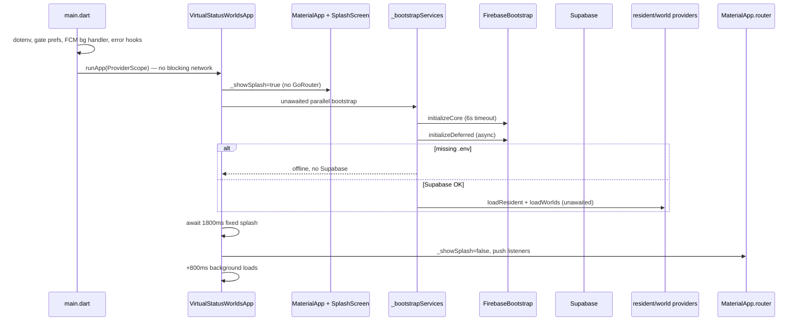
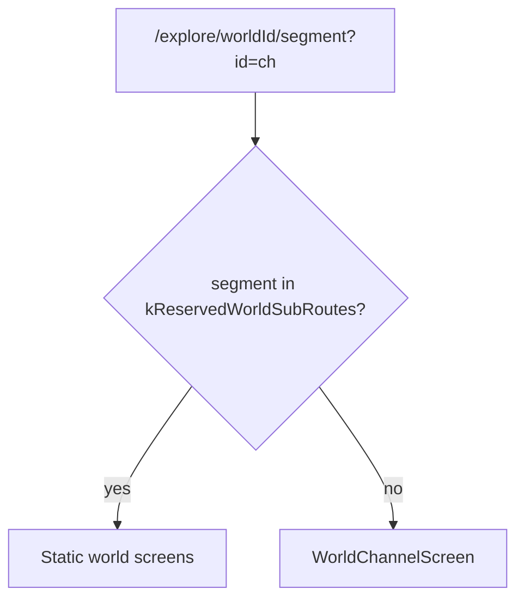
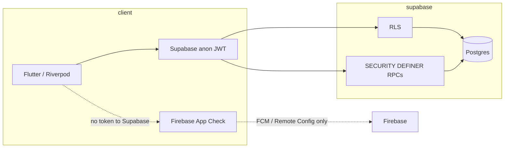
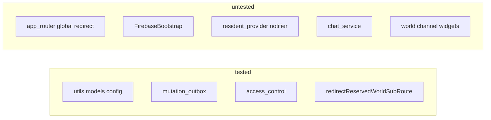

# Vertiege swarm audit

- **Date:** 2026-05-24
- **Model:** `composer-2.5` (Cursor CLI)
- **Preset:** research (Research Team)
- **Mode:** ask
- **Run artifacts:** `/home/immabe/Vertiege/.swarm/runs/2026-05-24T13-55-51`

---

# Vertiege Flutter codebase audit

**Date:** 2026-05-24  
**Scope:** Read-only audit of `develop` (Linux dev session + uncommitted startup/router work)  
**Sources:** Cursor swarm researchers (shell/routing, security/data, testing/build) + reviewer synthesis  
**Prior stubs:** `docs/audits/2026-05-24-cursor-swarm-audit.md` (SWARM_OK only), `docs/audits/2026-05-24-cursor-cli-audit.md` (empty) — superseded by this report  
**Cross-checks:** `docs/linux-setup-session-2026-05-24.md`, `docs/audits/2026-05-21-baseline-audit.md`, `rls-audit.md`, `2026-05-21-security-advisor.md`, `product-gap-audit.md`, `2026-05-22-condition-audit.md`

**Terminology:** “Linux port” in repo docs means **developing on Arch Linux** with **Android as the run target**, not shipping a Flutter **linux desktop** binary. `DefaultFirebaseOptions` rejects `TargetPlatform.linux`; Firebase-dependent features are off on desktop `flutter run` on a Linux host.

---

## Executive summary

Vertiege is a Flutter + Riverpod + GoRouter app backed by Supabase (JWT + RLS) with Firebase used for Crashlytics, Remote Config, FCM, and App Check on mobile. Recent Linux-session work improved cold start by deferring Firebase/Supabase to `app.dart`, using a lightweight splash shell, and splitting Firebase into core vs deferred init — design matches `docs/linux-setup-session-2026-05-24.md` and is **confirmed in code**.

**Strengths:** Clear world-channel URL contract (`/explore/{worldId}/{name}?id={channelId}`); tested `redirectReservedWorldSubRoute` helper; mutation outbox for worlds/posts/chat; solid unit tests for access control, outbox replay, and FCM route mapping; graceful Firebase/Supabase timeouts.

**Highest risks (no verified auth bypass without RLS failure):**

| Priority | Issue |
|----------|--------|
| **High** | Sign-out clears Riverpod only — mutation outbox and disk caches (resident, chat) are **not** cleared (`session_reset.dart`). |
| **High** | Profile upsert can write tier/gate/coins; escalation trigger exists only in **archive** SQL — production policies not verified in repo migrations. |
| **High** | `chat_service_test.dart` is a no-op; **`app_router` global redirect** (auth, gate, verifier, Android deep links) has **zero** tests despite recent fixes. |
| **High** | **Duplicate** `Connectivity().onConnectivityChanged` listeners in `app.dart` (verified L61–72) — leaked subscription + duplicate callbacks. |

**Linux session status:** Black screen, Riverpod self-dependency, channel URLs, and `auth` host deep link are **resolved in tree**. **ANR fix is coded but not device-verified** (linux doc). **Gate flow bug:** OAuth callback navigates to `/the-gate` when gate incomplete, but router only allows `/onboarding` — `/the-gate` is immediately redirected away.

**May audits still open:** RLS on many tables, push E2E, partial offline/realtime (`product-gap-audit.md`, `2026-05-22-condition-audit.md`). Promote to `main` remains **held** pending device UAT.

---

## Architecture

### Cold start sequence



**Design intent** (`docs/linux-setup-session-2026-05-24.md`): first paint before network; split Firebase core (Crashlytics) vs deferred (App Check, Analytics, Performance, Remote Config); splash dismiss is **time-based**, not gated on bootstrap completion.

```13:38:lib/main.dart
void main() async {
  WidgetsFlutterBinding.ensureInitialized();
  FirebaseMessaging.onBackgroundMessage(firebaseMessagingBackgroundHandler);
  // ... error handlers ...
  await dotenv.load(isOptional: true);
  await loadGateCompletionStatus();

  // Show Flutter UI immediately — Firebase/Supabase init runs after first frame.
  runApp(const ProviderScope(child: VirtualStatusWorldsApp()));
}
```

### Provider and router wiring

| Layer | Role |
|--------|------|
| `ProviderScope` | Root in `main.dart` |
| `goRouterRefreshProvider` | `GoRouterRefresh` + `residentProvider` select tuple + Supabase `onAuthStateChange` |
| `appRouterProvider` | Single `GoRouter` with global `redirect` |
| `residentMilestoneListenerProvider` | Side-effect `ref.listen` (fixes prior self-dependency in `ResidentNotifier.build`) |
| Post-splash `app.dart` | Watches milestone listener, resident, `appRouterProvider` |

**Shell:** `StatefulShellRoute.indexedStack` — `/`, `/explore`, `/chat`, `/identity`, `/more`.

**World tree:** `/explore/:worldId` → static children (`settings`, `members`, `marketplace`, …) + catch-all `:channelName` → `WorldChannelScreen` with `redirectReservedWorldSubRoute`.

### World channel URL contract

**Canonical:** `/explore/{worldId}/{channelName}?id={channelId}`

- Shortcuts/teaser use `context.push` with `?id=` query.
- `WorldChannelScreen` keys chat off **query** `id`, not the path segment.



**Reserved segments:** `members`, `settings`, `marketplace`, `polls`, `treasury`, `challenges` (`world_route_redirects.dart`). `announcements` is **not** reserved (intentional per tests).

### Platform: Linux host vs Linux desktop target

| Area | Android/iOS | Linux desktop `TargetPlatform.linux` |
|------|-------------|--------------------------------------|
| Firebase | Configured | `UnsupportedError` in `firebase_options.dart` |
| Bootstrap | Full stack | Core init fails gracefully; console CrashReporter |
| FCM / push | Registered | No Linux path |
| App Check | Play Integrity / DeviceCheck | Skipped when Firebase unavailable |
| Deep links | `uri.host == 'auth'|'verifier'` | N/A on desktop run |

### Security boundary (client)



---

## Security

### Credentials and configuration

- `dotenv.load(isOptional: true)` in `main.dart`; missing `SUPABASE_URL` / `SUPABASE_ANON_KEY` → offline mode, no Supabase init (`app.dart`).
- `.env` is gitignored; CI injects secrets. Client ships **anon** JWT only — correct for mobile; treat as public.
- **Risk:** `SUPERUSER_EMAILS` / `VERIFIER_ADMIN_EMAILS` in dotenv parsed client-side (`admin_access_service.dart`) — affects **UI/router only**, not Postgres unless mirrored in JWT metadata.

### Firebase App Check vs Supabase

- App Check activates after Firebase core; debug providers in `kDebugMode`.
- **No** App Check token on Supabase REST/RPC — trust model is **JWT + RLS**.
- Skipped when Firebase fails (typical Linux desktop dev).

### Auth and gates

| Path | Notes |
|------|--------|
| Email/password | UI min password length 6; leaked-password protection **off** per Security Advisor |
| OAuth | `vertiege://auth/callback`; Android `uri.host == 'auth'` rewrite in router |
| Session | `SecureStorageService` duplicates tokens; Supabase SDK owns session — no restore path found |
| Sign-out | Clears Supabase + Riverpod; **does not** clear disk outbox/caches (see findings) |
| Verifier | `VerifierSession` in-memory + `app_metadata` or env email lists |

**Gate inconsistency (verified):**

```48:49:lib/screens/auth/auth_callback.dart
      } else if (!resident.gateCompleted) {
        context.go('/the-gate');
```

```181:186:lib/router/app_router.dart
      if (!gateDone) {
        if (location != '/onboarding') {
          return '/onboarding';
        }
```

Incomplete gate → only `/onboarding` allowed; navigation to `/the-gate` is redirected immediately.

### Remote Config / feature flags

Keys include feature toggles, `post_outbox_enabled`, `verbose_errors`, `minimum_build`, `maintenance_banner`. **`postOutboxEnabled` is defined in `feature_flags.dart` but never referenced elsewhere** — remote kill-switch is dead. `minimum_build` / `maintenance_banner` have **no client enforcement** found.

### RLS and client write patterns (from `docs/audits/rls-audit.md`)

**Fixed on remote:** recursion on `world_members`, `posts`, `channels`, `channel_messages`; `device_tokens` own-row.

**Still open:** many tables “Requires Verification”; storage buckets; indexes; most transactional RPCs recommended but not used by app.

| Client pattern | Server must enforce |
|----------------|---------------------|
| `ProfileService.upsertProfile` — tier, gate, coins, streak | Column policies / triggers (`trg_prevent_escalation` in **archive** only) |
| `WorldService.createWorld` — direct `worlds` insert | INSERT policy; **`create_world_full` RPC on remote unused by app** |
| Chat — membership pre-check then insert | `channel_messages` RLS |
| `push_token_service` → `debug_logs` | Permissive insert (Advisor WARN) |
| `verifyProfession` without proof | Local `verifiedRoles` — must not trust client-only |

**Migration drift:** 12 local vs 32 remote migrations (`2026-05-21-migration-reconciliation.md`); profile hardening may exist on remote without matching local files.

---

## Reliability

| Area | Behavior |
|------|----------|
| Crash reporting | `ConsoleCrashReporter` until Firebase core; global hooks in `main.dart` |
| Timeouts | Firebase core 6s; Supabase 8s; profile load 8s; Remote Config fetch 5s |
| Splash vs auth | Fixed 1.8s; `redirect` returns `null` while `isLoading` — brief wrong shell possible |
| Push | Routes ignored while `_showSplash` (`app.dart` L78–82) |
| Remote Config | Defaults until deferred init; no app-wide “ready” signal |
| Offline UX | `OfflineBanner` when offline; **`onRetry` not passed** — copy says “Pull to retry” |
| `SafeAsyncBuilder` | Defined, **never imported** in `lib/` |
| `fb_status` / `fb_error` | Written to storage; **no UI consumer** in `lib/` |

**Bootstrap failure coupling:** Missing `.env` or Supabase timeout → early return from `_bootstrapServices` — no resident/world load and **no shell-level degraded banner** (only connectivity banner if network is up).

**Verified defect:**

```61:72:lib/app.dart
    _connectivitySubscription = Connectivity().onConnectivityChanged.listen((
      results,
    ) {
      final offline = results.every((r) => r == ConnectivityResult.none);
      if (mounted) setState(() => _isOnline = !offline);
    });
    _connectivitySubscription = Connectivity().onConnectivityChanged.listen((
```

Second assignment replaces the first without canceling it — **leaked listener** plus duplicate `setState`.

---

## Data layer

### Load path

`app.dart` bootstrap → `residentProvider.loadResident` (profile, merge cache, outbox replay) → `worldProvider.loadWorlds` → `channelProvider` / `chatProvider` for channel UI.

| Step | Offline / error behavior |
|------|---------------------------|
| Profile | 8s timeout; merge `joinedWorldIds` cache ∪ remote; cache fallback on failure |
| Worlds | 8s timeout; `@worlds_cache` on failure |
| Channels | On error: **empty list** + error string — looks like “no channels” |
| Join/send | Optimistic UI → `MutationOutbox` on failure; replay on load paths |

### Outbox

- Store: `@mutation_outbox_v1` via `StorageService`
- Types: `world.join`/`leave`, `post.*`, `chat.message`, `channel.message`
- Max 5 retries; then **stuck** with no purge UI
- **Sign-out does not clear outbox** (`session_reset.dart` has no `MutationOutboxService.clear()`)

### Consistency hazards

1. **`joinedWorldIds` merge** — stale memberships after server-side leave/reject.
2. **Chat disk cache** — loaded on provider build before auth refresh; pairs with sign-out gap.
3. **Local gamification** — streak/check-in/rep may persist without guaranteed server sync.
4. **`award_activity_xp`** — local XP may diverge when RPC returns 0.
5. **Dead Remote Config** — cannot disable post outbox remotely.

---

## Testing

| Metric | Value |
|--------|--------|
| Test files | **21** under `test/` |
| Integration tests | **None** (`integration_test/` absent) |
| CI | `flutter analyze` + `flutter test` on `ubuntu-latest` (`.github/workflows/ci.yml`) |
| `lib/` scale | ~329 Dart files — coverage skewed to utils/models |

**Solid:** `mutation_outbox_service_test`, `access_control_test`, `firebase_messaging_handlers_test`, `moderation_filter_test`, `world_repository_test`, `world_route_redirects_test` (3 cases, 1 of 6 reserved segments).

**Gaps aligned with Linux session (untested):** early `runApp`, `firebase_bootstrap` split, `app.dart` splash/bootstrap, `resident_provider` notifier, `world_channel_shortcuts` / `world_feed_chat_teaser`, `remote_config_service` timeouts, `app_router` global redirect.



`test/benchmark/chat_service_benchmark_test.dart` is a placeholder (`expect(true, true)`).

---

## Android / build

### Local Gradle (`android/gradle.properties`) — 7 GB Arch host

| Property | Value |
|----------|--------|
| `org.gradle.jvmargs` | `-Xmx1536m`, G1, metaspace 512m |
| `org.gradle.daemon` | `false` |
| `org.gradle.workers.max` | `2` |
| `org.gradle.parallel` | `false` |

Past JVM crashes (`android/hs_err_*.log`) align with linux doc OOM tuning.

### Release APK (`android/app/build.gradle.kts`)

- Java/Kotlin **17**; desugaring enabled
- **`isMinifyEnabled = false`**, **`isShrinkResources = false`** — ProGuard rules present but inactive

### CI vs local

| | Local Arch | CI (`ubuntu-latest`) |
|--|------------|----------------------|
| Gradle memory | Capped 1536m, no daemon | Default (higher) |
| Java | App targets 17 | Workflow uses 21 |
| Linux desktop | Not built | Not in workflow |
| APK | Device builds per linux doc | `flutter build apk` on `develop` |

---

## Findings table

36 merged findings. No **Critical** row — no verified auth bypass without RLS misconfiguration. Severity: **High / Medium / Low** only.

| ID | Severity | Area | Finding | Recommended fix | Files |
|----|----------|------|---------|-----------------|-------|
| F01 | High | Security / Data | Sign-out clears Riverpod via `resetUserSessionState` but not mutation outbox, resident JSON, or chat disk cache — next user may see or replay prior session data. | On sign-out: `MutationOutboxService.clear()`, delete `residentKey` / `chatMessagesKey` / worlds cache; scope keys by `userId`. | `lib/state/session_reset.dart`, `lib/services/mutation_outbox_service.dart`, `lib/state/chat_provider.dart`, `lib/state/resident_provider.dart` |
| F02 | High | Security | `ProfileService.upsertProfile` can write `tier`, `gate_completed`, `sovereign_coins`, streak fields; escalation trigger in archive SQL only — production RLS/triggers not verified in active migrations. | Verify remote `profiles` UPDATE in SQL editor; restrict client columns; add migration. | `lib/services/profile_service.dart`, `docs/audits/rls-audit.md`, `supabase/migrations_archive/` |
| F03 | High | Testing | `chat_service_test.dart` is placeholder (`expect(1, 1)`). | Mock Supabase or extract testable helpers. | `test/services/chat_service_test.dart`, `lib/services/chat_service.dart` |
| F04 | High | Testing | No tests for `app_router` global redirect (auth, gate, verifier, tier, Android `auth`/`verifier` hosts) despite Linux session fixes. | `go_router` tests with `ProviderContainer` + fake auth/resident. | `lib/router/app_router.dart`, `docs/linux-setup-session-2026-05-24.md` |
| F05 | High | Reliability | Duplicate `Connectivity().onConnectivityChanged` — first subscription not canceled. | Remove duplicate; single subscription. | `lib/app.dart` L61–72 |
| F06 | Medium | Security | `SUPERUSER_EMAILS` / `VERIFIER_ADMIN_EMAILS` in dotenv affect UI/router only. | JWT `app_metadata` / DB functions; dev-only lists. | `lib/services/admin_access_service.dart`, `lib/router/app_router.dart` |
| F07 | Medium | Security | App Check does not protect Supabase; boundary is JWT + RLS. | Prioritize RLS/RPC audit. | `lib/services/app_check_service.dart` |
| F08 | Medium | Security | Client inserts into `debug_logs` under permissive RLS (Security Advisor). | Narrow policy; debug flag only. | `lib/services/push_token_service.dart`, `docs/audits/2026-05-21-security-advisor.md` |
| F09 | Medium | Security | `verifyProfession` without proof updates local `verifiedRoles`. | Require server verification before local grant. | `lib/state/resident_provider.dart` L837–858 |
| F10 | Medium | Security / Data | `WorldService.createWorld` direct insert; `create_world_full` RPC unused. | Route through RPC if canonical. | `lib/services/world_service.dart`, `docs/audits/rls-audit.md` |
| F11 | Medium | Data | `joinedWorldIds` merged as cache ∪ remote — stale memberships. | Server list only; cache on remote failure. | `lib/state/resident_provider.dart` L94–98 |
| F12 | Medium | Data | Outbox items remain after max retries; no discard UI. | Dead-letter UI or user-consented clear. | `lib/services/mutation_outbox_service.dart` |
| F13 | Medium | Routing | OAuth callback → `/the-gate` when gate incomplete; router only allows `/onboarding`. | Align callback with redirect matrix or allow `/the-gate` in gate branch. | `lib/screens/auth/auth_callback.dart`, `lib/router/app_router.dart` L181–186 |
| F14 | Medium | Routing | `gateCompletedCache` loaded in `main.dart`; router uses `resident.gateCompleted` only. | Single source of truth. | `lib/main.dart`, `lib/screens/onboarding/the_gate_screen.dart`, `lib/router/app_router.dart` |
| F15 | Medium | Reliability | Fixed 1.8s splash + `isLoading` bypass — main shell before profile resolves. | Gate router on profile readiness or skeleton shell. | `lib/app.dart` L88–95, `lib/router/app_router.dart` L174 |
| F16 | Medium | Reliability | Push routes blocked during splash. | Queue initial route until post-splash. | `lib/app.dart` L78–82, `lib/services/push_token_service.dart` |
| F17 | Medium | Worlds / Routing | Missing `?id=` → empty `channelId`; message load/subscribe no-op. | Require `id` redirect or resolve by name. | `lib/router/app_router.dart` L311–315, `lib/widgets/worlds/world_channel_shortcuts.dart` |
| F18 | Medium | Testing | `world_route_redirects_test` covers 1/6 reserved segments; no `app_router` wiring tests. | Table-test all reserved segments; optional navigation test. | `test/router/world_route_redirects_test.dart`, `lib/router/world_route_redirects.dart` |
| F19 | Medium | Testing | No tests for `FirebaseBootstrap` core/deferred or Linux unsupported path. | Unit-test `isInitialized` / `lastError` with platform fakes. | `lib/services/firebase_bootstrap.dart`, `lib/firebase_options.dart` |
| F20 | Medium | Testing | `resident_provider` notifier (timeout, cache merge, milestone listener) untested. | Notifier tests with mocked services. | `lib/state/resident_provider.dart`, `test/models/resident_test.dart` |
| F21 | Medium | Testing | World channel shortcut/teaser URL fixes have zero tests. | Pump tests for `context.push` paths with `?id=`. | `lib/widgets/worlds/world_channel_shortcuts.dart`, `world_feed_chat_teaser.dart` |
| F22 | Medium | Reliability | `OfflineBanner` without `onRetry`; copy says “Pull to retry”. | Wire retry or reword. | `lib/app.dart` L469, `lib/widgets/core/offline_banner.dart` |
| F23 | Medium | Reliability | Bootstrap failures / missing `.env` only logged — no degraded-mode banner. | Banner or empty state when `!isSupabaseConfigured()`. | `lib/app.dart` L131–157 |
| F24 | Medium | Android / DevEx | Local Gradle tuned for 7 GB RAM; CI uncapped — profiles diverge; `hs_err_*.log` history. | Document profiles; optional CI overrides. | `android/gradle.properties`, `docs/linux-setup-session-2026-05-24.md` |
| F25 | Medium | Android | Release minify/shrink disabled. | Enable incrementally when ProGuard stable. | `android/app/build.gradle.kts` L60–65 |
| F26 | Medium | Platform | No Firebase for `TargetPlatform.linux` — features silently off on desktop dev. | Document expectation or `flutterfire configure` for desktop target. | `lib/firebase_options.dart`, `lib/services/firebase_bootstrap.dart` |
| F27 | Low | Security | `SecureStorageService` duplicates session tokens; no restore path. | SDK session only or explicit restore. | `lib/services/auth_service.dart`, `lib/services/secure_storage_service.dart` |
| F28 | Low | Security | Leaked-password protection disabled; signup length ≥ 6 only. | Enable in Supabase Auth dashboard. | `lib/screens/auth/signup_screen.dart`, `docs/audits/2026-05-21-security-advisor.md` |
| F29 | Low | Data | `post_outbox_enabled` Remote Config unused. | Wire in `PostRepository._runOrQueue` or remove key. | `lib/services/feature_flags.dart`, `lib/repositories/post_repository.dart` |
| F30 | Low | Data | `minimum_build` / `maintenance_banner` not enforced client-side. | Version gate + banner or remove keys. | `lib/services/remote_config_service.dart`, `lib/services/feature_flags.dart` |
| F31 | Low | Data | Local streak/check-in/rep may persist without server sync. | RPC sync; reconcile on load. | `lib/state/resident_provider.dart`, `lib/services/profile_service.dart` |
| F32 | Low | Testing | Benchmark test file is placeholder. | Real benchmark tag or remove. | `test/benchmark/chat_service_benchmark_test.dart` |
| F33 | Low | Reliability | `SafeAsyncBuilder` unused. | Adopt or delete. | `lib/widgets/core/safe_async_builder.dart` |
| F34 | Low | Reliability | `fb_status` / `fb_error` stored without in-app UI. | Dev overlay or settings. | `lib/app.dart` L223–231 |
| F35 | Low | Android | CI Java 21 vs app compile 17. | Align toolchain if warnings appear. | `.github/workflows/ci.yml`, `android/app/build.gradle.kts` |
| F36 | Low | Data | `award_activity_xp` failure returns 0; local XP may diverge; channel empty-on-error (F12 related). | XP from RPC only; distinct channel error state. | `lib/state/resident_provider.dart`, `lib/state/channel_provider.dart` |

---

## Reconciliation with prior audits

| Prior claim | Verdict |
|-------------|---------|
| Black screen — blocking init before `runApp` | **Resolved** |
| Riverpod self-dependency in `ResidentNotifier` | **Resolved** (`residentMilestoneListenerProvider`) |
| Bad channel URL `/channel/{uuid}` | **Resolved** |
| Auth callback placeholder | **Resolved** (`product-gap-audit.md`) |
| Android `auth` host deep link | **Resolved** (linux doc) |
| Verifier deep link to player login | **Resolved** |
| Migration drift | **Resolved** (reconciliation doc) |
| Auth callback “routes to gate” (baseline audit) | **Partially outdated** — callback uses `/the-gate` but redirect forces `/onboarding` (F13) |
| ANR fix complete | **Partial** — code in tree; **device verification open** |
| Push verified / RLS all tables verified | **Still open** |
| ~108–110 tests passing | **Plausible**; **coverage shape unchanged** |
| `2026-05-24-cursor-*-audit.md` | **No substantive content** |

---

## Prioritized next steps

### P0 — before `main` / release

1. **Device UAT** per `docs/DEVICE_UAT.md` — cold start, channels with `?id=`, create world, verifier, push token row.
2. **Confirm ANR fix** on CPH2649 (single-terminal `flutter run`; linux doc L137–165).
3. **F05** — Remove duplicate connectivity listener (`lib/app.dart` L61–72).
4. **F01** — Sign-out storage hygiene (outbox + resident/chat/worlds caches).

### P1 — high user / security impact

5. **F02** — SQL-verify `profiles` UPDATE policies and triggers on production.
6. **F04** — `app_router` redirect regression tests (auth + gate + deep links).
7. **F03** — Replace `chat_service_test` placeholder.
8. **F13** — Align gate navigation (`auth_callback` vs router).
9. **F17** — Enforce channel `?id=` or resolve by name.
10. **F11** — Server-authoritative `joinedWorldIds`.

### P2 — quality, build, polish

11. **F18, F21** — Table-test reserved world segments; widget tests for channel shortcuts/teaser.
12. **F22, F23** — Shell degraded-mode UX; `OfflineBanner.onRetry`.
13. **F10, F08** — `create_world_full` RPC; tighten `debug_logs` RLS.
14. **F25, F24** — Release minify when stable; document Gradle profiles (Arch vs CI).
15. **F29–F30** — Wire or remove dead Remote Config keys.
16. **F20, F19** — `resident_provider` and `FirebaseBootstrap` unit tests.
17. **Optional:** CI `flutter test` on Linux runner documenting Firebase-skip expectation (no desktop artifact required).

---

*Read-only Cursor swarm audit — synthesized 2026-05-24. No repository files were modified. To persist this report under `docs/audits/`, switch to Agent mode.*