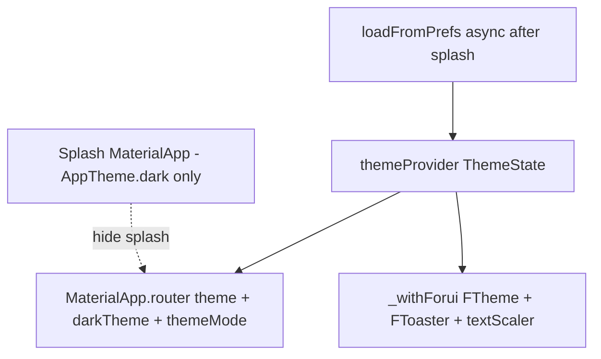
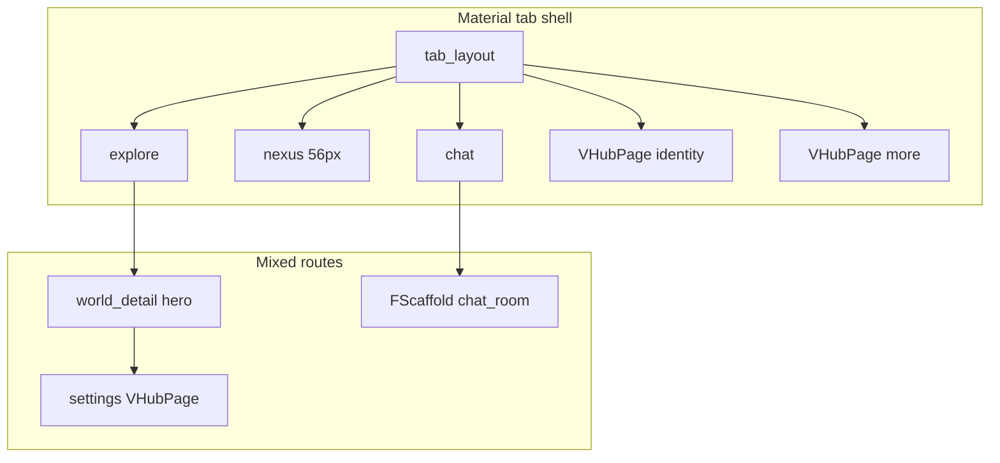

# Vertiege UI/UX swarm audit

- **Date:** 2026-05-24
- **Model:** `composer-2.5` (Cursor CLI)
- **Preset:** research (Research Team)
- **Mode:** ask
- **Run artifacts:** `/home/immabe/Vertiege/.swarm/runs/2026-05-24T15-58-16`

---

# Vertiege UI/UX audit — consolidated report (2026-05-24)

**Scope:** Read-only audit of Flutter UI/UX (Forui 0.21, `VTheme`/`VColors`, light/dark/system, shell, feedback, accessibility).  
**Skills applied:** `vertiege-forui-ui`, `flutter-ai-ui-skill`, `ui-design-brain` (+ `components.md` pattern mapping).  
**Cross-check:** [docs/audits/2026-05-24-cursor-swarm-ui-ux-audit.md](docs/audits/2026-05-24-cursor-swarm-ui-ux-audit.md) — findings **U01–U12** retained; **Identity tier** and **post-splash prefs flash** updated from current code.  
**Analyzer:** `python .cursor/skills/flutter-ai-ui-skill/scripts/analyse_flutter_project.py` was **not run** in this swarm pass (Ask mode). **ANA-*** rows below are grep/rule proxies; run the script in Agent mode for a complete list.

---

## Executive summary

Vertiege has a **coherent brand** (AMOLED dark, violet/gold, glass/tier prestige) and a **documented Forui migration** (`lib/forui/README.md`, `VertiegeForuiTheme`). The app is **mid-migration**: ~29 flows use **`VHubPage`** (`FScaffold` + `FHeader`), but **high-traffic tab roots** (Explore, Nexus, Chat), **auth**, **world channel**, and **create-post** still use **Material `Scaffold` + `AppBar`**.

**Theme at the root is mostly correct after splash:** `themeProvider` drives `themeMode` and `useDarkForui` together in `app.dart`. Reliability gaps remain: a **second `MaterialApp`** forces **dark-only splash** (U01); **default `ThemeScheme.light`** (U02); **`loadFromPrefs()` after splash** while initial state is light can cause **dark splash → brief light main → saved theme**; and widgets overwhelmingly use **`VColors` + `isDark`** instead of `colorScheme` / `context.theme.colors` (U03).

**Feedback is split three ways:** `FToaster` is mounted but **`showFToast` has zero call sites**; ~29 files still use **`SnackBar`**; custom **`XpToast`** overlays exist for gamification (U06).

**Shell friction (U07):** Material tab headers (Nexus **56px** toolbar) vs plain `Text(title)` in `VHubPage` vs `WorldHeroBanner` on world detail — three header paradigms on one journey.

**Accessibility:** Global **text scale** is wired; **`VAccessibleHeaderAction`** appears in only **3** screens; tab **FAB/campfire** animations often ignore **`motionEnabled`**; campfire leave uses **40dp** vs **48dp** header-action pattern (U11).

**Correction vs prior audit:** **`identity_screen.dart` is no longer Tier A Material** — it uses `VHubPage` with accessible header actions; treat as **Tier B** (shell done, feedback/scale polish). Update `vertiege-forui-ui` Tier A list accordingly.

**Top waves:** (1) single app + system default + color extension, (2) Tier A shell + `VPageChrome`, (3) `VFeedback` + auth `FTextField`/`FButton`, (4) dialogs, semantics, motion, XL UAT, analyzer JSON.

---

## Design system inventory

| Layer | Path | Role |
|-------|------|------|
| **Tokens** | `lib/theme/v_tokens.dart` | `VSpacing`, `VRadius`, `VFontSize`, `VAnimation`, `VTouchTarget` (min 48; `iconButton` 40) |
| **Palette** | `lib/theme/v_colors.dart` | Static M3-style light/dark; tier/prestige/status; prefer `colorScheme` per file comment |
| **Legacy aliases** | `lib/theme/colors.dart` | `AppColors` → `VColors` (remove when safe) |
| **Material theme** | `lib/theme/v_theme.dart` | `VTheme.light` / `dark` — full M3 `ThemeData`, `useMaterial3: true` |
| **Facade** | `lib/theme/app_theme.dart` | `AppTheme` → `VTheme` (used by `app.dart`) |
| **Forui theme** | `lib/theme/forui_theme.dart` | `VertiegeForuiTheme` → `FThemeData`; `systemOverlayStyle` |
| **User prefs** | `lib/state/theme_provider.dart` | `ThemeScheme` + `TextSize` (0.85×–1.3×); `@theme_preference`; default **`ThemeScheme.light`** |
| **App wiring** | `lib/app.dart` | Splash `MaterialApp` vs `MaterialApp.router` + `_withForui` |
| **Hub shell** | `lib/forui/v_hub_page.dart` | `FScaffold` + `FHeader` / `FHeader.nested` |
| **Settings rows** | `lib/widgets/v_section_list.dart` | `FTileGroup` / `FTile`; uses `context.theme` |
| **Sheets** | `lib/widgets/core/glass_sheet.dart` | `showAppSheet` → `showFSheet` |
| **Legacy bridge** | `lib/ui/buttons/v_button.dart`, etc. | Material wrappers (~34 files) |
| **A11y** | `lib/widgets/core/v_accessible.dart` | 48dp `VAccessibleHeaderAction` |
| **Motion** | `lib/utils/v_motion.dart` | `motionEnabled` from `disableAnimations` |

### Wiring flow



Post-splash sync (when prefs are applied):

```494:512:lib/app.dart
    final useDarkForui = switch (themeState.scheme) {
      ThemeScheme.light => false,
      ThemeScheme.dark => true,
      ThemeScheme.system => platformBrightness == Brightness.dark,
    };
    // ...
      theme: AppTheme.light,
      darkTheme: AppTheme.dark,
      themeMode: themeState.themeMode,
```

```561:577:lib/app.dart
    return FTheme(
      data: isDark ? VertiegeForuiTheme.dark : VertiegeForuiTheme.light,
      child: FToaster(
        child: FTooltipGroup(
          child: MediaQuery(
            data: MediaQuery.of(context).copyWith(textScaler: textScaler),
```

**Note:** Prior audit used **U04** for both “FTheme vs Material brightness” (theme section) and “tab Material roots” (findings table). This report uses **findings-table U04** = tab Material only; theme FTheme alignment is covered under U03/U01.

---

## Forui adoption vs Material/Cupertino

### Adoption snapshot (`lib/`, grep)

| Pattern | ~Files | Notes |
|---------|-------:|-------|
| `VHubPage` | 29 | Largest Forui surface |
| `FScaffold` | 3 | `v_hub_page`, `chat_room_screen` |
| `FHeader` / actions | 10 | Via hub + chat room |
| `FButton` | 8 | Empty states, some flows |
| **`FTextField`** | **0** | README only |
| **`FDialog` / `showFToast`** | **0** | Not adopted |
| `showFSheet` / `showAppSheet` | 1 wrapper | **1** prod caller (`post_item.dart`) |
| `FToaster` | 1 | Mount only in `app.dart` |
| `import package:forui/forui.dart` | 36 | ~11% of `lib/**/*.dart` |
| `Scaffold(` | 18 | Tab shell, auth, channel, splash |
| `AppBar(` | 9 | Tab roots + channel/thread |
| `VButton` | 34 | Dominant button |
| `SnackBar(` | 29 | Settings/world_settings heaviest |
| `showDialog(` | 15 | Tier/prestige/settings |
| `showModalBottomSheet(` | 11 | vs 1× Forui sheet path |
| `ListTile(` | 9 | Legacy rows |

### In good shape

- Root: `FLocalizations`, `FTheme`, `FToaster`, `FTooltipGroup` (`app.dart`).
- **`VHubPage`**: nested back via `FIcons.chevronLeft` (`v_hub_page.dart`).
- **`VSectionList`**: Forui-native settings reference.
- **`chat_room_screen`**: `FScaffold` + `FHeader.nested`.
- **`more_screen.dart`**: minimal hub + section list (Tier C reference).
- **`empty_state.dart`**: `FButton` CTA where used.

### Target mapping

| Use case | Today | Target |
|----------|-------|--------|
| Tab / auth shell | Material `Scaffold` + `AppBar` | `FScaffold` + shared `VPageChrome` |
| Inputs | `TextField` | `FTextField` |
| Toasts | `SnackBar` / `XpToast` | `showFToast` / `VFeedback.toast` |
| Dialogs | `showDialog` | `FDialog` |
| Sheets | `showModalBottomSheet` | `showAppSheet` |
| Buttons | `VButton` | `FButton` |
| Settings appearance | Material `SegmentedButton` + Forui `FSelect` | Forui segment for theme |

**Cupertino:** No meaningful Cupertino shell; iOS uses Material + Forui wrapper.

**Brand:** Do not flatten glass/tier prestige to generic SaaS; migrate **chrome and feedback**, keep semantic tier colors.

---

## Light / dark / system behavior and gaps

### How it works

- **Settings:** `SegmentedButton<ThemeScheme>` + `FSelect<TextSize>` (`settings_screen.dart` ~L799–867).
- **Main app:** `themeMode` + `useDarkForui` aligned for `ThemeScheme.system`.
- **Text scale:** `TextScaler.linear(themeState.textScale)` in app builder.

### Splash vs post-splash

| Phase | Tree | Honors `themeProvider`? |
|-------|------|-------------------------|
| **Splash** | `MaterialApp(theme: AppTheme.dark, home: SplashScreen)` | **No** — no `themeMode`, no `FTheme` |
| **Main** | `MaterialApp.router` + `_withForui` | **Yes** (after prefs apply) |

```465:471:lib/app.dart
    if (_showSplash) {
      return MaterialApp(
        title: 'Vertiege',
        debugShowCheckedModeBanner: false,
        theme: AppTheme.dark,
        home: const SplashScreen(),
```

**U01+ (validated):** After splash hides, `loadFromPrefs()` runs again while `ThemeState` may still be **light default**:

```119:121:lib/app.dart
    WidgetsBinding.instance.addPostFrameCallback((_) {
      if (!mounted) return;
      ref.read(themeProvider.notifier).loadFromPrefs();
```

**G6:** `ThemeState.isDark` is only `scheme == ThemeScheme.dark` — **false** when system is dark (`theme_provider.dart` L28–29). Affects `toggle()`, not Settings segmented control.

### Color API adoption (approx.)

| API | ~Files |
|-----|-------:|
| `VColors.*` | ~160 |
| `isDark ?` ternaries | ~95 |
| `colorScheme.*` | ~30 |
| `context.theme` (Forui) | 2 |

**Top `VColors` offenders:** `explore_screen.dart` (73), `world_settings_screen.dart` (71), `the_gate_screen.dart` (70), `cosmetics_shop_screen.dart` (67), `create_post_screen.dart` (63), `identity_screen.dart` (60), `login_screen.dart` / `world_channel_screen.dart` (51 each).

---

## Navigation & shell consistency

### Shell matrix

| Surface | Chrome | Notes |
|---------|--------|-------|
| `tab_layout.dart` | Material `Scaffold` + custom nav + FAB | Compose `showModalBottomSheet`; FAB anim **no `motionEnabled`** |
| Explore | Material + `AppBar` | Manual `VColors` bg; U12 loading/loaded duplicate |
| Nexus | Material + **56px** `AppBar` | Inline search in title |
| Chat list | Material + `AppBar` | Icon actions, tooltip only |
| **Identity** | **`VHubPage`** | `VAccessibleHeaderAction`; SnackBar on refresh |
| More | `VHubPage` | Tier C reference |
| Alerts | `VHubPage` | `VButton` in header (not 48dp action) |
| Create post | Material + `AppBar` | Tier A push surface |
| Chat room | `FScaffold` + `FHeader.nested` | Reference |
| Settings | `VHubPage` | Body Tier C; appearance Tier B |
| World detail | **Split:** `VHubPage` loading/error; main **`Scaffold` + hero** | Three paradigms per journey |
| World channel | Material + `AppBar` | Partial `Semantics` on back/title |

### U07 — header mismatch

| Dimension | Tab `AppBar` | `VHubPage` / `FHeader` |
|-----------|--------------|-------------------------|
| Height | Nexus **56px** | Forui default (unbridged in code) |
| Title | `headlineMedium` + manual colors | Plain `Text(title)` |
| Background | Manual `VColors` + alpha | Forui / `FScaffold` |
| Actions | `IconButton` + tooltip | `FHeaderAction` / `VAccessibleHeaderAction` |

**Fix:** Shared `VPageChrome` + document metrics in `forui/README.md`.



---

## Feedback patterns

| Channel | Usage |
|---------|--------|
| **`FToaster`** | Mounted; **0** `showFToast` |
| **`SnackBar`** | **29** files — `settings_screen`, `world_settings_screen`, `identity_screen`, `login_screen`, `app.dart`, feed widgets |
| **`XpToast`** | `post_composer.dart`, `post_input.dart` |
| **`MaterialBanner`** | Maintenance/offline in `app.dart` (U10) |
| **Dialogs** | 15 files — tier/prestige/daily reward Material |
| **Sheets** | 1× `showAppSheet` vs 11× `showModalBottomSheet` |

**Irony:** `settings_screen.dart` uses **`VHubPage` + Forui tiles** but **SnackBar** for most outcomes.

**Recommendation (U06):** `VFeedback` with `toast()`, `confirm()`, `sheet()`; no new `ScaffoldMessenger` on Forui hubs.

---

## Accessibility

| Area | Status | Gap |
|------|--------|-----|
| Text size pref | **Good** | XL UAT on Nexus bento, explore cards, identity honour wall, gate |
| Global `textScaler` | **Good** | Dense Forui at 1.3× unverified on device |
| AMOLED captions | **Generally OK** | `#A1A1AA` on `#000000`; `labelSm` nav at 1.3× may clip |
| Header actions | **Partial** | `VAccessibleHeaderAction` in **3** files only |
| Tab icon actions | **Weak** | Tooltip only, no `Semantics` on Explore/Nexus/Chat |
| Touch targets | **Mixed** | Campfire leave **40dp** vs **48dp** min in `v_accessible.dart` |
| Reduced motion | **Partial** | `FadeIn` OK; tab FAB, gate, alerts header anim **not** gated |
| World channel | **Better** | `Semantics` on back/title; unused `v_motion` import |

---

## Screen-by-screen migration tiers

**A** = high-traffic Material chrome / funnel  
**B** = `VHubPage` or Forui shell with legacy controls or mixed feedback  
**C** = hub-first; polish SnackBar → toast, `VButton` → `FButton`

### Tier A — Wave 2 shell (do first)

| Screen | Path | Action |
|--------|------|--------|
| Tab shell | `lib/screens/tabs/tab_layout.dart` | Forui-aligned nav; `showAppSheet` compose; motion-gate FAB |
| Explore | `lib/screens/tabs/explore_screen.dart` | `FHeader`; U12 skeleton |
| Nexus | `lib/screens/tabs/nexus_screen.dart` | Same; XL search UAT |
| Chat list | `lib/screens/tabs/chat_list_screen.dart` | `FHeader` + accessible actions |
| Create post | `lib/screens/tabs/create_post_screen.dart` | Same shell wave |
| Auth funnel | `lib/screens/auth/*.dart` | Shared chrome; U08 |
| World channel | `lib/screens/world_channel_screen.dart` | `FScaffold` + nested header; keep semantics |

**Removed from Tier A:** `identity_screen.dart` → **Tier B** (uses `VHubPage` at L218, L225, L293).

### Tier B — Wave 3 controls / mixed

| Screen | Path | Notes |
|--------|------|-------|
| **Identity** | `lib/screens/tabs/identity_screen.dart` | Shell done; SnackBar refresh → toast; XL honour wall |
| Alerts | `lib/screens/tabs/alerts_screen.dart` | Header `VButton` → accessible Forui action |
| Nexus notifications sheet | `lib/screens/tabs/nexus_notifications_sheet.dart` | → `showFSheet` |
| Onboarding / Gate | `lib/screens/onboarding/*.dart` | Brand OK; `FTextField`/`FButton`; motion |
| Settings appearance | `lib/screens/settings_screen.dart` L769–872 | `SegmentedButton` → Forui segment; keep `FSelect` text size |
| World settings, create world, cosmetics, etc. | per prior audit | Heavy SnackBar |

### Tier C — Wave 4 polish

| Screen | Notes |
|--------|-------|
| Settings body | `VHubPage` L885+; ~18 SnackBars in file |
| More | Reference hub |
| Achievements, league, treasury, polls, etc. | SnackBar → toast; `VButton` → `FButton` |

---

## Findings table (single source)

| ID | Sev | Area | Finding | Fix | Files |
|----|-----|------|---------|-----|-------|
| **U01** | High | Theme | Dual `MaterialApp`; splash forced dark; post-splash `loadFromPrefs` can flash wrong theme | Single app; themed splash route/overlay; eager/sync prefs | `lib/app.dart`, `lib/screens/splash_screen.dart`, `lib/state/theme_provider.dart` |
| **U02** | Med | Theme | Default `ThemeScheme.light`, not system | Default `ThemeScheme.system` | `lib/state/theme_provider.dart` |
| **U03** | Med | Theme | `VColors` + `isDark` sprawl (~160 / ~95 files); low `colorScheme` / `context.theme` use | `context.colors` extension; migrate top 10 offenders | `lib/theme/v_colors.dart`, `explore_screen.dart`, `world_settings_screen.dart`, … |
| **U04** | Med | Forui | Tab roots + channel + create-post still Material `AppBar` | Tier A migration | `tab_layout.dart`, `explore_screen.dart`, `nexus_screen.dart`, `chat_list_screen.dart`, `create_post_screen.dart`, `world_channel_screen.dart` |
| **U05** | Med | Forui | `VButton` dominant vs `FButton` (~34 vs ~8 files) | Thin-wrap or codemod | `lib/ui/buttons/v_button.dart`, callers |
| **U06** | Med | Feedback | SnackBar ~29 files; `FToaster` unused; `XpToast` third channel | `VFeedback`; top 20 call sites | `lib/app.dart`, `settings_screen.dart`, `world_settings_screen.dart`, `identity_screen.dart`, feed widgets |
| **U07** | Med | UX | Tab Material headers vs `VHubPage` / hero banner | `VPageChrome` shared metrics | `lib/forui/v_hub_page.dart`, tab screens, `world_detail_screen.dart` |
| **U08** | Med | Forms | Auth raw `TextField`; zero `FTextField` in `lib/` | Shared auth fieldset | `lib/screens/auth/login_screen.dart`, `signup_screen.dart`, `verifier_login_screen.dart` |
| **U09** | Low | Forui | No `FDialog`; Material tier/prestige dialogs | Migrate core dialogs | `tier_up_dialog.dart`, `prestige_up_dialog.dart`, `daily_reward_dialog.dart` |
| **U10** | Low | UX | `MaterialBanner` for maintenance/offline | `FAlert` strip | `lib/app.dart` L520–545 |
| **U11** | Low | A11y | Sparse semantics; 40dp campfire; FAB/gate/alerts ignore `motionEnabled` | `VAccessibleHeaderAction` on tab actions; `motionEnabled`; 48dp leave | `v_accessible.dart`, `tab_layout.dart`, `explore_screen.dart`, `the_gate_screen.dart`, `alerts_screen.dart` |
| **U12** | Low | UX | Explore loading vs loaded layout shift | Shared header skeleton | `lib/screens/tabs/explore_screen.dart` |

### Analyzer backlog (run script to complete)

```bash
python .cursor/skills/flutter-ai-ui-skill/scripts/analyse_flutter_project.py --path /home/immabe/Vertiege --json
```

Filter `lib/theme/v_colors.dart`, `v_tokens.dart`, `v_theme.dart` for widget-level theming debt.

| ID | Sev | Cat | File | Message |
|----|-----|-----|------|---------|
| ANA-001 | CRITICAL | Theming | `lib/widgets/nexus/bento_cards/spotlight_card.dart` | Hardcoded `Color(0x…)` in widget |
| ANA-002 | CRITICAL | Theming | `lib/screens/league_screen.dart` | Hardcoded colors |
| ANA-003 | CRITICAL | Theming | `lib/config/cosmetics.dart` | Hardcoded colors |
| ANA-004 | HIGH | Performance | `lib/screens/tabs/chat_list_screen.dart` | `ListView(` without `.builder` |
| ANA-005 | HIGH | Performance | `lib/widgets/feed/post_composer.dart` | `Image.network(` (prefer cached) |
| ANA-006 | HIGH | Theming | `lib/app.dart:466` | Isolated splash `MaterialApp` (↔ U01) |
| ANA-007 | MED | Theming | `lib/state/theme_provider.dart:13` | Default not system (↔ U02) |
| ANA-008 | MED | Widgets | `lib/screens/tabs/explore_screen.dart` | Oversized `build()` — extract |
| ANA-009 | LOW | Theming | `pubspec.yaml` | No `google_fonts` (optional; Forui fonts OK) |

---

## Prioritized implementation waves

### Wave 1 — Theme correctness (1–2 days)

**IDs:** U01, U02, U03  
- Single `MaterialApp`; splash as route/overlay with `themeMode`.  
- Default `ThemeScheme.system`; load prefs **before** first themed frame or sync cache (fixes U01+).  
- `BuildContext` color extension; keep `VertiegeForuiTheme` in sync with `VTheme` on palette edits.  
- Optional: fix `ThemeState.isDark` for system (G6).

### Wave 2 — Shell unification (3–5 days)

**IDs:** U04, U07, U12  
- Tier A: `tab_layout`, explore, nexus, chat_list, create_post, auth shells, world_channel.  
- Shared `VPageChrome` (title, height, back, actions).  
- **Do not** re-migrate identity shell — polish in Wave 3/4 only.  
- Explore header/skeleton parity (U12).

### Wave 3 — Forui controls & feedback (3–5 days)

**IDs:** U05, U06, U08  
- `VFeedback` + replace top SnackBar sites (settings, world_settings, identity refresh, login).  
- `VButton` → `FButton` codemod; lint new `VButton`.  
- Auth `FTextField` / `FButton` shared layout.  
- Settings appearance: `SegmentedButton` → Forui segment.

### Wave 4 — Polish & a11y (ongoing)

**IDs:** U09, U10, U11  
- `FDialog` for tier/prestige/daily reward; `FAlert` banners.  
- Semantics + `VAccessibleHeaderAction` on Material tab actions; 48dp campfire; `motionEnabled` on FAB/gate/alerts.  
- Sheets: `showModalBottomSheet` → `showAppSheet`.  
- Golden screenshots: Explore, Settings, Login (light/dark).  
- Run analyzer JSON; triage ANA-*.

---

## Verification checklist

- [ ] Cold start: light / dark / system — no wrong splash or post-splash flash (U01, U01+)
- [ ] Settings → theme — tabs + world channel update instantly
- [ ] Explore → world → settings — header/back consistent (U07)
- [ ] Login/signup — keyboard, focus, errors visible (U08)
- [ ] Text size **XL** — Nexus bento, explore cards, identity honour wall, gate copy
- [ ] Reduced motion — FAB/gate/alerts suppressed (U11)
- [ ] TalkBack: tab bar, Material header actions, identity refresh/settings

---

## Skill & doc alignment

| Source | Action |
|--------|--------|
| **vertiege-forui-ui** | Remove `identity_screen.dart` from Tier A list; code uses `VHubPage` |
| **flutter-ai-ui-skill** | Run analyzer in Agent mode; enforce `ColorScheme` in new widgets |
| **ui-design-brain** | Map Navigation/Form/Toast to `FHeader`, `FTextField`, `showFToast` |
| **Tracker** | [docs/audits/2026-05-24-ui-ux-fix-tracker.md](docs/audits/2026-05-24-ui-ux-fix-tracker.md) — add U01+ note; Identity → Tier B |
| **Re-run** | `./scripts/audit-ui-ux.sh` |

---

## Suggested Forui component map

| Use case | Component |
|----------|-----------|
| Page shell | `FScaffold` + `FHeader` / `VHubPage` |
| Settings list | `FTileGroup`, `VSectionList` |
| Primary CTA | `FButton` |
| Text input | `FTextField` |
| Toast | `showFToast` via `FToaster` |
| Confirm | `FDialog` |
| Bottom sheet | `showAppSheet` → `showFSheet` |
| Theme toggle | Forui segment / `FTabs` |
| Loading | `FProgress` in empty states |

---

*Consolidated from swarm subtasks 1–4 (2026-05-24). Repository not modified. To persist this report or run the analyzer, switch to Agent mode.*