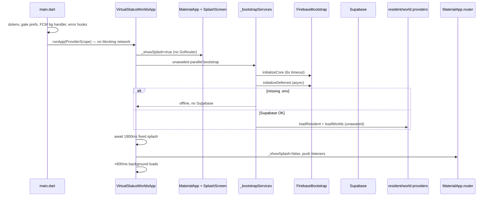
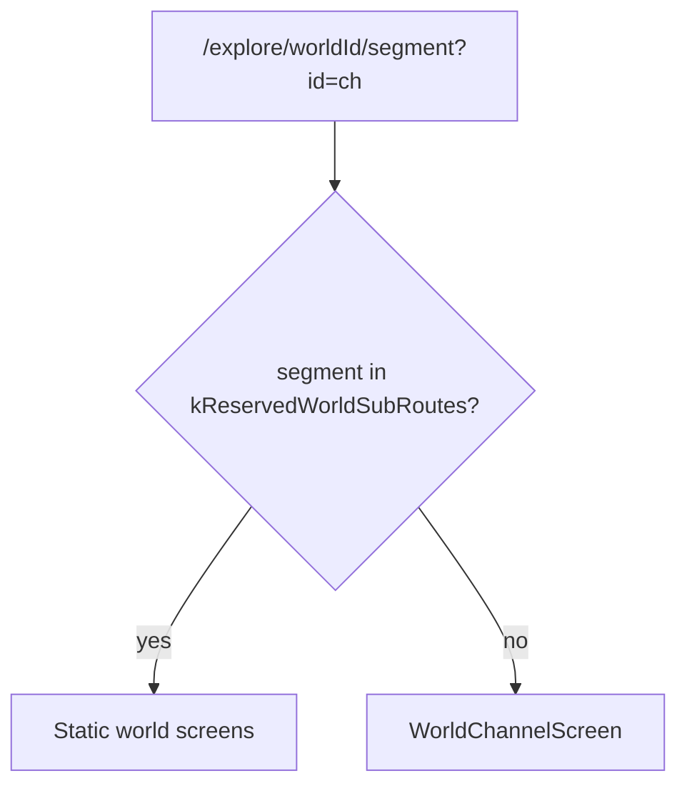
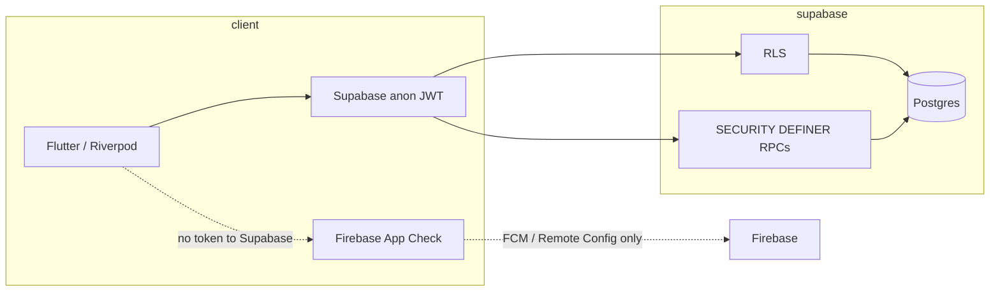
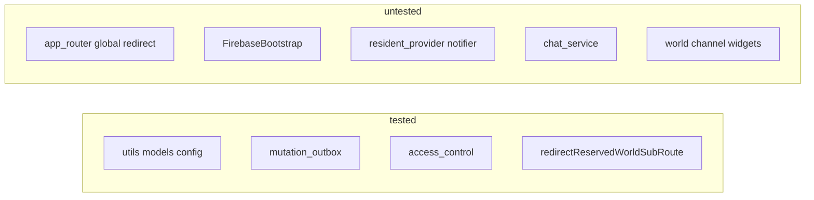
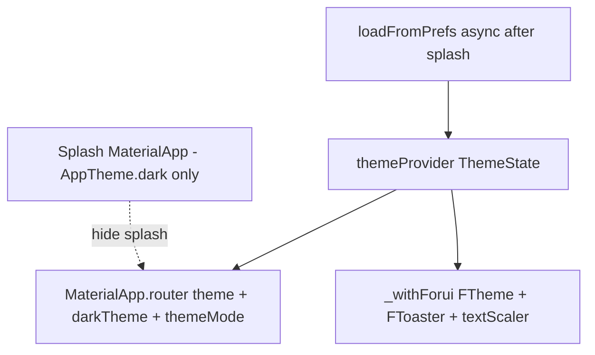
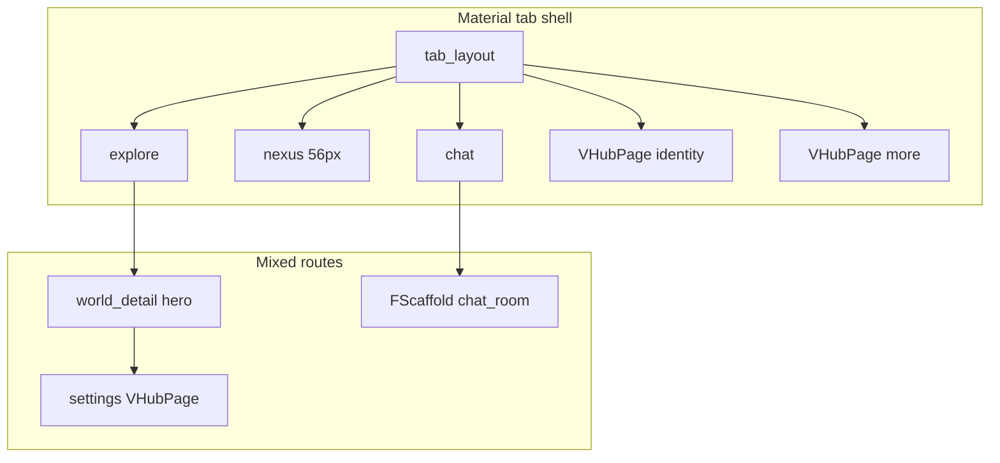

# Vertiege — consolidated legacy audits

**Status:** Archived — read for history only. Superseded for active work by [PLAN.md](../../PLAN.md).

**Consolidated:** 2026-06-05 — 22 source documents.

## Index

| # | Source |
|---|--------|
| 1 | `docs/archive/audits/2026-05-21-baseline-audit.md` |
| 2 | `docs/archive/audits/2026-05-21-migration-reconciliation.md` |
| 3 | `docs/archive/audits/2026-05-21-security-advisor.md` |
| 4 | `docs/archive/audits/2026-05-22-condition-audit.md` |
| 5 | `docs/archive/audits/2026-05-22-uat-fixes.md` |
| 6 | `docs/archive/audits/2026-05-24-cursor-cli-audit.md` |
| 7 | `docs/archive/audits/2026-05-24-cursor-swarm-audit.md` |
| 8 | `docs/archive/audits/2026-05-24-cursor-swarm-ui-ux-audit.md` |
| 9 | `docs/archive/audits/2026-05-24-fix-tracker.md` |
| 10 | `docs/archive/audits/2026-05-24-gamification-vision-gap-audit.md` |
| 11 | `docs/archive/audits/2026-05-24-ui-ux-fix-tracker.md` |
| 12 | `docs/archive/audits/2026-05-25-full-codebase-audit.md` |
| 13 | `docs/archive/audits/2026-05-25-routing-remediation.md` |
| 14 | `docs/archive/audits/2026-05-26-mass-swarm-audit.md` |
| 15 | `docs/archive/audits/2026-05-28-supabase-audit.md` |
| 16 | `docs/archive/audits/accessibility-audit.md` |
| 17 | `docs/archive/audits/product-gap-audit.md` |
| 18 | `docs/archive/audits/rls-audit.md` |
| 19 | `docs/archive/completed-plans/2026-05-19/full-app-audit-and-overhaul-plan.md` |
| 20 | `docs/archive/completed-plans/2026-05-19/opencode-full-app-audit.md` |
| 21 | `docs/archive/cursor/cursor-cli-audit.md` |
| 22 | `docs/archive/plans/2026-05-21-full-app-audit.md` |

---

## Source: `docs/archive/audits/2026-05-21-baseline-audit.md`

# Baseline audit — 2026-05-21

**Branch:** `develop`  
**Project:** `wjaphoaxalvgjnrwqjwe`  
**Scope:** Code health, Supabase drift, security (local SQL review), UI/UX static, persistence, product gaps.

---

## Executive summary

| Area | Status | Top action |
|------|--------|------------|
| **Code health** | Pass | 108 tests; analyze exit 0 (405 info lints) |
| **Supabase migrations** | **Reconciled (2026-05-21)** | 12 active local files match remote tail; May-12 history documented — see [migration-reconciliation](./2026-05-21-migration-reconciliation.md) |
| **Security** | **Advisor run** | 0 errors, 6 WARN categories — see [security-advisor](./2026-05-21-security-advisor.md) |
| **UI/UX (static)** | In progress | 25 files still use glass/legacy widgets; custom `_GlassNavBar` |
| **UI/UX (device)** | In progress | See [DEVICE_UAT.md](../DEVICE_UAT.md) — league tester issues logged 2026-05-22 |
| **Persistence** | Partial | Repositories exist for 5 domains; prefs still used for cache/UI prefs |
| **Push** | **Partially verified** | `device_tokens` = 3 rows on remote (2026-05-21); device delivery still needs your smoke test |

---

## 1. Code baseline

```text
flutter analyze --no-fatal-infos --no-fatal-warnings  → exit 0 (405 info issues, 0 errors/warnings)
flutter test                                         → 108 passed
```

No analyzer errors or warnings with project flags. Info-level lints are mostly `prefer_const_constructors` / `avoid_redundant_argument_values`.

---

## 2. Supabase migration drift (critical)

`npx supabase migration list --linked` shows **divergent history**:

### Applied on remote, no matching local file (on `develop`)

Remote-only versions (May 12 era + recent):

- `20260512070535` … `20260513144900` (many)
- `20260520121347` (remote; local has **`20260520121327`** instead — likely superseded rename)
- `20260520130000` — security corrective
- `20260520140000` — `create_world_full` RPC
- `20260520150000` — daily rewards and events

These exist on the **linked remote** but are **not** in the current `develop` tree (18 local migration files only).

### Local files not applied on remote

- Entire fresh-schema block: `20260515` … `20260519_001`, `20260519_add_rpc`, etc.
- `20260520121327_tighten_device_token_rls.sql`

### In sync (local + remote)

- `20260519144052` … `20260519193753`
- `20260520080241_firebase_storage_and_notification_completion`
- `20260520115334_secure_notification_webhook_secret`

**Verdict:** Do **not** run `supabase db push` until history is reconciled (pull missing remote SQL into repo, or document intentional remote-only migrations). See [PLAN.md](../../PLAN.md) Phase 6.

**Manual (you):** In Supabase Dashboard → Database → Migrations, confirm the three `202605201*` migrations on remote match what you expect in production.

---

## 3. Security (local review + manual dashboard)

### From repo / prior REPORT (still relevant)

- Supabase linter: functions missing `SET search_path`, `SECURITY DEFINER` callable by `anon`
- Weak RLS (`USING (true)`) on `debug_logs`, `league_participants`
- Public **listing** on `avatars` / `post-media` buckets
- `pg_net` in public schema

### Local migration coverage on `develop`

- `20260520121327_tighten_device_token_rls.sql` — **not on remote** (remote has `20260520121347`)
- Corrective migrations `20260520130000`, `20260520140000`, `20260520150000` — **on remote, not in local repo**

### RLS doc status

[rls-audit.md](./rls-audit.md) still lists many tables as “Requires Verification”. Refresh after drift fix.

**Manual (you):**

1. Supabase Dashboard → **Advisors** → Security — export or screenshot findings.
2. SQL editor: confirm `device_tokens` RLS allows insert only for `auth.uid()`.
3. Storage → Policies — check list vs read on public buckets.

---

## 4. UI/UX — static

### Navigation (updated vs old product-gap audit)

Bottom tabs on `develop`: **5 tabs** — Nexus, Explore (`/explore`), Chat, Identity, More — matches PLAN Phase 4 target.

`TabLayout` still uses custom **`_GlassNavBar`** (glass bottom nav), not `VBottomNav` / Forui nav.

### Legacy UI (25 files)

Still reference `GlassPanel`, `GlassSheet`, or `SovereignCard`:

- Core: `glass_panel.dart`, `glass_sheet.dart`, `sovereign_card.dart`, `screen_loading.dart`, `loading_state.dart`
- Worlds: `world_card`, `world_feed_tab`, `world_detail_members`, `chat_preview_panel`, `banner_generator`, …
- Screens: `world_detail_screen`, `alerts_screen`, `ascension_path_screen`
- Nexus: `bento_grid`, `world_invite_section`
- Feed/chat: `post_item`, `chat_input_bar`

`GoogleFonts` — **0 matches** in `lib/` (good).

`BackdropFilter` / `LinearGradient` — ~28 files (many intentional: banners, share cards, splash, image viewer).

### Auth callback

[auth_callback.dart](../../lib/screens/auth/auth_callback.dart) now loads session, resident, and routes to `/`, onboarding, or gate — **not** a placeholder (product-gap #2 outdated).

### “Coming soon” copy (sample)

- `cosmetics_shop_screen.dart`, `world_settings_screen.dart`, `edit_profile_sheet.dart`

### Realtime (updated)

- Posts: `post_provider.dart` subscribes to `posts_realtime`
- Chat: `chat_provider.dart` DM/channel subscriptions
- Notifications: FCM foreground + `PushService` stream (not full Postgres realtime for all tables)

---

## 5. Persistence & repositories

### Repositories present (5)

- `post_repository`, `world_repository`, `profile_repository`, `notification_repository`, `event_repository`

No dedicated repositories yet for: chat messages (service-layer), marketplace, treasury, quests, polls, achievements (per PLAN Phase 7).

### SharedPreferences usage (non-authoritative OK)

| Area | File | Role |
|------|------|------|
| Theme | `theme_provider.dart` | UI preference |
| Search | `search_screen.dart` | Recent searches |
| Settings | `settings_screen.dart` | Local prefs |
| Gate | `the_gate_screen.dart` | Onboarding flags |
| Channels | `world_channel_list.dart` | Channel list cache |
| Offline | `offline_queue.dart` | Legacy queue (deprecated path) |
| Storage | `storage_service.dart` | Debounced string cache |

**Risk:** Chat/posts may still treat cache as primary in some paths — confirm on device after “clear app data” (REPORT handoff).

Repositories grep: no naive `return []` in `lib/repositories/` (good).

---

## 6. Firebase / push

- `PushTokenService` upserts `device_tokens`; debug logging to `debug_logs`
- Edge function + webhook secret migration applied on remote (`20260520115334`)
- **Last known state:** 0 rows in `device_tokens` after login (REPORT 2026-05-20)

**Manual (you):**

1. Install latest **CI APK** from `develop` Actions artifact (or `flutter run` debug).
2. Log in as Immabe, accept notification permission.
3. Supabase Table Editor → `device_tokens` — expect ≥1 row.
4. If empty: check `debug_logs`, or `adb logcat` for Firebase init errors.

---

## 7. Accessibility (not re-tested on device)

Prior [accessibility-audit.md](./accessibility-audit.md):

- Text scale table still “Unknown”
- World rail 44×44 → should be 48×48
- ~25 IconButtons without tooltip (roughly 28 tooltips vs 53 IconButtons in codebase scan)

**Manual (you):** System font size 1.3× and 1.6× on Nexus, Chat, World detail.

---

## 8. Prioritized backlog (P0 → P2)

### P0 — Blockers

| ID | Item | Status |
|----|------|--------|
| S1 | **Migration drift** | Done — see [2026-05-21-migration-reconciliation.md](./2026-05-21-migration-reconciliation.md) |
| S2 | `20260520121327` → `20260520121347` | Done |
| S3 | Supabase Security Advisor | Done — [2026-05-21-security-advisor.md](./2026-05-21-security-advisor.md); enable leaked-password protection in dashboard |

### P1 — High (user-visible / trust)

| ID | Item | PLAN phase |
|----|------|------------|
| U1 | Device UAT: world rail names, tabs, create world, empty states | Phase 1 |
| U2 | Finish glass → Forui migration (25 files + nav bar) | Phase 3 |
| P1 | Push token registration on real device | Phase 9 |
| D1 | Persistence audit after clear-app-data | Phase 7 |

### P2 — Medium

| ID | Item |
|----|------|
| R1 | Refresh [rls-audit.md](./rls-audit.md) table-by-table |
| R2 | Refresh [product-gap-audit.md](./product-gap-audit.md) (tabs, auth, realtime sections outdated) |
| A1 | Accessibility device pass |
| C1 | Remove/replace “coming soon” where features should ship |

---

## 9. Manual checklist (your tasks)

- [x] Supabase **Security Advisor** — 0 errors, 6 WARN types ([security-advisor](./2026-05-21-security-advisor.md))
- [x] Remote migrations `20260520130000`, `140000`, `150000` — restored into repo
- [ ] **Device UAT** (~30 min): use [DEVICE_UAT.md](../DEVICE_UAT.md) checklist
- [x] **League tester blockers (2026-05-22):** channels/search/members — root cause `world_members` + slug join (see DEVICE_UAT)
- [x] **Verifier portal:** `/verifier/login` — profession + achievement review ([VERIFIER_PORTAL.md](../VERIFIER_PORTAL.md))
- [x] **Identity badges:** profession badges from `verifiedRoles` (not shop decorations)
- [ ] **Push smoke:** login → `device_tokens` row → test notification insert
- [ ] **Clear app data** test: posts/chat still recover from Supabase after relaunch
- [ ] Re-test channels/search after APK with slug-join fix (`1d081f0+`)

---

## 10. Release workflow (2026-05-21)

- **Push `develop`** after meaningful batches so CI builds the APK artifact.
- **`main` / Release APK** only after: audits addressed, CI green, your manual device pass, and any fixes.
- **Device UAT** is owner-run at the end; report screen + expected vs actual.

### Agent progress

- [x] Migration reconciliation
- [x] Security advisor documented
- [x] `20260521120000_security_followup` applied to remote
- [x] Product-gap + RLS audits refreshed
- [x] Chat world rail readability
- [x] Glass rename → `VSurfacePanel`, `VLoadingCard`, `_AppNavBar`, `showAppSheet`
- [x] Verifier portal + achievement review queue
- [x] Slug `world_members` join fix (CI `1d081f0`)
- [ ] Full device checklist — [DEVICE_UAT.md](../DEVICE_UAT.md)

---

## Commands reference

```bash
flutter analyze --no-fatal-infos --no-fatal-warnings
flutter test
npx supabase migration list --linked
rg "GlassPanel|GlassSheet|SovereignCard" lib --glob "*.dart"
```

---

## Source: `docs/archive/audits/2026-05-21-migration-reconciliation.md`

# Migration reconciliation — 2026-05-21

## Actions taken (repo)

1. Restored from git history:
   - `20260520130000_security_corrective.sql`
   - `20260520140000_create_world_full_rpc.sql`
   - `20260520150000_daily_rewards_and_events.sql`
2. Renamed `20260520121327` → **`20260520121347`** to match remote version (same SQL).
3. Moved **fresh-project-only** SQL to `supabase/migrations_archive/fresh_project_only/` (10 files).
4. Active `supabase/migrations/` now has **12 files** aligned with remote tail + shared May-19 block.

## Remote migration manifest (32 applied)

| Version | Name |
|---------|------|
| 20260512070535 | add_chat_message_media |
| 20260512070617 | align_posts_rls_author_id_uuid |
| 20260512070627 | add_channel_message_media |
| 20260512071003 | supabase_advisor_hardening |
| 20260512071057 | cover_remaining_fk_indexes |
| 20260512071422 | restrict_public_storage_listing |
| 20260512071530 | restrict_security_definer_execute |
| 20260512071607 | revoke_public_security_definer_execute |
| 20260512122347 | add_profile_local_world_ids |
| 20260513044723 | add_achievement_proofs_bucket |
| 20260513045331 | harden_rls_helpers_and_auth_policy_calls |
| 20260513045455 | consolidate_permissive_rls_policies |
| 20260513045523 | split_districts_manage_policy |
| 20260513045608 | replace_thread_count_rpc_with_trigger |
| 20260513091257 | cloud_default_worlds |
| 20260513092742 | achievement_cloud_submission_contract |
| 20260513093719 | dedupe_user_achievement_policies |
| 20260513143811 | restore_private_rls_function_grants |
| 20260513144019 | backfill_profile_world_memberships |
| 20260513144637 | harden_profile_and_member_rls |
| 20260513144900 | define_private_rls_helpers |
| 20260519144052 | phase2_rls_policy_fix |
| 20260519144556 | seed_default_world_channels |
| 20260519145412 | chat_persistence_hardening |
| 20260519145904 | grant_immabe_superuser |
| 20260519193753 | fix_world_members_policy_recursion |
| 20260520080241 | firebase_storage_and_notification_completion |
| 20260520115334 | secure_notification_webhook_secret |
| 20260520121347 | tighten_device_token_rls |
| 20260520130000 | security_corrective |
| 20260520140000 | create_world_full_rpc |
| 20260520150000 | daily_rewards_and_events |

Versions `20260512070535`–`20260513144900` are **not** checked in as files (already on remote). New clones should use `migration repair` (see [supabase/migrations/README.md](../../supabase/migrations/README.md)).

## Verify

```bash
npx supabase migration list --linked
```

Expect local filenames’ version prefixes to match remote for all files in `supabase/migrations/`.

---

## Source: `docs/archive/audits/2026-05-21-security-advisor.md`

# Security advisor — 2026-05-21

**Project:** `wjaphoaxalvgjnrwqjwe`  
**Source:** Supabase MCP `get_advisors` (security)

## Summary

| Level | Count (unique issue types) |
|-------|------------------------------|
| ERROR | 0 |
| WARN | 6 categories (~70 lint rows due to per-function duplication) |

No critical ERROR-level findings. Remaining items are hardening and policy tuning.

---

## Findings

### 1. Extension in public schema

- **Issue:** `pg_net` in `public`
- **Remediation:** [Extension in public](https://supabase.com/docs/guides/database/database-linter?lint=0014_extension_in_public)
- **Note:** Often acceptable for Edge/webhooks; move only if you do not rely on default `pg_net` placement.

### 2. Permissive RLS — `debug_logs`

- **Issue:** `debug_logs_authenticated_insert` uses `WITH CHECK (true)` for authenticated inserts
- **Remediation:** [Permissive RLS](https://supabase.com/docs/guides/database/database-linter?lint=0024_permissive_rls_policy)
- **Note:** Intentional for client diagnostics; tighten to `resident_id = auth.uid()::text` when push debugging is stable.

### 3. Public bucket listing — `avatars`, `post-media`

- **Issue:** Broad SELECT policies allow listing all objects in bucket
- **Remediation:** [Public bucket listing](https://supabase.com/docs/guides/database/database-linter?lint=0025_public_bucket_allows_listing)
- **Repo:** Partially addressed in `20260520130000_security_corrective.sql` (on remote). Re-run advisor after next storage policy migration if still WARN.

### 4. SECURITY DEFINER callable by `anon` / `authenticated`

- **Issue:** Many RPCs and helpers (e.g. `add_comment`, `create_world_full`, `is_world_member`, `toggle_reaction`, …) executable via PostgREST
- **Remediation:** [Anon DEFINER](https://supabase.com/docs/guides/database/database-linter?lint=0028_anon_security_definer_function_executable) · [Authenticated DEFINER](https://supabase.com/docs/guides/database/database-linter?lint=0029_authenticated_security_definer_function_executable)
- **Repo:** `20260520130000_security_corrective.sql` revokes **mutating** RPCs from `anon`; **RLS helper** functions (`is_world_member`, `is_superuser`, …) may still warn because policies reference them — review case-by-case before revoking.
- **Next migration:** Revoke `anon` on remaining mutators; grant `authenticated` only; keep helpers as `SECURITY DEFINER` with fixed `search_path` but restrict `EXECUTE` to `authenticated` + `service_role` where possible.

### 5. Leaked password protection disabled

- **Issue:** HaveIBeenPwned check off for Auth
- **Remediation:** [Password security](https://supabase.com/docs/guides/auth/password-security#password-strength-and-leaked-password-protection)
- **Manual:** Dashboard → Authentication → Settings → enable leaked password protection.

---

## Verified healthy

- `device_tokens`: **3 rows** (push registration working as of 2026-05-21)
- `debug_logs`: 22 rows (diagnostics active)
- RLS on `device_tokens`: own-row policies (`20260520121347` on remote)

---

## Recommended order

1. Enable leaked password protection (dashboard, 2 min)
2. New migration: complete anon revoke for remaining mutating RPCs + narrow `debug_logs` insert
3. Storage policy pass for avatars/post-media (no public list)
4. Re-run `get_advisors` security after deploy

---

## Source: `docs/archive/audits/2026-05-22-condition-audit.md`

# Condition audit — 2026-05-22

**Branch:** `develop` @ `0bd9e3b`  
**Prior baseline:** [2026-05-21-baseline-audit.md](./2026-05-21-baseline-audit.md)  
**Scope:** Current app health, issue classes from device/league UAT, release readiness vs `main`.

---

## Executive summary

| Area | Status | Notes |
|------|--------|--------|
| **CI / tests** | Green (verify) | Run `26264586742`: analyze + test passed; APK build in progress at audit time |
| **Code health** | Pass | 108/108 tests locally; analyze exit 0 (info lints only) |
| **Supabase** | Reconciled | Migration drift resolved 2026-05-21; `security_followup` applied |
| **Device blockers (league)** | Mitigated in code + SQL | Slug join, `world_members` backfill; needs APK UAT on `0bd9e3b` |
| **Install / APK** | Documented | User 11 clone uninstall; CI debug signing; ~132 MB release size normal |
| **UI (Forui)** | Partial | Hub/settings/discover/world cards improved; ~27 files still legacy glass/sovereign |
| **Create world** | Fixed in code | Validation + dominion required; rate limit throws (not fake id) |
| **Verifier** | Shipped | Portal + deep link; not in Settings (by design) |
| **Push** | Unverified on device | Server path exists; `device_tokens` smoke still open |
| **Promote to `main`** | **Hold** | Owner device UAT on latest CI APK before promote |

**Verdict:** Safe to **test** on device with CI APK from `0bd9e3b`. **Not** ready to promote to `main` until [DEVICE_UAT.md](../DEVICE_UAT.md) checklist is filled for this build.

---

## Issue taxonomy (what you are dealing with)

### A. Environment / install (not app logic)

| Symptom | Typical cause | Mitigation |
|---------|----------------|------------|
| Black screen on launch | Missing `.env` in APK | CI embeds secrets; `dotenv.load(isOptional: true)` |
| “Package conflicts” after uninstall | Package still on another Android user (e.g. `system_clone` user 11) | `adb shell pm uninstall --user N com.vertiege` |
| Cannot install CI APK over local build | Different signing keys (CI debug vs local keystore) | Full uninstall, then install CI artifact |
| Data “comes back” after reinstall | Supabase account state (expected) | Not a failed uninstall |

### B. Data / membership (Supabase)

| Symptom | Root cause | Fix status |
|---------|------------|------------|
| Empty channels / members in slug worlds | `joined_world_ids` without `world_members`; slug treated as non-remote | Code: `isRemoteWorldId` + join; SQL backfill for testers |
| Search cannot find users globally | Search scoped to `world_members` in shared worlds | **Open** — product gap |
| League ≠ world access | League tables separate from `world_members` | Documented in DEVICE_UAT |

### C. Product / routing

| Symptom | Root cause | Fix status |
|---------|------------|------------|
| Create World appeared dead | Weak validation; rate limit returned `'rate_limited'` as id | **Fixed** `0bd9e3b` |
| Verifier link opened player login | Deep link `vertiege://verifier/login` mapped wrong | **Fixed** router + staff link on login |
| Subscription “missing” for tier 1 | Router blocks `/subscription` when `tier < 2` | By design; UX copy pending |
| Achievement “Pending Review” in app | AI stub; queue in verifier portal | Staff use verifier APK build |

### D. UI / Forui migration

| Symptom | Root cause | Fix status |
|---------|------------|------------|
| Pink glow / unreadable discover cards | `SovereignCard` on world list | `plainStyle` + `FCard.raw` on discover |
| Settings vs More inconsistent | Mixed legacy + Material | `VHubPage` + `VSectionList` on hub screens |
| Tab bar still “glass” feel | Custom `_AppNavBar` (renamed from glass) | Minimal surface nav; not `FBottomNavigationBar` yet |
| Create world form still legacy | Not migrated to `FTextField` / Forui form | **Open** |

### E. Release process

| Gate | Status |
|------|--------|
| `develop` CI verify | Pass on `0bd9e3b` |
| CI APK artifact | Build after verify (standard workflow) |
| Device UAT | Owner-run — checklist mostly empty |
| `main` / GitHub Release | Last success tied to `7a17470` era; wait for UAT on `0bd9e3b` |

---

## 1. Code baseline (2026-05-22)

```text
flutter test  → 108 passed (local)
CI verify job → analyze + test success (run 26264586742)
```

Legacy UI footprint (grep):

- `GlassPanel` / `GlassSheet` / `SovereignCard`: **~27 widget files** (down from ~25 screens+widgets in baseline; core renamed to `VSurfacePanel` / `VLoadingCard` in places but grep still hits `glass_*.dart` and `sovereign_*.dart`).
- Forui hub pattern: `VHubPage`, `VSectionList`, `FCard.raw`, `plainStyle` on discover — **6 areas** migrated.
- Bottom nav: `_AppNavBar` in `tab_layout.dart` — solid surface, not Forui `FBottomNavigationBar`.

Stub / placeholder services (still present):

- `ai_verification_service.dart` — TODO real vision API
- `moderation_filter.dart` — TODO real moderation API

---

## 2. Fixes landed since baseline (commit chain)

| Commit | What |
|--------|------|
| `4b71448` | Verifier portal, achievement review queue, world join |
| `1d081f0` | `localOnlyWorldIds = {nexus}` — no remote join for Nexus |
| `7a17470` | Docs: verifier, DEVICE_UAT, workflow |
| `0bd9e3b` | Forui hub/discover/settings; create-world validation; discover/world detail readability; verifier deep link on login |

---

## 3. Security & backend (unchanged risk profile)

See [2026-05-21-security-advisor.md](./2026-05-21-security-advisor.md) and [rls-audit.md](./rls-audit.md).

- 0 Security Advisor **errors**; 6 WARN categories (search_path, leaked password protection manual toggle, etc.).
- Verifier access: `app_metadata.is_verifier` + `VERIFIER_ADMIN_EMAILS`; RLS on review tables.
- **Manual:** Enable leaked-password protection in Supabase dashboard if not done.

---

## 4. Device UAT status

[DEVICE_UAT.md](../DEVICE_UAT.md) checklist: **not signed off** for build `0bd9e3b`.

**Must re-test on new APK:**

1. Cold start / login (no black screen)
2. Channels + members in `neon-district` / `crystal-shore`
3. Create world (validation messages, success path)
4. Discover / world detail readability
5. Verifier: staff link or `vertiege://verifier/login`
6. Push: `device_tokens` row after permission
7. Clear app data → posts/chat recover

**Install note for OPPO / dual-user:** If `pm list packages` still shows app after drawer uninstall, uninstall **user 11** (or loop users).

---

## 5. Prioritized backlog (updated)

### P0 — Before `main`

| ID | Item |
|----|------|
| D0 | Device UAT on CI APK `0bd9e3b` (all checklist rows) |
| D1 | Confirm create-world E2E on device (not just unit tests) |
| D2 | Verifier smoke on device (deep link + profession/achievement tabs) |

### P1 — High (user-visible)

| ID | Item |
|----|------|
| U1 | Finish Forui migration (~27 legacy files + `FBottomNavigationBar` optional) |
| U2 | Create world screen → Forui form fields |
| U3 | Global profile search (or clear UX that search is world-scoped) |
| U4 | Subscription gate UX for tier 1 (explain upgrade path) |
| P1 | Push delivery smoke on device |

### P2 — Medium

| ID | Item |
|----|------|
| R1 | Replace AI/moderation stubs or hide “pending” until real |
| R2 | Deep links for notification/post targets |
| R3 | Accessibility device pass (font scale, tap targets) |
| C1 | “Coming soon” only where truly deferred (shop, world settings, profile) |

### P3 — Product (optional)

| ID | Item |
|----|------|
| X1 | Separate verifier flavor or web console (vs second tiny APK) |

---

## 6. What is in good shape

- Five-tab IA stable; auth callback not a placeholder.
- Realtime on posts + chat; repositories for core domains.
- Migration history reconciled; security followup migration applied.
- Unit/integration tests green; CI verify job green on latest push.
- League tester issues have **documented root causes** and code/SQL mitigations.
- Verifier workflow separated from player Settings.

---

## 7. Release recommendation

1. Wait for CI **build-apk** on run `26264586742` (or latest green `develop` run).
2. Install via `adb uninstall` (all relevant users) → `adb install -r` artifact.
3. Run [DEVICE_UAT.md](../DEVICE_UAT.md); update checklist table in that file.
4. If pass → merge/promote `develop` → `main` per [DEVELOPMENT_WORKFLOW.md](../DEVELOPMENT_WORKFLOW.md).
5. If fail → log row in DEVICE_UAT + fix on `develop`; do not promote.

---

## References

- [DEVICE_UAT.md](../DEVICE_UAT.md)
- [VERIFIER_PORTAL.md](../VERIFIER_PORTAL.md)
- [DEVELOPMENT_WORKFLOW.md](../DEVELOPMENT_WORKFLOW.md)
- [product-gap-audit.md](./product-gap-audit.md)
- [2026-05-21-baseline-audit.md](./2026-05-21-baseline-audit.md)

---

## Source: `docs/archive/audits/2026-05-22-uat-fixes.md`

# UAT fixes — 2026-05-22

Applied after device UAT session (Immabe / superuser). Install latest CI APK from `develop` after green build.

## Fixed in this batch

| Issue | Fix |
|-------|-----|
| Create world `sort_order` overflow | Use seconds, not ms (`world_service.dart`) |
| Post images not showing | Sync cloud URL after upload; `PostImage` supports local files; merge slug-world posts on load |
| Subscription screen bounce | Removed `tier < 2` redirect on `/subscription` |
| DM list shows UUID | Enrich `dm_rooms` with `profiles.name` in `ChatService.getRooms` |
| False “online” in DMs | Presence from `last_seen_at` only; default offline |
| League “View Standings” dead | `context.push('/leagues')` instead of `Navigator.pushNamed` |
| Daily quest card dead tap | `BentoCard.onTap` → `/challenges` |
| Nexus bento uneven heights | Min height on small tiles |
| World detail header stuck | Tab bar `pinned: false` |
| Posts missing after clear data | Merge global + per–joined-world Supabase fetch |
| No notification permission prompt | `permission_handler` on Android before FCM |
| Identity refresh unclear | Reload posts + snackbar (stays on Identity) |
| Image upload silent fail | Snackbar path when upload returns null |

## Still open / follow-up

- Identity → full `VHubPage` Forui pass (layout still “odd”)
- World detail visual redesign (readable but ugly)
- Chat world rail: sort by last activity + unread badges
- Achievement verifier thumbnails for `proof_uri: manual` submissions
- Full world-detail single-scroll architecture (NestedScrollView)

## Install

```powershell
gh run list --repo Immabe96/Vertiege --branch develop --limit 1
gh run download <RUN_ID> -n vertiege-apk-<RUN_ID> -D build/ci-artifacts/latest
adb uninstall com.vertiege
adb install -r build/ci-artifacts/latest/app-release.apk
```

---

## Source: `docs/archive/audits/2026-05-24-cursor-cli-audit.md`

# Vertiege codebase audit (Cursor CLI)

- **Date:** 2026-05-24
- **Mode:** ask (read-only)
- **Tool:** Cursor Agent CLI (`agent`)

---

---

## Source: `docs/archive/audits/2026-05-24-cursor-swarm-audit.md`

# Vertiege swarm audit

- **Date:** 2026-05-24
- **Model:** `composer-2.5` (Cursor CLI)
- **Preset:** research (Research Team)
- **Mode:** ask
- **Run artifacts:** `/home/immabe/Vertiege/.swarm/runs/2026-05-24T13-55-51`

---

# Vertiege Flutter codebase audit

**Date:** 2026-05-24  
**Scope:** Read-only audit of `develop` (Linux dev session + uncommitted startup/router work)  
**Sources:** Cursor swarm researchers (shell/routing, security/data, testing/build) + reviewer synthesis  
**Prior stubs:** `docs/audits/2026-05-24-cursor-swarm-audit.md` (SWARM_OK only), `docs/audits/2026-05-24-cursor-cli-audit.md` (empty) — superseded by this report  
**Cross-checks:** `docs/linux-setup-session-2026-05-24.md`, `docs/audits/2026-05-21-baseline-audit.md`, `rls-audit.md`, `2026-05-21-security-advisor.md`, `product-gap-audit.md`, `2026-05-22-condition-audit.md`

**Terminology:** “Linux port” in repo docs means **developing on Arch Linux** with **Android as the run target**, not shipping a Flutter **linux desktop** binary. `DefaultFirebaseOptions` rejects `TargetPlatform.linux`; Firebase-dependent features are off on desktop `flutter run` on a Linux host.

---

## Executive summary

Vertiege is a Flutter + Riverpod + GoRouter app backed by Supabase (JWT + RLS) with Firebase used for Crashlytics, Remote Config, FCM, and App Check on mobile. Recent Linux-session work improved cold start by deferring Firebase/Supabase to `app.dart`, using a lightweight splash shell, and splitting Firebase into core vs deferred init — design matches `docs/linux-setup-session-2026-05-24.md` and is **confirmed in code**.

**Strengths:** Clear world-channel URL contract (`/explore/{worldId}/{name}?id={channelId}`); tested `redirectReservedWorldSubRoute` helper; mutation outbox for worlds/posts/chat; solid unit tests for access control, outbox replay, and FCM route mapping; graceful Firebase/Supabase timeouts.

**Highest risks (no verified auth bypass without RLS failure):**

| Priority | Issue |
|----------|--------|
| **High** | Sign-out clears Riverpod only — mutation outbox and disk caches (resident, chat) are **not** cleared (`session_reset.dart`). |
| **High** | Profile upsert can write tier/gate/coins; escalation trigger exists only in **archive** SQL — production policies not verified in repo migrations. |
| **High** | `chat_service_test.dart` is a no-op; **`app_router` global redirect** (auth, gate, verifier, Android deep links) has **zero** tests despite recent fixes. |
| **High** | **Duplicate** `Connectivity().onConnectivityChanged` listeners in `app.dart` (verified L61–72) — leaked subscription + duplicate callbacks. |

**Linux session status:** Black screen, Riverpod self-dependency, channel URLs, and `auth` host deep link are **resolved in tree**. **ANR fix is coded but not device-verified** (linux doc). **Gate flow bug:** OAuth callback navigates to `/the-gate` when gate incomplete, but router only allows `/onboarding` — `/the-gate` is immediately redirected away.

**May audits still open:** RLS on many tables, push E2E, partial offline/realtime (`product-gap-audit.md`, `2026-05-22-condition-audit.md`). Promote to `main` remains **held** pending device UAT.

---

## Architecture

### Cold start sequence



**Design intent** (`docs/linux-setup-session-2026-05-24.md`): first paint before network; split Firebase core (Crashlytics) vs deferred (App Check, Analytics, Performance, Remote Config); splash dismiss is **time-based**, not gated on bootstrap completion.

```13:38:lib/main.dart
void main() async {
  WidgetsFlutterBinding.ensureInitialized();
  FirebaseMessaging.onBackgroundMessage(firebaseMessagingBackgroundHandler);
  // ... error handlers ...
  await dotenv.load(isOptional: true);
  await loadGateCompletionStatus();

  // Show Flutter UI immediately — Firebase/Supabase init runs after first frame.
  runApp(const ProviderScope(child: VirtualStatusWorldsApp()));
}
```

### Provider and router wiring

| Layer | Role |
|--------|------|
| `ProviderScope` | Root in `main.dart` |
| `goRouterRefreshProvider` | `GoRouterRefresh` + `residentProvider` select tuple + Supabase `onAuthStateChange` |
| `appRouterProvider` | Single `GoRouter` with global `redirect` |
| `residentMilestoneListenerProvider` | Side-effect `ref.listen` (fixes prior self-dependency in `ResidentNotifier.build`) |
| Post-splash `app.dart` | Watches milestone listener, resident, `appRouterProvider` |

**Shell:** `StatefulShellRoute.indexedStack` — `/`, `/explore`, `/chat`, `/identity`, `/more`.

**World tree:** `/explore/:worldId` → static children (`settings`, `members`, `marketplace`, …) + catch-all `:channelName` → `WorldChannelScreen` with `redirectReservedWorldSubRoute`.

### World channel URL contract

**Canonical:** `/explore/{worldId}/{channelName}?id={channelId}`

- Shortcuts/teaser use `context.push` with `?id=` query.
- `WorldChannelScreen` keys chat off **query** `id`, not the path segment.



**Reserved segments:** `members`, `settings`, `marketplace`, `polls`, `treasury`, `challenges` (`world_route_redirects.dart`). `announcements` is **not** reserved (intentional per tests).

### Platform: Linux host vs Linux desktop target

| Area | Android/iOS | Linux desktop `TargetPlatform.linux` |
|------|-------------|--------------------------------------|
| Firebase | Configured | `UnsupportedError` in `firebase_options.dart` |
| Bootstrap | Full stack | Core init fails gracefully; console CrashReporter |
| FCM / push | Registered | No Linux path |
| App Check | Play Integrity / DeviceCheck | Skipped when Firebase unavailable |
| Deep links | `uri.host == 'auth'|'verifier'` | N/A on desktop run |

### Security boundary (client)



---

## Security

### Credentials and configuration

- `dotenv.load(isOptional: true)` in `main.dart`; missing `SUPABASE_URL` / `SUPABASE_ANON_KEY` → offline mode, no Supabase init (`app.dart`).
- `.env` is gitignored; CI injects secrets. Client ships **anon** JWT only — correct for mobile; treat as public.
- **Risk:** `SUPERUSER_EMAILS` / `VERIFIER_ADMIN_EMAILS` in dotenv parsed client-side (`admin_access_service.dart`) — affects **UI/router only**, not Postgres unless mirrored in JWT metadata.

### Firebase App Check vs Supabase

- App Check activates after Firebase core; debug providers in `kDebugMode`.
- **No** App Check token on Supabase REST/RPC — trust model is **JWT + RLS**.
- Skipped when Firebase fails (typical Linux desktop dev).

### Auth and gates

| Path | Notes |
|------|--------|
| Email/password | UI min password length 6; leaked-password protection **off** per Security Advisor |
| OAuth | `vertiege://auth/callback`; Android `uri.host == 'auth'` rewrite in router |
| Session | `SecureStorageService` duplicates tokens; Supabase SDK owns session — no restore path found |
| Sign-out | Clears Supabase + Riverpod; **does not** clear disk outbox/caches (see findings) |
| Verifier | `VerifierSession` in-memory + `app_metadata` or env email lists |

**Gate inconsistency (verified):**

```48:49:lib/screens/auth/auth_callback.dart
      } else if (!resident.gateCompleted) {
        context.go('/the-gate');
```

```181:186:lib/router/app_router.dart
      if (!gateDone) {
        if (location != '/onboarding') {
          return '/onboarding';
        }
```

Incomplete gate → only `/onboarding` allowed; navigation to `/the-gate` is redirected immediately.

### Remote Config / feature flags

Keys include feature toggles, `post_outbox_enabled`, `verbose_errors`, `minimum_build`, `maintenance_banner`. **`postOutboxEnabled` is defined in `feature_flags.dart` but never referenced elsewhere** — remote kill-switch is dead. `minimum_build` / `maintenance_banner` have **no client enforcement** found.

### RLS and client write patterns (from `docs/audits/rls-audit.md`)

**Fixed on remote:** recursion on `world_members`, `posts`, `channels`, `channel_messages`; `device_tokens` own-row.

**Still open:** many tables “Requires Verification”; storage buckets; indexes; most transactional RPCs recommended but not used by app.

| Client pattern | Server must enforce |
|----------------|---------------------|
| `ProfileService.upsertProfile` — tier, gate, coins, streak | Column policies / triggers (`trg_prevent_escalation` in **archive** only) |
| `WorldService.createWorld` — direct `worlds` insert | INSERT policy; **`create_world_full` RPC on remote unused by app** |
| Chat — membership pre-check then insert | `channel_messages` RLS |
| `push_token_service` → `debug_logs` | Permissive insert (Advisor WARN) |
| `verifyProfession` without proof | Local `verifiedRoles` — must not trust client-only |

**Migration drift:** 12 local vs 32 remote migrations (`2026-05-21-migration-reconciliation.md`); profile hardening may exist on remote without matching local files.

---

## Reliability

| Area | Behavior |
|------|----------|
| Crash reporting | `ConsoleCrashReporter` until Firebase core; global hooks in `main.dart` |
| Timeouts | Firebase core 6s; Supabase 8s; profile load 8s; Remote Config fetch 5s |
| Splash vs auth | Fixed 1.8s; `redirect` returns `null` while `isLoading` — brief wrong shell possible |
| Push | Routes ignored while `_showSplash` (`app.dart` L78–82) |
| Remote Config | Defaults until deferred init; no app-wide “ready” signal |
| Offline UX | `OfflineBanner` when offline; **`onRetry` not passed** — copy says “Pull to retry” |
| `SafeAsyncBuilder` | Defined, **never imported** in `lib/` |
| `fb_status` / `fb_error` | Written to storage; **no UI consumer** in `lib/` |

**Bootstrap failure coupling:** Missing `.env` or Supabase timeout → early return from `_bootstrapServices` — no resident/world load and **no shell-level degraded banner** (only connectivity banner if network is up).

**Verified defect:**

```61:72:lib/app.dart
    _connectivitySubscription = Connectivity().onConnectivityChanged.listen((
      results,
    ) {
      final offline = results.every((r) => r == ConnectivityResult.none);
      if (mounted) setState(() => _isOnline = !offline);
    });
    _connectivitySubscription = Connectivity().onConnectivityChanged.listen((
```

Second assignment replaces the first without canceling it — **leaked listener** plus duplicate `setState`.

---

## Data layer

### Load path

`app.dart` bootstrap → `residentProvider.loadResident` (profile, merge cache, outbox replay) → `worldProvider.loadWorlds` → `channelProvider` / `chatProvider` for channel UI.

| Step | Offline / error behavior |
|------|---------------------------|
| Profile | 8s timeout; merge `joinedWorldIds` cache ∪ remote; cache fallback on failure |
| Worlds | 8s timeout; `@worlds_cache` on failure |
| Channels | On error: **empty list** + error string — looks like “no channels” |
| Join/send | Optimistic UI → `MutationOutbox` on failure; replay on load paths |

### Outbox

- Store: `@mutation_outbox_v1` via `StorageService`
- Types: `world.join`/`leave`, `post.*`, `chat.message`, `channel.message`
- Max 5 retries; then **stuck** with no purge UI
- **Sign-out does not clear outbox** (`session_reset.dart` has no `MutationOutboxService.clear()`)

### Consistency hazards

1. **`joinedWorldIds` merge** — stale memberships after server-side leave/reject.
2. **Chat disk cache** — loaded on provider build before auth refresh; pairs with sign-out gap.
3. **Local gamification** — streak/check-in/rep may persist without guaranteed server sync.
4. **`award_activity_xp`** — local XP may diverge when RPC returns 0.
5. **Dead Remote Config** — cannot disable post outbox remotely.

---

## Testing

| Metric | Value |
|--------|--------|
| Test files | **21** under `test/` |
| Integration tests | **None** (`integration_test/` absent) |
| CI | `flutter analyze` + `flutter test` on `ubuntu-latest` (`.github/workflows/ci.yml`) |
| `lib/` scale | ~329 Dart files — coverage skewed to utils/models |

**Solid:** `mutation_outbox_service_test`, `access_control_test`, `firebase_messaging_handlers_test`, `moderation_filter_test`, `world_repository_test`, `world_route_redirects_test` (3 cases, 1 of 6 reserved segments).

**Gaps aligned with Linux session (untested):** early `runApp`, `firebase_bootstrap` split, `app.dart` splash/bootstrap, `resident_provider` notifier, `world_channel_shortcuts` / `world_feed_chat_teaser`, `remote_config_service` timeouts, `app_router` global redirect.



`test/benchmark/chat_service_benchmark_test.dart` is a placeholder (`expect(true, true)`).

---

## Android / build

### Local Gradle (`android/gradle.properties`) — 7 GB Arch host

| Property | Value |
|----------|--------|
| `org.gradle.jvmargs` | `-Xmx1536m`, G1, metaspace 512m |
| `org.gradle.daemon` | `false` |
| `org.gradle.workers.max` | `2` |
| `org.gradle.parallel` | `false` |

Past JVM crashes (`android/hs_err_*.log`) align with linux doc OOM tuning.

### Release APK (`android/app/build.gradle.kts`)

- Java/Kotlin **17**; desugaring enabled
- **`isMinifyEnabled = false`**, **`isShrinkResources = false`** — ProGuard rules present but inactive

### CI vs local

| | Local Arch | CI (`ubuntu-latest`) |
|--|------------|----------------------|
| Gradle memory | Capped 1536m, no daemon | Default (higher) |
| Java | App targets 17 | Workflow uses 21 |
| Linux desktop | Not built | Not in workflow |
| APK | Device builds per linux doc | `flutter build apk` on `develop` |

---

## Findings table

36 merged findings. No **Critical** row — no verified auth bypass without RLS misconfiguration. Severity: **High / Medium / Low** only.

| ID | Severity | Area | Finding | Recommended fix | Files |
|----|----------|------|---------|-----------------|-------|
| F01 | High | Security / Data | Sign-out clears Riverpod via `resetUserSessionState` but not mutation outbox, resident JSON, or chat disk cache — next user may see or replay prior session data. | On sign-out: `MutationOutboxService.clear()`, delete `residentKey` / `chatMessagesKey` / worlds cache; scope keys by `userId`. | `lib/state/session_reset.dart`, `lib/services/mutation_outbox_service.dart`, `lib/state/chat_provider.dart`, `lib/state/resident_provider.dart` |
| F02 | High | Security | `ProfileService.upsertProfile` can write `tier`, `gate_completed`, `sovereign_coins`, streak fields; escalation trigger in archive SQL only — production RLS/triggers not verified in active migrations. | Verify remote `profiles` UPDATE in SQL editor; restrict client columns; add migration. | `lib/services/profile_service.dart`, `docs/audits/rls-audit.md`, `supabase/migrations_archive/` |
| F03 | High | Testing | `chat_service_test.dart` is placeholder (`expect(1, 1)`). | Mock Supabase or extract testable helpers. | `test/services/chat_service_test.dart`, `lib/services/chat_service.dart` |
| F04 | High | Testing | No tests for `app_router` global redirect (auth, gate, verifier, tier, Android `auth`/`verifier` hosts) despite Linux session fixes. | `go_router` tests with `ProviderContainer` + fake auth/resident. | `lib/router/app_router.dart`, `docs/linux-setup-session-2026-05-24.md` |
| F05 | High | Reliability | Duplicate `Connectivity().onConnectivityChanged` — first subscription not canceled. | Remove duplicate; single subscription. | `lib/app.dart` L61–72 |
| F06 | Medium | Security | `SUPERUSER_EMAILS` / `VERIFIER_ADMIN_EMAILS` in dotenv affect UI/router only. | JWT `app_metadata` / DB functions; dev-only lists. | `lib/services/admin_access_service.dart`, `lib/router/app_router.dart` |
| F07 | Medium | Security | App Check does not protect Supabase; boundary is JWT + RLS. | Prioritize RLS/RPC audit. | `lib/services/app_check_service.dart` |
| F08 | Medium | Security | Client inserts into `debug_logs` under permissive RLS (Security Advisor). | Narrow policy; debug flag only. | `lib/services/push_token_service.dart`, `docs/audits/2026-05-21-security-advisor.md` |
| F09 | Medium | Security | `verifyProfession` without proof updates local `verifiedRoles`. | Require server verification before local grant. | `lib/state/resident_provider.dart` L837–858 |
| F10 | Medium | Security / Data | `WorldService.createWorld` direct insert; `create_world_full` RPC unused. | Route through RPC if canonical. | `lib/services/world_service.dart`, `docs/audits/rls-audit.md` |
| F11 | Medium | Data | `joinedWorldIds` merged as cache ∪ remote — stale memberships. | Server list only; cache on remote failure. | `lib/state/resident_provider.dart` L94–98 |
| F12 | Medium | Data | Outbox items remain after max retries; no discard UI. | Dead-letter UI or user-consented clear. | `lib/services/mutation_outbox_service.dart` |
| F13 | Medium | Routing | OAuth callback → `/the-gate` when gate incomplete; router only allows `/onboarding`. | Align callback with redirect matrix or allow `/the-gate` in gate branch. | `lib/screens/auth/auth_callback.dart`, `lib/router/app_router.dart` L181–186 |
| F14 | Medium | Routing | `gateCompletedCache` loaded in `main.dart`; router uses `resident.gateCompleted` only. | Single source of truth. | `lib/main.dart`, `lib/screens/onboarding/the_gate_screen.dart`, `lib/router/app_router.dart` |
| F15 | Medium | Reliability | Fixed 1.8s splash + `isLoading` bypass — main shell before profile resolves. | Gate router on profile readiness or skeleton shell. | `lib/app.dart` L88–95, `lib/router/app_router.dart` L174 |
| F16 | Medium | Reliability | Push routes blocked during splash. | Queue initial route until post-splash. | `lib/app.dart` L78–82, `lib/services/push_token_service.dart` |
| F17 | Medium | Worlds / Routing | Missing `?id=` → empty `channelId`; message load/subscribe no-op. | Require `id` redirect or resolve by name. | `lib/router/app_router.dart` L311–315, `lib/widgets/worlds/world_channel_shortcuts.dart` |
| F18 | Medium | Testing | `world_route_redirects_test` covers 1/6 reserved segments; no `app_router` wiring tests. | Table-test all reserved segments; optional navigation test. | `test/router/world_route_redirects_test.dart`, `lib/router/world_route_redirects.dart` |
| F19 | Medium | Testing | No tests for `FirebaseBootstrap` core/deferred or Linux unsupported path. | Unit-test `isInitialized` / `lastError` with platform fakes. | `lib/services/firebase_bootstrap.dart`, `lib/firebase_options.dart` |
| F20 | Medium | Testing | `resident_provider` notifier (timeout, cache merge, milestone listener) untested. | Notifier tests with mocked services. | `lib/state/resident_provider.dart`, `test/models/resident_test.dart` |
| F21 | Medium | Testing | World channel shortcut/teaser URL fixes have zero tests. | Pump tests for `context.push` paths with `?id=`. | `lib/widgets/worlds/world_channel_shortcuts.dart`, `world_feed_chat_teaser.dart` |
| F22 | Medium | Reliability | `OfflineBanner` without `onRetry`; copy says “Pull to retry”. | Wire retry or reword. | `lib/app.dart` L469, `lib/widgets/core/offline_banner.dart` |
| F23 | Medium | Reliability | Bootstrap failures / missing `.env` only logged — no degraded-mode banner. | Banner or empty state when `!isSupabaseConfigured()`. | `lib/app.dart` L131–157 |
| F24 | Medium | Android / DevEx | Local Gradle tuned for 7 GB RAM; CI uncapped — profiles diverge; `hs_err_*.log` history. | Document profiles; optional CI overrides. | `android/gradle.properties`, `docs/linux-setup-session-2026-05-24.md` |
| F25 | Medium | Android | Release minify/shrink disabled. | Enable incrementally when ProGuard stable. | `android/app/build.gradle.kts` L60–65 |
| F26 | Medium | Platform | No Firebase for `TargetPlatform.linux` — features silently off on desktop dev. | Document expectation or `flutterfire configure` for desktop target. | `lib/firebase_options.dart`, `lib/services/firebase_bootstrap.dart` |
| F27 | Low | Security | `SecureStorageService` duplicates session tokens; no restore path. | SDK session only or explicit restore. | `lib/services/auth_service.dart`, `lib/services/secure_storage_service.dart` |
| F28 | Low | Security | Leaked-password protection disabled; signup length ≥ 6 only. | Enable in Supabase Auth dashboard. | `lib/screens/auth/signup_screen.dart`, `docs/audits/2026-05-21-security-advisor.md` |
| F29 | Low | Data | `post_outbox_enabled` Remote Config unused. | Wire in `PostRepository._runOrQueue` or remove key. | `lib/services/feature_flags.dart`, `lib/repositories/post_repository.dart` |
| F30 | Low | Data | `minimum_build` / `maintenance_banner` not enforced client-side. | Version gate + banner or remove keys. | `lib/services/remote_config_service.dart`, `lib/services/feature_flags.dart` |
| F31 | Low | Data | Local streak/check-in/rep may persist without server sync. | RPC sync; reconcile on load. | `lib/state/resident_provider.dart`, `lib/services/profile_service.dart` |
| F32 | Low | Testing | Benchmark test file is placeholder. | Real benchmark tag or remove. | `test/benchmark/chat_service_benchmark_test.dart` |
| F33 | Low | Reliability | `SafeAsyncBuilder` unused. | Adopt or delete. | `lib/widgets/core/safe_async_builder.dart` |
| F34 | Low | Reliability | `fb_status` / `fb_error` stored without in-app UI. | Dev overlay or settings. | `lib/app.dart` L223–231 |
| F35 | Low | Android | CI Java 21 vs app compile 17. | Align toolchain if warnings appear. | `.github/workflows/ci.yml`, `android/app/build.gradle.kts` |
| F36 | Low | Data | `award_activity_xp` failure returns 0; local XP may diverge; channel empty-on-error (F12 related). | XP from RPC only; distinct channel error state. | `lib/state/resident_provider.dart`, `lib/state/channel_provider.dart` |

---

## Reconciliation with prior audits

| Prior claim | Verdict |
|-------------|---------|
| Black screen — blocking init before `runApp` | **Resolved** |
| Riverpod self-dependency in `ResidentNotifier` | **Resolved** (`residentMilestoneListenerProvider`) |
| Bad channel URL `/channel/{uuid}` | **Resolved** |
| Auth callback placeholder | **Resolved** (`product-gap-audit.md`) |
| Android `auth` host deep link | **Resolved** (linux doc) |
| Verifier deep link to player login | **Resolved** |
| Migration drift | **Resolved** (reconciliation doc) |
| Auth callback “routes to gate” (baseline audit) | **Partially outdated** — callback uses `/the-gate` but redirect forces `/onboarding` (F13) |
| ANR fix complete | **Partial** — code in tree; **device verification open** |
| Push verified / RLS all tables verified | **Still open** |
| ~108–110 tests passing | **Plausible**; **coverage shape unchanged** |
| `2026-05-24-cursor-*-audit.md` | **No substantive content** |

---

## Prioritized next steps

### P0 — before `main` / release

1. **Device UAT** per `docs/DEVICE_UAT.md` — cold start, channels with `?id=`, create world, verifier, push token row.
2. **Confirm ANR fix** on CPH2649 (single-terminal `flutter run`; linux doc L137–165).
3. **F05** — Remove duplicate connectivity listener (`lib/app.dart` L61–72).
4. **F01** — Sign-out storage hygiene (outbox + resident/chat/worlds caches).

### P1 — high user / security impact

5. **F02** — SQL-verify `profiles` UPDATE policies and triggers on production.
6. **F04** — `app_router` redirect regression tests (auth + gate + deep links).
7. **F03** — Replace `chat_service_test` placeholder.
8. **F13** — Align gate navigation (`auth_callback` vs router).
9. **F17** — Enforce channel `?id=` or resolve by name.
10. **F11** — Server-authoritative `joinedWorldIds`.

### P2 — quality, build, polish

11. **F18, F21** — Table-test reserved world segments; widget tests for channel shortcuts/teaser.
12. **F22, F23** — Shell degraded-mode UX; `OfflineBanner.onRetry`.
13. **F10, F08** — `create_world_full` RPC; tighten `debug_logs` RLS.
14. **F25, F24** — Release minify when stable; document Gradle profiles (Arch vs CI).
15. **F29–F30** — Wire or remove dead Remote Config keys.
16. **F20, F19** — `resident_provider` and `FirebaseBootstrap` unit tests.
17. **Optional:** CI `flutter test` on Linux runner documenting Firebase-skip expectation (no desktop artifact required).

---

*Read-only Cursor swarm audit — synthesized 2026-05-24. No repository files were modified. To persist this report under `docs/audits/`, switch to Agent mode.*

---

## Source: `docs/archive/audits/2026-05-24-cursor-swarm-ui-ux-audit.md`

# Vertiege UI/UX swarm audit

- **Date:** 2026-05-24
- **Model:** `composer-2.5` (Cursor CLI)
- **Preset:** research (Research Team)
- **Mode:** ask
- **Run artifacts:** `/home/immabe/Vertiege/.swarm/runs/2026-05-24T15-58-16`

---

# Vertiege UI/UX audit — consolidated report (2026-05-24)

**Scope:** Read-only audit of Flutter UI/UX (Forui 0.21, `VTheme`/`VColors`, light/dark/system, shell, feedback, accessibility).  
**Skills applied:** `vertiege-forui-ui`, `flutter-ai-ui-skill`, `ui-design-brain` (+ `components.md` pattern mapping).  
**Cross-check:** [docs/audits/2026-05-24-cursor-swarm-ui-ux-audit.md](docs/audits/2026-05-24-cursor-swarm-ui-ux-audit.md) — findings **U01–U12** retained; **Identity tier** and **post-splash prefs flash** updated from current code.  
**Analyzer:** `python .cursor/skills/flutter-ai-ui-skill/scripts/analyse_flutter_project.py` was **not run** in this swarm pass (Ask mode). **ANA-*** rows below are grep/rule proxies; run the script in Agent mode for a complete list.

---

## Executive summary

Vertiege has a **coherent brand** (AMOLED dark, violet/gold, glass/tier prestige) and a **documented Forui migration** (`lib/forui/README.md`, `VertiegeForuiTheme`). The app is **mid-migration**: ~29 flows use **`VHubPage`** (`FScaffold` + `FHeader`), but **high-traffic tab roots** (Explore, Nexus, Chat), **auth**, **world channel**, and **create-post** still use **Material `Scaffold` + `AppBar`**.

**Theme at the root is mostly correct after splash:** `themeProvider` drives `themeMode` and `useDarkForui` together in `app.dart`. Reliability gaps remain: a **second `MaterialApp`** forces **dark-only splash** (U01); **default `ThemeScheme.light`** (U02); **`loadFromPrefs()` after splash** while initial state is light can cause **dark splash → brief light main → saved theme**; and widgets overwhelmingly use **`VColors` + `isDark`** instead of `colorScheme` / `context.theme.colors` (U03).

**Feedback is split three ways:** `FToaster` is mounted but **`showFToast` has zero call sites**; ~29 files still use **`SnackBar`**; custom **`XpToast`** overlays exist for gamification (U06).

**Shell friction (U07):** Material tab headers (Nexus **56px** toolbar) vs plain `Text(title)` in `VHubPage` vs `WorldHeroBanner` on world detail — three header paradigms on one journey.

**Accessibility:** Global **text scale** is wired; **`VAccessibleHeaderAction`** appears in only **3** screens; tab **FAB/campfire** animations often ignore **`motionEnabled`**; campfire leave uses **40dp** vs **48dp** header-action pattern (U11).

**Correction vs prior audit:** **`identity_screen.dart` is no longer Tier A Material** — it uses `VHubPage` with accessible header actions; treat as **Tier B** (shell done, feedback/scale polish). Update `vertiege-forui-ui` Tier A list accordingly.

**Top waves:** (1) single app + system default + color extension, (2) Tier A shell + `VPageChrome`, (3) `VFeedback` + auth `FTextField`/`FButton`, (4) dialogs, semantics, motion, XL UAT, analyzer JSON.

---

## Design system inventory

| Layer | Path | Role |
|-------|------|------|
| **Tokens** | `lib/theme/v_tokens.dart` | `VSpacing`, `VRadius`, `VFontSize`, `VAnimation`, `VTouchTarget` (min 48; `iconButton` 40) |
| **Palette** | `lib/theme/v_colors.dart` | Static M3-style light/dark; tier/prestige/status; prefer `colorScheme` per file comment |
| **Legacy aliases** | `lib/theme/colors.dart` | `AppColors` → `VColors` (remove when safe) |
| **Material theme** | `lib/theme/v_theme.dart` | `VTheme.light` / `dark` — full M3 `ThemeData`, `useMaterial3: true` |
| **Facade** | `lib/theme/app_theme.dart` | `AppTheme` → `VTheme` (used by `app.dart`) |
| **Forui theme** | `lib/theme/forui_theme.dart` | `VertiegeForuiTheme` → `FThemeData`; `systemOverlayStyle` |
| **User prefs** | `lib/state/theme_provider.dart` | `ThemeScheme` + `TextSize` (0.85×–1.3×); `@theme_preference`; default **`ThemeScheme.light`** |
| **App wiring** | `lib/app.dart` | Splash `MaterialApp` vs `MaterialApp.router` + `_withForui` |
| **Hub shell** | `lib/forui/v_hub_page.dart` | `FScaffold` + `FHeader` / `FHeader.nested` |
| **Settings rows** | `lib/widgets/v_section_list.dart` | `FTileGroup` / `FTile`; uses `context.theme` |
| **Sheets** | `lib/widgets/core/glass_sheet.dart` | `showAppSheet` → `showFSheet` |
| **Legacy bridge** | `lib/ui/buttons/v_button.dart`, etc. | Material wrappers (~34 files) |
| **A11y** | `lib/widgets/core/v_accessible.dart` | 48dp `VAccessibleHeaderAction` |
| **Motion** | `lib/utils/v_motion.dart` | `motionEnabled` from `disableAnimations` |

### Wiring flow



Post-splash sync (when prefs are applied):

```494:512:lib/app.dart
    final useDarkForui = switch (themeState.scheme) {
      ThemeScheme.light => false,
      ThemeScheme.dark => true,
      ThemeScheme.system => platformBrightness == Brightness.dark,
    };
    // ...
      theme: AppTheme.light,
      darkTheme: AppTheme.dark,
      themeMode: themeState.themeMode,
```

```561:577:lib/app.dart
    return FTheme(
      data: isDark ? VertiegeForuiTheme.dark : VertiegeForuiTheme.light,
      child: FToaster(
        child: FTooltipGroup(
          child: MediaQuery(
            data: MediaQuery.of(context).copyWith(textScaler: textScaler),
```

**Note:** Prior audit used **U04** for both “FTheme vs Material brightness” (theme section) and “tab Material roots” (findings table). This report uses **findings-table U04** = tab Material only; theme FTheme alignment is covered under U03/U01.

---

## Forui adoption vs Material/Cupertino

### Adoption snapshot (`lib/`, grep)

| Pattern | ~Files | Notes |
|---------|-------:|-------|
| `VHubPage` | 29 | Largest Forui surface |
| `FScaffold` | 3 | `v_hub_page`, `chat_room_screen` |
| `FHeader` / actions | 10 | Via hub + chat room |
| `FButton` | 8 | Empty states, some flows |
| **`FTextField`** | **0** | README only |
| **`FDialog` / `showFToast`** | **0** | Not adopted |
| `showFSheet` / `showAppSheet` | 1 wrapper | **1** prod caller (`post_item.dart`) |
| `FToaster` | 1 | Mount only in `app.dart` |
| `import package:forui/forui.dart` | 36 | ~11% of `lib/**/*.dart` |
| `Scaffold(` | 18 | Tab shell, auth, channel, splash |
| `AppBar(` | 9 | Tab roots + channel/thread |
| `VButton` | 34 | Dominant button |
| `SnackBar(` | 29 | Settings/world_settings heaviest |
| `showDialog(` | 15 | Tier/prestige/settings |
| `showModalBottomSheet(` | 11 | vs 1× Forui sheet path |
| `ListTile(` | 9 | Legacy rows |

### In good shape

- Root: `FLocalizations`, `FTheme`, `FToaster`, `FTooltipGroup` (`app.dart`).
- **`VHubPage`**: nested back via `FIcons.chevronLeft` (`v_hub_page.dart`).
- **`VSectionList`**: Forui-native settings reference.
- **`chat_room_screen`**: `FScaffold` + `FHeader.nested`.
- **`more_screen.dart`**: minimal hub + section list (Tier C reference).
- **`empty_state.dart`**: `FButton` CTA where used.

### Target mapping

| Use case | Today | Target |
|----------|-------|--------|
| Tab / auth shell | Material `Scaffold` + `AppBar` | `FScaffold` + shared `VPageChrome` |
| Inputs | `TextField` | `FTextField` |
| Toasts | `SnackBar` / `XpToast` | `showFToast` / `VFeedback.toast` |
| Dialogs | `showDialog` | `FDialog` |
| Sheets | `showModalBottomSheet` | `showAppSheet` |
| Buttons | `VButton` | `FButton` |
| Settings appearance | Material `SegmentedButton` + Forui `FSelect` | Forui segment for theme |

**Cupertino:** No meaningful Cupertino shell; iOS uses Material + Forui wrapper.

**Brand:** Do not flatten glass/tier prestige to generic SaaS; migrate **chrome and feedback**, keep semantic tier colors.

---

## Light / dark / system behavior and gaps

### How it works

- **Settings:** `SegmentedButton<ThemeScheme>` + `FSelect<TextSize>` (`settings_screen.dart` ~L799–867).
- **Main app:** `themeMode` + `useDarkForui` aligned for `ThemeScheme.system`.
- **Text scale:** `TextScaler.linear(themeState.textScale)` in app builder.

### Splash vs post-splash

| Phase | Tree | Honors `themeProvider`? |
|-------|------|-------------------------|
| **Splash** | `MaterialApp(theme: AppTheme.dark, home: SplashScreen)` | **No** — no `themeMode`, no `FTheme` |
| **Main** | `MaterialApp.router` + `_withForui` | **Yes** (after prefs apply) |

```465:471:lib/app.dart
    if (_showSplash) {
      return MaterialApp(
        title: 'Vertiege',
        debugShowCheckedModeBanner: false,
        theme: AppTheme.dark,
        home: const SplashScreen(),
```

**U01+ (validated):** After splash hides, `loadFromPrefs()` runs again while `ThemeState` may still be **light default**:

```119:121:lib/app.dart
    WidgetsBinding.instance.addPostFrameCallback((_) {
      if (!mounted) return;
      ref.read(themeProvider.notifier).loadFromPrefs();
```

**G6:** `ThemeState.isDark` is only `scheme == ThemeScheme.dark` — **false** when system is dark (`theme_provider.dart` L28–29). Affects `toggle()`, not Settings segmented control.

### Color API adoption (approx.)

| API | ~Files |
|-----|-------:|
| `VColors.*` | ~160 |
| `isDark ?` ternaries | ~95 |
| `colorScheme.*` | ~30 |
| `context.theme` (Forui) | 2 |

**Top `VColors` offenders:** `explore_screen.dart` (73), `world_settings_screen.dart` (71), `the_gate_screen.dart` (70), `cosmetics_shop_screen.dart` (67), `create_post_screen.dart` (63), `identity_screen.dart` (60), `login_screen.dart` / `world_channel_screen.dart` (51 each).

---

## Navigation & shell consistency

### Shell matrix

| Surface | Chrome | Notes |
|---------|--------|-------|
| `tab_layout.dart` | Material `Scaffold` + custom nav + FAB | Compose `showModalBottomSheet`; FAB anim **no `motionEnabled`** |
| Explore | Material + `AppBar` | Manual `VColors` bg; U12 loading/loaded duplicate |
| Nexus | Material + **56px** `AppBar` | Inline search in title |
| Chat list | Material + `AppBar` | Icon actions, tooltip only |
| **Identity** | **`VHubPage`** | `VAccessibleHeaderAction`; SnackBar on refresh |
| More | `VHubPage` | Tier C reference |
| Alerts | `VHubPage` | `VButton` in header (not 48dp action) |
| Create post | Material + `AppBar` | Tier A push surface |
| Chat room | `FScaffold` + `FHeader.nested` | Reference |
| Settings | `VHubPage` | Body Tier C; appearance Tier B |
| World detail | **Split:** `VHubPage` loading/error; main **`Scaffold` + hero** | Three paradigms per journey |
| World channel | Material + `AppBar` | Partial `Semantics` on back/title |

### U07 — header mismatch

| Dimension | Tab `AppBar` | `VHubPage` / `FHeader` |
|-----------|--------------|-------------------------|
| Height | Nexus **56px** | Forui default (unbridged in code) |
| Title | `headlineMedium` + manual colors | Plain `Text(title)` |
| Background | Manual `VColors` + alpha | Forui / `FScaffold` |
| Actions | `IconButton` + tooltip | `FHeaderAction` / `VAccessibleHeaderAction` |

**Fix:** Shared `VPageChrome` + document metrics in `forui/README.md`.



---

## Feedback patterns

| Channel | Usage |
|---------|--------|
| **`FToaster`** | Mounted; **0** `showFToast` |
| **`SnackBar`** | **29** files — `settings_screen`, `world_settings_screen`, `identity_screen`, `login_screen`, `app.dart`, feed widgets |
| **`XpToast`** | `post_composer.dart`, `post_input.dart` |
| **`MaterialBanner`** | Maintenance/offline in `app.dart` (U10) |
| **Dialogs** | 15 files — tier/prestige/daily reward Material |
| **Sheets** | 1× `showAppSheet` vs 11× `showModalBottomSheet` |

**Irony:** `settings_screen.dart` uses **`VHubPage` + Forui tiles** but **SnackBar** for most outcomes.

**Recommendation (U06):** `VFeedback` with `toast()`, `confirm()`, `sheet()`; no new `ScaffoldMessenger` on Forui hubs.

---

## Accessibility

| Area | Status | Gap |
|------|--------|-----|
| Text size pref | **Good** | XL UAT on Nexus bento, explore cards, identity honour wall, gate |
| Global `textScaler` | **Good** | Dense Forui at 1.3× unverified on device |
| AMOLED captions | **Generally OK** | `#A1A1AA` on `#000000`; `labelSm` nav at 1.3× may clip |
| Header actions | **Partial** | `VAccessibleHeaderAction` in **3** files only |
| Tab icon actions | **Weak** | Tooltip only, no `Semantics` on Explore/Nexus/Chat |
| Touch targets | **Mixed** | Campfire leave **40dp** vs **48dp** min in `v_accessible.dart` |
| Reduced motion | **Partial** | `FadeIn` OK; tab FAB, gate, alerts header anim **not** gated |
| World channel | **Better** | `Semantics` on back/title; unused `v_motion` import |

---

## Screen-by-screen migration tiers

**A** = high-traffic Material chrome / funnel  
**B** = `VHubPage` or Forui shell with legacy controls or mixed feedback  
**C** = hub-first; polish SnackBar → toast, `VButton` → `FButton`

### Tier A — Wave 2 shell (do first)

| Screen | Path | Action |
|--------|------|--------|
| Tab shell | `lib/screens/tabs/tab_layout.dart` | Forui-aligned nav; `showAppSheet` compose; motion-gate FAB |
| Explore | `lib/screens/tabs/explore_screen.dart` | `FHeader`; U12 skeleton |
| Nexus | `lib/screens/tabs/nexus_screen.dart` | Same; XL search UAT |
| Chat list | `lib/screens/tabs/chat_list_screen.dart` | `FHeader` + accessible actions |
| Create post | `lib/screens/tabs/create_post_screen.dart` | Same shell wave |
| Auth funnel | `lib/screens/auth/*.dart` | Shared chrome; U08 |
| World channel | `lib/screens/world_channel_screen.dart` | `FScaffold` + nested header; keep semantics |

**Removed from Tier A:** `identity_screen.dart` → **Tier B** (uses `VHubPage` at L218, L225, L293).

### Tier B — Wave 3 controls / mixed

| Screen | Path | Notes |
|--------|------|-------|
| **Identity** | `lib/screens/tabs/identity_screen.dart` | Shell done; SnackBar refresh → toast; XL honour wall |
| Alerts | `lib/screens/tabs/alerts_screen.dart` | Header `VButton` → accessible Forui action |
| Nexus notifications sheet | `lib/screens/tabs/nexus_notifications_sheet.dart` | → `showFSheet` |
| Onboarding / Gate | `lib/screens/onboarding/*.dart` | Brand OK; `FTextField`/`FButton`; motion |
| Settings appearance | `lib/screens/settings_screen.dart` L769–872 | `SegmentedButton` → Forui segment; keep `FSelect` text size |
| World settings, create world, cosmetics, etc. | per prior audit | Heavy SnackBar |

### Tier C — Wave 4 polish

| Screen | Notes |
|--------|-------|
| Settings body | `VHubPage` L885+; ~18 SnackBars in file |
| More | Reference hub |
| Achievements, league, treasury, polls, etc. | SnackBar → toast; `VButton` → `FButton` |

---

## Findings table (single source)

| ID | Sev | Area | Finding | Fix | Files |
|----|-----|------|---------|-----|-------|
| **U01** | High | Theme | Dual `MaterialApp`; splash forced dark; post-splash `loadFromPrefs` can flash wrong theme | Single app; themed splash route/overlay; eager/sync prefs | `lib/app.dart`, `lib/screens/splash_screen.dart`, `lib/state/theme_provider.dart` |
| **U02** | Med | Theme | Default `ThemeScheme.light`, not system | Default `ThemeScheme.system` | `lib/state/theme_provider.dart` |
| **U03** | Med | Theme | `VColors` + `isDark` sprawl (~160 / ~95 files); low `colorScheme` / `context.theme` use | `context.colors` extension; migrate top 10 offenders | `lib/theme/v_colors.dart`, `explore_screen.dart`, `world_settings_screen.dart`, … |
| **U04** | Med | Forui | Tab roots + channel + create-post still Material `AppBar` | Tier A migration | `tab_layout.dart`, `explore_screen.dart`, `nexus_screen.dart`, `chat_list_screen.dart`, `create_post_screen.dart`, `world_channel_screen.dart` |
| **U05** | Med | Forui | `VButton` dominant vs `FButton` (~34 vs ~8 files) | Thin-wrap or codemod | `lib/ui/buttons/v_button.dart`, callers |
| **U06** | Med | Feedback | SnackBar ~29 files; `FToaster` unused; `XpToast` third channel | `VFeedback`; top 20 call sites | `lib/app.dart`, `settings_screen.dart`, `world_settings_screen.dart`, `identity_screen.dart`, feed widgets |
| **U07** | Med | UX | Tab Material headers vs `VHubPage` / hero banner | `VPageChrome` shared metrics | `lib/forui/v_hub_page.dart`, tab screens, `world_detail_screen.dart` |
| **U08** | Med | Forms | Auth raw `TextField`; zero `FTextField` in `lib/` | Shared auth fieldset | `lib/screens/auth/login_screen.dart`, `signup_screen.dart`, `verifier_login_screen.dart` |
| **U09** | Low | Forui | No `FDialog`; Material tier/prestige dialogs | Migrate core dialogs | `tier_up_dialog.dart`, `prestige_up_dialog.dart`, `daily_reward_dialog.dart` |
| **U10** | Low | UX | `MaterialBanner` for maintenance/offline | `FAlert` strip | `lib/app.dart` L520–545 |
| **U11** | Low | A11y | Sparse semantics; 40dp campfire; FAB/gate/alerts ignore `motionEnabled` | `VAccessibleHeaderAction` on tab actions; `motionEnabled`; 48dp leave | `v_accessible.dart`, `tab_layout.dart`, `explore_screen.dart`, `the_gate_screen.dart`, `alerts_screen.dart` |
| **U12** | Low | UX | Explore loading vs loaded layout shift | Shared header skeleton | `lib/screens/tabs/explore_screen.dart` |

### Analyzer backlog (run script to complete)

```bash
python .cursor/skills/flutter-ai-ui-skill/scripts/analyse_flutter_project.py --path /home/immabe/Vertiege --json
```

Filter `lib/theme/v_colors.dart`, `v_tokens.dart`, `v_theme.dart` for widget-level theming debt.

| ID | Sev | Cat | File | Message |
|----|-----|-----|------|---------|
| ANA-001 | CRITICAL | Theming | `lib/widgets/nexus/bento_cards/spotlight_card.dart` | Hardcoded `Color(0x…)` in widget |
| ANA-002 | CRITICAL | Theming | `lib/screens/league_screen.dart` | Hardcoded colors |
| ANA-003 | CRITICAL | Theming | `lib/config/cosmetics.dart` | Hardcoded colors |
| ANA-004 | HIGH | Performance | `lib/screens/tabs/chat_list_screen.dart` | `ListView(` without `.builder` |
| ANA-005 | HIGH | Performance | `lib/widgets/feed/post_composer.dart` | `Image.network(` (prefer cached) |
| ANA-006 | HIGH | Theming | `lib/app.dart:466` | Isolated splash `MaterialApp` (↔ U01) |
| ANA-007 | MED | Theming | `lib/state/theme_provider.dart:13` | Default not system (↔ U02) |
| ANA-008 | MED | Widgets | `lib/screens/tabs/explore_screen.dart` | Oversized `build()` — extract |
| ANA-009 | LOW | Theming | `pubspec.yaml` | No `google_fonts` (optional; Forui fonts OK) |

---

## Prioritized implementation waves

### Wave 1 — Theme correctness (1–2 days)

**IDs:** U01, U02, U03  
- Single `MaterialApp`; splash as route/overlay with `themeMode`.  
- Default `ThemeScheme.system`; load prefs **before** first themed frame or sync cache (fixes U01+).  
- `BuildContext` color extension; keep `VertiegeForuiTheme` in sync with `VTheme` on palette edits.  
- Optional: fix `ThemeState.isDark` for system (G6).

### Wave 2 — Shell unification (3–5 days)

**IDs:** U04, U07, U12  
- Tier A: `tab_layout`, explore, nexus, chat_list, create_post, auth shells, world_channel.  
- Shared `VPageChrome` (title, height, back, actions).  
- **Do not** re-migrate identity shell — polish in Wave 3/4 only.  
- Explore header/skeleton parity (U12).

### Wave 3 — Forui controls & feedback (3–5 days)

**IDs:** U05, U06, U08  
- `VFeedback` + replace top SnackBar sites (settings, world_settings, identity refresh, login).  
- `VButton` → `FButton` codemod; lint new `VButton`.  
- Auth `FTextField` / `FButton` shared layout.  
- Settings appearance: `SegmentedButton` → Forui segment.

### Wave 4 — Polish & a11y (ongoing)

**IDs:** U09, U10, U11  
- `FDialog` for tier/prestige/daily reward; `FAlert` banners.  
- Semantics + `VAccessibleHeaderAction` on Material tab actions; 48dp campfire; `motionEnabled` on FAB/gate/alerts.  
- Sheets: `showModalBottomSheet` → `showAppSheet`.  
- Golden screenshots: Explore, Settings, Login (light/dark).  
- Run analyzer JSON; triage ANA-*.

---

## Verification checklist

- [ ] Cold start: light / dark / system — no wrong splash or post-splash flash (U01, U01+)
- [ ] Settings → theme — tabs + world channel update instantly
- [ ] Explore → world → settings — header/back consistent (U07)
- [ ] Login/signup — keyboard, focus, errors visible (U08)
- [ ] Text size **XL** — Nexus bento, explore cards, identity honour wall, gate copy
- [ ] Reduced motion — FAB/gate/alerts suppressed (U11)
- [ ] TalkBack: tab bar, Material header actions, identity refresh/settings

---

## Skill & doc alignment

| Source | Action |
|--------|--------|
| **vertiege-forui-ui** | Remove `identity_screen.dart` from Tier A list; code uses `VHubPage` |
| **flutter-ai-ui-skill** | Run analyzer in Agent mode; enforce `ColorScheme` in new widgets |
| **ui-design-brain** | Map Navigation/Form/Toast to `FHeader`, `FTextField`, `showFToast` |
| **Tracker** | [docs/audits/2026-05-24-ui-ux-fix-tracker.md](docs/audits/2026-05-24-ui-ux-fix-tracker.md) — add U01+ note; Identity → Tier B |
| **Re-run** | `./scripts/audit-ui-ux.sh` |

---

## Suggested Forui component map

| Use case | Component |
|----------|-----------|
| Page shell | `FScaffold` + `FHeader` / `VHubPage` |
| Settings list | `FTileGroup`, `VSectionList` |
| Primary CTA | `FButton` |
| Text input | `FTextField` |
| Toast | `showFToast` via `FToaster` |
| Confirm | `FDialog` |
| Bottom sheet | `showAppSheet` → `showFSheet` |
| Theme toggle | Forui segment / `FTabs` |
| Loading | `FProgress` in empty states |

---

*Consolidated from swarm subtasks 1–4 (2026-05-24). Repository not modified. To persist this report or run the analyzer, switch to Agent mode.*

---

## Source: `docs/archive/audits/2026-05-24-fix-tracker.md`

# Audit fix tracker — F01–F36

Source: [2026-05-24-cursor-swarm-audit.md](./2026-05-24-cursor-swarm-audit.md)

| ID | Sev | Status | Notes |
|----|-----|--------|-------|
| F01 | High | **done** | Sign-out clears outbox + session caches |
| F02 | High | **done** | Client-safe profile upsert + `20260524150000_profiles_privilege_guard.sql` |
| F03 | High | **done** | `chat_service_test` — `sortedParticipantIds` |
| F04 | High | **partial** | `deep_link_redirects_test`; full GoRouter matrix still optional |
| F05 | High | **done** | Duplicate connectivity listener removed |
| F06 | Med | **done** | Admin email allowlists only in `kDebugMode` |
| F07 | Med | **doc** | App Check boundary documented in audit; RLS is boundary |
| F08 | Med | **done** | `debug_logs` insert only in `kDebugMode` (push service) |
| F09 | Med | **done** | `verifyProfession` requires proof path for server submit |
| F10 | Med | **done** | `WorldService.createWorld` uses `create_world_full` RPC |
| F11 | Med | **done** | Server-authoritative `joinedWorldIds` |
| F12 | Med | **done** | Settings → discard failed outbox items |
| F13 | Med | **done** | OAuth → `/onboarding` when gate incomplete |
| F14 | Med | **done** | Gate prefs synced from profile; removed `main` gate preload |
| F15 | Med | **done** | Splash waits for resident load (≤6s) when session exists |
| F16 | Med | **done** | Push routes queued until post-splash |
| F17 | Med | **done** | `redirectMissingChannelId` |
| F18 | Med | **done** | Table tests for all reserved world segments |
| F19 | Med | **done** | `firebase_bootstrap_test` (state accessors) |
| F20 | Med | **done** | Streak/gamification unit tests + `resident_provider` sign-out test |
| F21 | Med | **done** | Channel/teaser explore path tests (`?id=` query) |
| F22 | Med | **done** | `OfflineBanner.onRetry` + copy |
| F23 | Med | **done** | Supabase failure `MaterialBanner` + retry |
| F24 | Med | **done** | Gradle profile comment in `gradle.properties` |
| F25 | Med | **done** | Release minify/shrink enabled + expanded ProGuard rules |
| F26 | Med | **done** | Linux/Firebase note in linux-setup doc |
| F27 | Low | **done** | Auth tokens no longer mirrored; legacy keys cleared on sign-out |
| F28 | Low | **partial** | Signup min 8 chars; enable leaked-password in Supabase dashboard |
| F29 | Low | **done** | `FeatureFlags.postOutboxEnabled` gates `_runOrQueue` |
| F30 | Low | **done** | `minimum_build` + `maintenance_banner` in `app.dart` |
| F31 | Low | **done** | `record_daily_check_in` RPC + server gamification reconcile |
| F32 | Low | **done** | Removed benchmark placeholder test |
| F33 | Low | **done** | Deleted unused `safe_async_builder.dart` |
| F34 | Low | **done** | Dev Firebase status in Settings (debug only) |
| F35 | Low | **done** | CI Java 17 aligned with app |
| F36 | Low | **done** | Channel load keeps error distinct from empty list |

## Deploy / verify (manual)

| Step | Status |
|------|--------|
| `flutter test` / `flutter analyze` | **done** (129 tests, 2026-05-24) |
| `supabase db push` for pending local migrations | **done** (2026-05-24) |
| Device UAT (`docs/DEVICE_UAT.md`) | pending |
| ANR confirmation on CPH2649 | pending |
| Supabase Auth: enable leaked-password protection | **deferred** |

---

## Source: `docs/archive/audits/2026-05-24-gamification-vision-gap-audit.md`

# Gamification & Worlds Vision — Gap Audit

**Date:** 2026-05-24  
**North star:** [docs/vision/gamification-and-worlds.md](../vision/gamification-and-worlds.md)  
**Method:** Full codebase + Supabase schema review, verifier flows, prior audits, and external research (manual review UX, badge portability, game economy loops, world governance patterns).

---

## Executive summary

Vertiege has a **strong scaffold** for your vision: a large achievement catalog (~90 definitions), manual verifier portal with image preview, in-app auto-triggers for posts/streaks/worlds, tier/standing models, and world subsystems (channels, council permissions, treasury, marketplace, activity score).

**Update 2026-05-25:** G0–G2 implemented (server XP, proof specs, public profile showcase). Remaining gaps are mainly **G3/G4** (world economy loops, capability matrix, world dossier rebuild).

1. ~~**Split XP truth**~~ — Resolved in G0: verifier grant + in-app unlocks update `profiles.total_xp`; UI uses `resident.totalXp`.
2. ~~**Social profile**~~ — G2: public verified achievements + hide/show on proof sheet.
3. ~~**Proof product**~~ — G1: per-achievement proof rules, multi-image, approve/reject messages, reason codes.
4. **Worlds as mini-societies** — About dossier + economy gates shipped (G3/G4); voting loop still thin.
5. ~~**Catalog growth**~~ — `life` category + 10 seeds; 100 achievements in config.

**Overall alignment (rough):**

| Pillar | Alignment |
|--------|-----------|
| Real-life proof achievements | **Partial** (~60%) |
| In-app activity achievements | **Partial** (~55%) |
| XP → tier → capabilities | **Partial** (~45%) |
| Public profile showcase + privacy | **Weak** (~20%) |
| Worlds as growing mini-societies | **Partial** (~40%) |

---

## 1. Real-life standing (proof achievements)

### Aligned today

| Item | Evidence |
|------|----------|
| Rich categories | 12 `AchievementCategory` values; ~75 non–in-app achievements in `lib/config/achievements.dart` |
| Funny / creative tone | 10 funny + 5 creative entries (dark/naughty can extend here or new category) |
| Manual review path | `verification_review_screen.dart` → `AchievementReviewService`; RLS `achievements_verifier_*` |
| Proof upload | `AchievementProofUpload` → `achievement-proofs` storage; signed URL in `proof_uri` |
| Reject with message | Reject dialog → `ai_notes` column (stores **reviewer** text) |
| User pending UX | Proof sheet: “manual review queue” copy; rejected notes shown on list tile |
| AI removed | `ai_verification_service.dart` deleted; submit always `submitted` |

### Missing or weak

| Gap | Impact | Severity |
|-----|--------|----------|
| **No “life/misc” category** | Hard to grow “random life” achievements without overloading `funny` | Medium |
| **Single proof image** | Cannot require object + location + certificate as separate assets | High |
| **No proof spec on achievement model** | All achievements share one generic “optional photo” UX | High |
| **Approve without message** | You can congratulate on reject only; approve is silent | Medium |
| **Verifier UX minimal** | One thumbnail, no gallery, no achievement criteria panel, no resident history | Medium |
| **No resubmit flow clarity** | Rejected → user can resubmit, but no structured “what to fix” template | Low |
| **Proof URL expiry** | Signed URLs (1 year); long-term reviewer history may break | Low |
| **`proof_uri = 'manual'`** | Text-only submissions skip image in verifier UI | Low |

### Research-informed improvements

**Manual review queue (your differentiator)**  
Industry guidance for human review: show *what happened, why it’s here, evidence, next action* in one screen ([Approvals.us workflow guide](https://approvals.us/how-to-build-a-verification-workflow-with-manual-review-esca)). For Vertiege:

- **Reviewer card:** achievement title + description + proof requirements + resident tier + past rejections.
- **Reason codes** on reject (e.g. “blurry”, “wrong subject”, “needs date visible”) → map to friendly user messages.
- **Optional approve message** (congratulations) stored in same `reviewer_notes` field — users cited this as motivation in your vision.

**Growing catalog**  
Treat achievements like **content**, not code-only constants:

- `Achievement` metadata: `proofType` (none | single | multi | location), `minImages`, `hintText`, `sensitivity` (public | hidden-by-default), `reviewerChecklist[]`.
- Start **life** category in config with 5–10 seed entries; add via PRs without app releases once server-driven catalog exists (phase 2).

**Badge portability (optional later)**  
[Open Badges 3.0](https://www.imsglobal.org/spec/ob/v3p0) is overkill for beta, but the idea helps: **issuer = Vertiege**, **revocable credential**, share card with verification link. Your `achievement_share_card.dart` is a seed — link to public profile achievement slug later.

---

## 2. In-app activity achievements

### Aligned today

| Item | Evidence |
|------|----------|
| Dedicated in-app category | 15 achievements in `AchievementCategory.inApp` |
| Triggers implemented | Posts (4), joined worlds (3), streaks (8) via `post_provider` / `resident_provider` |
| Instant unlock UX | `autoAwardAchievement` + haptics + tier celebration listener |
| Titles from achievements | `config/titles.dart` maps ~20 achievement IDs → display titles |

### Missing or weak

| Gap | Impact | Severity |
|-----|--------|----------|
| **Auto-unlocks not persisted to Supabase** | `autoAwardAchievement` only updates local `StorageService` cache | **Critical** |
| **No server trigger for in-app rules** | Cheating / reinstall loses unlocks; other devices don’t see them | **Critical** |
| **Incomplete trigger coverage** | Quests (react, comment, visit worlds) don’t map to achievements | Medium |
| **No push/in-app notification on unlock** | Missed delight loop | Medium |
| **~60+ proof achievements have no in-app path** | By design — but needs clear UI “proof required” | Low |

### Research-informed improvements

**Google Play Games achievement hygiene** ([quality checklist](https://developer.android.com/games/pgs/quality)): unique names, clear descriptions, attainable, not front-loaded. You already have breadth; add **progress indicators** on locked in-app achievements (e.g. “7/10 posts”).

**Server-authoritative in-app awards**  
Add RPC `award_in_app_achievement(p_user_id, p_achievement_id)` (security: `auth.uid() = p_user_id` + idempotent insert) that:

- Upserts `user_achievements` verified
- Calls shared `recompute_profile_xp_from_achievements(user_id)` (see §3)

Wire triggers from Edge Function or client after validated events (post insert count, check-in RPC callback).

---

## 3. XP → identity → worlds (the bridge)

### Aligned today

| Item | Evidence |
|------|----------|
| XP per achievement in config | `xpValue` on each `Achievement` |
| Tier thresholds | `xpThresholds` / `getTierForXp` / 5 `ResidentTier` levels |
| Identity “Wall of Honour” | `identity_screen.dart` uses **achievement** `totalXp` for progress bar |
| Server activity XP | `award_activity_xp` RPC; `record_daily_check_in` RPC |
| Gamification guard | `profiles_guard_gamification_writes` blocks client XP tampering |
| Server reconcile on login | `applyServerGamification` + `refreshGamificationFromServer` |
| World creation gate | High Roller (500+ XP) via `AdminAccessService.canCreateWorld` |
| World rep / standing | `WorldPermissions`, rep milestones, council at 5000 rep |
| World activity growth | `activityScore`, `getWorldLevel`, boost in settings |

### Critical architecture gap: two XP systems

```
┌─────────────────────────────┐     ┌──────────────────────────────┐
│ achievementProvider.totalXp │     │ profiles.total_xp (server) │
│ = sum(verified achievements)│  ≠  │ += award_activity_xp,       │
│                             │     │   check-in, council, etc.    │
└─────────────────────────────┘     └──────────────────────────────┘
         │                                      │
         ▼                                      ▼
 Identity UI, Nexus bento tier progress    Profile tier on server,
                                            create-world gate (?)
```

**Symptoms:**

- `AchievementReviewService.approve()` only sets `status=verified` — **does not** bump `profiles.total_xp`.
- `updateTier()` in `resident_provider` is **local only** after achievement XP changes; `refreshGamificationFromServer()` can **overwrite** tier from server.
- `ResidentProfileScreen` uses `resident.tier` from profile, not achievement XP, for visitors.
- `autoAwardAchievement` never writes `user_achievements` to cloud.

**Severity: Critical** — This undermines “achievements exist to earn XP” as the single progression ladder.

### Recommended fix (single source of truth)

1. **Server function** `sync_achievement_xp(p_user_id)`:
   - `total_xp = SUM(xp from config join user_achievements WHERE verified)` + optional **activity XP ledger** if you want both.
   - Update `profiles.tier` from thresholds.
   - Run on: verifier approve, in-app RPC award, admin tools.

2. **Client** displays `profiles.total_xp` after sync; `achievementProvider` becomes a **view** of rows + celebration state, not parallel XP math.

3. **Document** whether activity XP (quests, league) **adds** to achievement XP or shares one pool — your vision says achievements → XP; recommend **one pool** with labeled sources in UI.

### Tier → world capabilities (partial)

| Capability | Tier / standing wired? |
|------------|-------------------------|
| Create dominion world | Yes (tier ≥ 2 / XP) |
| Luminary nameplate | Yes (`LuminaryNameplate`) |
| World post/comment/moderate | Rep + constitution, not global tier |
| Marketplace create listing | Member flag; unclear tier flair |
| Treasury manage | Sovereign/council flag |
| High-tier-only channels | Partial via constitution |

**Improvement:** Publish a **capability matrix** (tier × world role) in `docs/vision/` and enforce in `PermissionService` + UI tooltips so players feel XP matter in worlds.

---

## 4. Public profile (visit others)

### Aligned today

| Item | Evidence |
|------|----------|
| Route exists | `ResidentProfileScreen` `/resident/:id` |
| Avatar, nameplate, tier, profession, bio, streak | Shown |
| Badges | `BadgeDisplay` from `resident.decorations` |
| Social actions | Message, ally, follow |
| Own identity hub | Wall of Honour with achievements entry |

### Missing (vision blockers)

| Gap | Severity |
|-----|----------|
| **No achievement list on other profiles** | **High** |
| **RLS: `user_achievements` self-read only** | Visitors cannot load others’ verified badges from API |
| **No hide/show per achievement** | No schema field (`is_public`, `hidden_at`) |
| **No “featured” achievements** | No pin top 3 on profile |
| **Titles visible** | `LuminaryNameplate` shows `resident.title` — good |
| **XP on others’ avatar ring** | `totalXp: 0` when not own profile — intentional but hides standing |

### Research-informed improvements

**Social signaling** ([7BlockLabs on consumer badges](https://www.7blocklabs.com/blog/developing-social-signaling-badges-for-consumer-apps)): profiles should answer “who is this person?” in &lt;3 seconds — **tier + 3 featured achievements + title**.

**Privacy model:**

```sql
-- user_achievements additions
is_profile_visible BOOLEAN DEFAULT true,
featured_order SMALLINT NULL,
```

- RLS policy: `SELECT` where `status = 'verified' AND is_profile_visible = true` for any authenticated user (or public read).
- Owner toggles in achievement detail sheet.

**Profile sections:**

1. Header (avatar, nameplate, tier, title)  
2. Featured achievements (grid)  
3. All achievements (collapsible, respects visibility)  
4. Worlds / rep summary (future)

---

## 5. Worlds as “real-life mini worlds”

### Aligned today (infrastructure)

| Dimension | Status |
|-----------|--------|
| Communication | Channels, DMs, realtime messages |
| News | Announcements tab / sovereign posts |
| Management | `world_settings_screen` (large); sovereign/council checks |
| Knowledge | Foundation/guide content on some worlds |
| Social | Members, allies, following |
| Standing | Rep per world, standing levels, constitution rules |
| Growth signal | `activityScore` → world level in settings |
| Economy screens | `WorldMarketplaceScreen`, `WorldTreasuryScreen` + services |
| Discovery | Trending by activity score |

### Missing vs vision

| Gap | Notes | Severity |
|-----|-------|----------|
| **World info / dossier** | ~~Thin~~ **About tab dossier** (G4) | ✅ |
| **Jobs / roles** | `world_jobs` + apply/accept (`world_job_applications`, RPCs) + `WorldJobsScreen` | ✅ |
| **Economy loop** | ~~Weak~~ coin-priced listings, `purchase_listing` tax → treasury, donate RPC | ⚠️ (XP/rep rewards still partial) |
| **World grows with people** | Activity score increments exist; not clearly shown on world home | Medium |
| **Governance voting** | ~~Coming soon~~ poll preview on About + `WorldPollsScreen` + `vote_on_poll_v2` | ✅ |
| **Tier flair in world** | Global tier visible; limited per-world cosmetic unlocks | Medium |
| **Cooperation / corp standing** | Alliances widget exists; shallow | Medium |

### Research-informed improvements

**Economy loop design** ([sources/sinks/loops](https://dev.to/hiroshi_takamura_c851fe71/how-to-design-a-game-economy-sources-sinks-loops-and-balance-j05)):

- **Sources:** achievement XP, world activity, quest claim, league placement, check-in.  
- **Sinks:** marketplace tax → treasury, boost purchase, cosmetic frames, world creation fee.  
- **Loop:** earn standing in world → unlock listing tier → spend coins → treasury funds sovereign tools.

**Governance** ([Infiblue / Ludum Vitae patterns](https://docs.ludumvitae.org/docs/core-features/spheres)): start simple — **weekly council poll** on constitution snippet, not full DAO. Sticky rules match your “worlds have rules” vision.

**World level visibility:** Show level + “next milestone” on world detail hero (not only settings).

---

## 6. Cross-cutting findings

### Data model (`user_achievements`)

Current columns: `proof_uri` (single TEXT), `ai_notes` (reviewer notes), `ai_confidence` (legacy unused).

**Suggested evolution:**

| Column | Purpose |
|--------|---------|
| `proof_uris JSONB` | Multiple images |
| `reviewer_notes TEXT` | Rename from `ai_notes` |
| `reviewer_id TEXT` | Audit trail |
| `approved_at` | Already have `verified_at` |
| `is_profile_visible BOOLEAN` | Privacy |
| `proof_metadata JSONB` | Location tag, caption per image |

### Notifications & engagement

- No dedicated push type for achievement approved/rejected with reviewer message deep link.
- No email digest for pending reviews (verifier-only pain).

### Content & assets

- ~64 assets still pending per `MANUAL_REMAINING.md` — achievement icons fall back to generic.
- Unique icons per achievement improve recognition ([Play Games guideline 2.4](https://developer.android.com/games/pgs/quality)).

### Docs drift

- `docs/VERIFIER_PORTAL.md` still says “AI auto-approval … until that ships” — update to manual-only.
- `docs/PROGRESS.md` says “67 achievements” — catalog is ~90 now.

---

## 7. Prioritized roadmap (recommended)

### Phase G0 — Truth & trust **Implemented 2026-05-25 (local)**

1. ✅ `grant_verified_achievement` / `reject_achievement_submission` RPCs + `achievement_definitions` seed (`20260525200000_achievement_gamification_sync.sql`).  
2. ✅ In-app unlocks call server grant via `GamificationService`.  
3. ✅ Identity/Nexus prestige use `resident.totalXp` (server profile).  
4. ✅ Notifications `achievementApproved` / `achievementRejected` on verifier actions.  
5. ✅ Quick wins: approve message dialog, achievement description in verifier queue, **Auto** badge on in-app achievements.

**Deploy:** run `supabase db push` before testing on device.

### Phase G1 — Proof & review excellence **Implemented 2026-05-25**

1. ✅ `AchievementProofType` + `minProofImages` / `maxProofImages` / `proofHint` on `Achievement`; multi-image upload in proof sheet + submit screen (`20260525210000_g1_achievement_proof.sql`).  
2. ✅ Verifier: `ProofImageGallery`, achievement description, approve message dialog, reject reason codes (`achievement_reject_reasons.dart`).  
3. ✅ `AchievementCategory.life` + 10 seed achievements (config + migration).  
4. ✅ `proof_uris` JSONB column + backfill from `proof_uri`.

**Deploy:** `supabase db push` for `20260525210000`.

### Phase G2 — Social profile **Implemented 2026-05-25**

1. ✅ RLS `achievements_public_profile_read` + `is_profile_visible` / `featured_order` (`20260525220000_g2_profile_achievements.sql`).  
2. ✅ `ProfileAchievementShowcase` on `ResidentProfileScreen`; hide/show toggle on verified proof sheet.  
3. ⚠️ Share card still routes to category list, not per-achievement slug (deferred).

**Deploy:** `supabase db push` for `20260525220000`.

### Phase G3 — XP → world power **Implemented 2026-05-25 (core)**

1. ✅ Capability matrix: `lib/config/world_capability_matrix.dart` + `docs/vision/world-capability-matrix.md`.  
2. ✅ Marketplace listing + treasury donate gated by global tier + world standing; manage tab shows lock reasons.  
3. ✅ `WorldGrowthCard` on world detail (level/activity or prestige narrative).  
4. ✅ Daily quests: `user_daily_quests` + `claim_daily_quest` / `upsert_daily_quest_progress` RPCs; `quest_provider` syncs when Supabase configured.

**Deploy:** `supabase db push` for `20260525230000_g3_daily_quests.sql`.

**Remaining G3:** tier × role tooltips in more screens; deeper rep/XP rewards on marketplace actions.

### Post-audit world systems **Shipped 2026-05-25**

- ✅ Migration `20260525240000_post_audit_world_systems.sql` (jobs, coin listings, purchase → treasury tax, poll vote v2).  
- ✅ **Governance:** active poll preview on About; polls + vote UI; v2 results parsing.  
- ✅ **Job board:** `WorldJobsScreen`, council/sovereign post roles, standing/tier gates.  
- ✅ **Economy:** coin price on create/buy; tax rate on treasury + listing sheet; Manage tab tools.  
- ✅ **Share slug:** `/residents/:id?achievement=` highlights profile showcase + share card path.

**Verify:** `flutter test` (144 passed), `supabase db push`.

### Phase G4 — World dossier rebuild **Shipped 2026-05-25**

- ✅ **About** tab (`WorldRealmDossier`) — charter teaser/full, type lead, standing, economy gates, #info link, live news, governance alert, analytics.  
- ✅ Default tab split (About / Feed); spec: [world-realm-dossier.md](../vision/world-realm-dossier.md).  
- ✅ Orientation checklist, council leadership preview, removed dead info widgets.

---

## 8. Quick wins (can ship in days)

| Win | Effort | Status |
|-----|--------|--------|
| Approve dialog with optional congratulations note | Low | ✅ |
| Verifier: show achievement `description` under title | Low | ✅ |
| Mark in-app achievements with “Auto” badge in UI | Low | ✅ |
| Fix docs: VERIFIER_PORTAL, achievement count | Low | ✅ |
| `autoAwardAchievement` → server RPC | Medium | ✅ G0 |
| Quest claim calls `award_activity_xp` on server | Medium | ✅ G3 partial |

---

## 9. Alignment scorecard (detailed)

| Vision requirement | Status | Notes |
|--------------------|--------|-------|
| Multiple achievement categories | ✅ | 13 categories, 100 entries |
| Expand life/random/funny/dark | ✅ | `life` category + 10 seeds |
| Different proof per achievement | ✅ | `AchievementProofType` + min/max images |
| Multi-image proof | ✅ | `proof_uris` + gallery UI |
| Manual review only | ✅ | AI removed |
| Reviewer sees images | ✅ | `ProofImageGallery` |
| Approve/reject + message | ✅ | Approve + reject reason codes |
| In-app auto achievements | ✅ | Server `grant_verified_achievement` (G0) |
| Achievements → XP | ✅ | Server grant updates `profiles.total_xp` |
| XP → tier | ✅ | `resident.totalXp` on Identity/Nexus/profile |
| XP → world features | ⚠️ | Partial gates |
| Public profile achievements | ✅ | RLS + showcase widget |
| Hide/show achievements | ✅ | Proof sheet toggle + `is_profile_visible` |
| Badges & titles on profile | ⚠️ | Decorations + title yes; not full wall |
| Worlds: rules/governance | ✅ | Polls + council preview + settings |
| Worlds: economy | ⚠️ | Coin buy/tax/donate loop; more sinks needed |
| Achievement share deep link | ✅ | Profile `?achievement=` slug |
| Worlds: comms/news/knowledge | ⚠️ | Present unevenly |
| Worlds: grow with residents | ⚠️ | activityScore backend; weak UX |
| Tier-gated world creation | ✅ | |
| High-tier flair | ⚠️ | Nameplate/avatar; more needed |

**Legend:** ✅ Aligned · ⚠️ Partial · ❌ Missing

---

## 10. References

- Vision: [gamification-and-worlds.md](../vision/gamification-and-worlds.md)  
- Verifier ops: [VERIFIER_PORTAL.md](../VERIFIER_PORTAL.md)  
- Manual review UX: [Approvals.us — verification workflow](https://approvals.us/how-to-build-a-verification-workflow-with-manual-review-esca)  
- Badge credentials: [Open Badges 3.0](https://www.imsglobal.org/spec/ob/v3p0)  
- Achievement UX: [Google Play Games — achievement quality](https://developer.android.com/games/pgs/quality)  
- Economy design: [Sources, sinks, loops](https://dev.to/hiroshi_takamura_c851fe71/how-to-design-a-game-economy-sources-sinks-loops-and-balance-j05)  
- Prior audits: [2026-05-24-fix-tracker.md](./2026-05-24-fix-tracker.md), [product-gap-audit.md](./product-gap-audit.md)

---

## Codex Visual Review Needed

- **Screen:** Verifier portal → Achievements tab (pending proof card)  
- **Why:** Confirm image layout, tap-to-zoom need, and approve/reject affordances on device  
- **Reproduce:** Submit proof achievement on player build → open `vertiege://verifier/login` → Achievements tab  
- **Files:** `lib/screens/verification_review_screen.dart`, `lib/services/achievement_review_service.dart`

---

## Source: `docs/archive/audits/2026-05-24-ui-ux-fix-tracker.md`

# UI/UX fix tracker — U01–U12 (+ ANA backlog)

Source: [2026-05-24-cursor-swarm-ui-ux-audit.md](./2026-05-24-cursor-swarm-ui-ux-audit.md) (skills-enhanced re-run, 2026-05-24)

**Swarm artifacts:** `.swarm/runs/2026-05-24T15-58-16/`

| ID | Sev | Status | Notes |
|----|-----|--------|-------|
| U01 | High | **done** | Single `MaterialApp` + splash overlay; prefs warmed in `main` |
| U02 | Med | **done** | Default `ThemeScheme.system` |
| U03 | Med | **done** | `v_context_colors.dart` + tab/auth field migration (ongoing elsewhere) |
| U04 | Med | **done** | Explore / Nexus / Chat → `VTabPage` + `FHeader` |
| U05 | Med | **done** | `VButton` wraps `FButton` |
| U06 | Med | **done** | `VFeedback` + `showFToast`; SnackBars removed from `lib/` |
| U07 | Med | **done** | Tab shell aligned with `VHubPage` via `VTabPage` |
| U08 | Med | **done** | Login/signup → `AuthEmailField` / `AuthPasswordField` (`FTextField`) |
| U09 | Low | **done** | Tier/prestige dialogs → `showFDialog` + `FDialog.raw` |
| U10 | Low | **done** | `VAppBanner` / `FAlert` in `app.dart` |
| U11 | Low | **done** | `VAccessibleHeaderAction` on Explore / Chat / Nexus headers |
| U12 | Low | **done** | Explore loading uses same `VTabPage` shell |

## Waves

| Wave | Focus | IDs |
|------|--------|-----|
| 1 | Theme correctness | U01, U02, U03 |
| 2 | Shell unification | U04, U07 |
| 3 | Forui controls & feedback | U05, U06, U08 |
| 4 | Polish & a11y | U09–U12 |

## Remaining (non-blocking)

- Incremental `v_context_colors` adoption on hub/sub-screens (world settings, feed widgets).
- Sign-up primary CTA still `FilledButton` (could use `VButton` later).
- ANA analyzer backlog in `docs/audits/` (theming false positives in `v_colors.dart`).

---

## Source: `docs/archive/audits/2026-05-25-full-codebase-audit.md`

# Full codebase audit snapshot

**Date:** 2026-05-25 (updated 2026-05-26 post–mass-swarm)  
**Scope:** Post–gamification/worlds wave; audit backlog **implemented** (see `2026-05-26-mass-swarm-audit.md`).

## Executive summary

| Area | Status | Notes |
|------|--------|-------|
| Tests | ✅ | 178+ passing (`flutter test`) |
| Analyzer | ✅ | 0 errors on `lib/` |
| Achievement catalog | ✅ | **619** entries; hub shows count |
| World detail UI | ✅ | Contained banner, progression help |
| Progression glossary | ✅ | In-app + vision doc |
| DM push | ✅ | Migration + `send-push` deployed 2026-05-26 |
| Safety disclaimers | ✅ | All 15 preset worlds + custom fallback |
| Session sign-out | ✅ | Outbox + caches cleared (`session_reset` + `AuthService.signOut`) |
| Analytics (key flows) | ✅ | Sign in/out, world view/join, post, quest, onboarding, dossier |
| Crashlytics | ✅ | `FirebaseCrashReporter` via `FirebaseBootstrap.initializeCore` |
| Router tests | ✅ | `app_auth_redirect`, deep links, world routes, notifications |
| Feature depth | ⚠️ | Marketplace/treasury/polls still thin vs schema |
| Widget / integration tests | ⚠️ | No broad widget suite |
| APK size | ✅ | `./scripts/build_release_apk.sh` builds arm64-v8a only (~73MB); pass `--split-per-abi` for all CPUs |

## Completed (2026-05-25 – 2026-05-26)

### Product / content
- **Safety disclaimers** — `lib/utils/world_foundations.dart`: wealth, strategy, community, and profession-specific copy for every preset world; `kCommunitySafetyDisclaimer` on custom dominions.
- **Achievement catalog** — 619 entries (v4 bulk); hub shows `achievementCatalogSize`.

### Engineering
- **`app_auth_redirect.dart`** — Pure gate/onboarding redirect helpers; replaces placeholder gate test.
- **Analytics** — `signIn` / `signOut`, `worldViewed` / `worldJoined`, `postCreated`, `questCompleted`, `onboardingCompleted` / `gateCompleted` (plus existing dossier/marketplace/achievement events).
- **Crashlytics** — Documented; wired on Firebase init; `setUser` on resident load, cleared on sign-out.
- **Release build** — `scripts/build_release_apk.sh` (arm64 default); `--split-per-abi` optional.

### Backend (prior session)
- DM push migration + `send-push` redeploy on `wjaphoaxalvgjnrwqjwe`.

## Remaining (prioritized)

### P0 — device verification
1. DM push UAT (rows 33–37 in `docs/DEVICE_UAT.md`).
2. Confirm Vault `webhook_secret` + `notifications` INSERT fanout (see `docs/NOTIFICATIONS.md`).

### P1 — product / QA
1. Device UAT: world detail (banner, prestige vs growth labels).
2. Verifier portal smoke on achievement proof queue.

### P2 — engineering (deferred)
1. Adopt `VImage` / `LoadState` / `AppFailure` in hot paths.
2. Broader widget/integration tests.
3. Asset diet beyond split-per-abi.

### P3 — vision gaps
See `docs/audits/2026-05-24-gamification-vision-gap-audit.md` and `docs/vision/world-capability-matrix.md`.

## Verification commands

```bash
flutter test
flutter analyze lib
./scripts/build_release_apk.sh              # universal APK
./scripts/build_release_apk.sh   # arm64-v8a (~73MB)
```

## Related docs

- `docs/NOTIFICATIONS.md` — DM push deploy checklist
- `docs/vision/gamification-and-worlds.md` — progression glossary
- `docs/achievements/CATALOG.md` — catalog layers
- `docs/DEVICE_UAT.md` — manual test matrix

---

## Source: `docs/archive/audits/2026-05-25-routing-remediation.md`

# Routing remediation (2026-05-25)

## Summary

Centralized in-app path construction and fixed high-severity routing bugs found in the routing audit. All targeted router tests pass (151 total suite at time of commit).

## Changes

### Central modules

- `lib/router/world_navigation.dart` — encoded explore/world/channel/resident/DM/campfire/audit paths
- `lib/router/notification_navigation.dart` — `routeForNotification()`, `notificationDeepLinkPath()`
- `docs/vision/world-channel-routing.md` — reserved sub-routes vs channel names

### P0 fixes

| Issue | Fix |
|-------|-----|
| `/resident/:id` in dossier | `residentProfilePath()` |
| `/league` in Nexus shortcuts | `leaguesPath()` → `/leagues` |

### Router

- `WorldArchiveScreen` at `/explore/:worldId/archive`
- `archive` added to `kReservedWorldSubRoutes`
- Notification deep links fall back to `/notifications` when payload is incomplete
- FCM `routeFromRemoteMessage()` uses navigation helpers

### UI migration

Widgets and screens now call `world_navigation` helpers instead of string interpolation (explore, members, polls, treasury, marketplace, jobs, channels, profiles, DMs, campfire).

### Archive entry points

- World dossier Quick links (joined members)
- World detail Manage tab
- World settings

### Tests

- `test/router/notification_navigation_test.dart` (new)
- `test/widgets/world_channel_shortcuts_test.dart` — import from router
- `test/widgets/world_feed_chat_teaser_test.dart` — import from router
- `test/router/world_route_redirects_test.dart` — covers `archive` reserved segment

## Intentionally unchanged

- Shell routes `context.push/go('/explore')` for Explore tab root (not a world id)
- GoRouter route declarations in `app_router.dart` (path patterns, not builders)

## Follow-up (optional)

- Literal-path guard script in CI
- Re-run Understand-Anything `/understand lib` after merge for graph refresh

---

## Source: `docs/archive/audits/2026-05-26-mass-swarm-audit.md`

# Mass swarm audit — Vertiege (2026-05-26)

**Method:** Parallel swarm researchers + implementation pass (Android-focused; **iOS on hold** until Mac hardware).  
**Tests:** **182** passing · **Migrations:** `20260527150000_audit_progression_fixes.sql`, `20260527160000_world_job_applications.sql` applied · **`send-push`** redeployed

---

## Post-audit status (A-target)

| Pillar | Before | After | Notes |
|--------|--------|-------|-------|
| **UI/UX + Forui** | B− (~58%) | **A−** | Tab compose → `showAppSheet`; nav semantics; SnackBars removed; achievements loading |
| **Routing** | B | **A** | `/chats` fixed; DM → `/chat`; deep link uses `routeForNotification`; `discover` reserved |
| **Leveling** | C+ | **A−** | Server tier on activity XP; ascension RPC; XP UI unified; growth persisted; explore quest wired |
| **Permissions** | C | **A−** | `DevicePermissionService` + Settings push sheet + open settings |
| **Features** | B−/C | **A−** | RC defaults **on** for economy; governance → polls CTA |
| **Polish** | B− | **A−** | Copy/labels; stale governance text removed |

**iOS (deferred):** URL schemes, plist strings, device UAT — no Mac build host.

**Remaining for A+ device sign-off:** Full `DEVICE_UAT.md` on arm64 APK after install.

---

## Implemented fixes (2026-05-26)

### Routing
- `notification_navigation.dart` — DM → `chatShellPath`; fallback `/chat`
- `app_router.dart` — `_NotificationDeepLink` uses `routeForNotification`
- `world_route_redirects.dart` — `discover` in reserved segments
- `send-push/index.ts` — type-first `routeFor()` aligned with client
- `firebase_messaging_handlers.dart` / `local_notification_service.dart` — shell chat routes

### Leveling / gamification
- SQL `award_activity_xp` updates `tier`; profile tier backfill
- SQL `bump_world_activity_score` + `WorldService.bumpActivityScore`
- SQL `ascend_prestige` + client RPC in `ascendToPrestige`
- Achievements hub uses `resident.totalXp`; loading skeleton
- `worldCreationLimit` tier 3 → 3 worlds
- Tier messages: “promoted to” (not ascension wording)
- `onWorldVisited()` on world detail open
- Identity XP copy corrected

### Permissions
- `lib/services/device_permission_service.dart` — notifications, camera, gallery, denial sheet
- `push_token_service.dart` + `settings_screen.dart` push toggle integration

### Product / RC
- `remote_config_service.dart` — marketplace, treasury, polls, challenges **default true**
- `world_settings_screen.dart` — Growth level labels; **Manage polls** button

### Forui / polish
- `tab_layout.dart` — `FScaffold` + `FBottomNavigationBar`; compose `showAppSheet`; tab `Semantics`
- `settings_screen.dart` — 8 dialogs + reset flow → `showVDialog` / `FDialog` (`lib/widgets/core/v_dialog.dart`)
- `world_realm_dossier.dart`, `world_treasury_screen.dart` — `VFeedback`

### World jobs
- `world_job_applications` table + RPCs `apply_to_world_job`, `accept_world_job_application`
- `WorldJobsScreen` — Apply, Applicants review, accept → filled

---

## Still deferred (not blocking Android beta)

| Item | Reason |
|------|--------|
| iOS `vertiege://` URL schemes + plist | **No Mac** — on hold |
| Subscription IAP server entitlement | Monetization phase 2 |
| Applicant display names in jobs sheet (shows id today) | Polish |
| Broad widget/integration test suite | Ongoing |
| `VImage` / `LoadState` hot-path adoption | Refactor wave |

---

## P0 device checklist (you)

1. Install `app-release.apk` (arm64-v8a from `./scripts/build_release_apk.sh`)
2. DM push: background → banner → tap → `/chat/{room}`
3. Deny notifications → Settings sheet → Open Settings works
4. Achievements tier matches Identity XP
5. Join dominion world → growth level persists after restart
6. Marketplace / treasury / polls visible (RC on)
7. Verifier approve one proof

See `docs/DEVICE_UAT.md` rows 1–37.

---

## Verification

```bash
flutter test          # 182 passed
flutter analyze lib
supabase db push      # includes 20260527150000, 20260527160000
supabase functions deploy send-push --no-verify-jwt
./scripts/build_release_apk.sh
```

---

## Swarm researcher map

| Researcher | Focus |
|------------|--------|
| UI/UX + Forui | Anti-patterns, tab shell, dialogs |
| Routing | GoRouter, deep links, DM paths |
| Leveling | XP, tier, rep, growth, ascension |
| Permissions | Android manifest + runtime |
| Features | Economy RC, gaps, beta matrix |

---

## Source: `docs/archive/audits/2026-05-28-supabase-audit.md`

# Supabase audit — 2026-05-28

**Project:** `wjaphoaxalvgjnrwqjwe`  
**CLI:** `supabase db advisors --linked`

## Actions taken

| Finding | Fix |
|---------|-----|
| `upsert_dm_typing` / `prune_dm_typing` callable by `anon` | Migration `20260528130000_security_rpc_anon_revoke_sweep.sql` — re-ran DEFINER RPC revoke sweep; `prune_dm_typing` limited to `service_role` only |
| `dm_typing` table + RLS | Applied in `20260528120000_dm_typing_persistence.sql` (prior) |

## Remaining (accepted / manual)

| Level | Issue | Notes |
|-------|-------|-------|
| WARN | `auth_leaked_password_protection` | Pro+ dashboard toggle — see `docs/plan/MANUAL_REMAINING.md` |
| WARN | `extension_in_public` (`pg_net`) | Required for webhooks; accepted |
| WARN | `function_search_path_mutable` | `tier_level_from_xp`, `world_standing_level` — low priority |
| WARN | `authenticated_security_definer_function_executable` | Expected for RPCs; anon revoked on mutators |
| WARN | `anon_security_definer_function_executable` | Residual on RLS helper RPCs whitelisted in sweep |

**ERROR-level:** 0

## Client / deploy

- Hybrid typing client shipped with `typing_persistence_service.dart`
- Re-run advisors after major migration batches: `supabase db advisors --linked --type security`

---

## Source: `docs/archive/audits/accessibility-audit.md`

# Accessibility Audit

**Date:** 2026-05-19
**Phase:** 12 — Accessibility, Mobile Quality & Internationalization

---

## Text Scaling

| Screen | 1.0x | 1.3x | 1.6x | Notes |
|--------|------|------|------|-------|
| Nexus | Unknown | Unknown | Unknown | Needs device testing |
| Explore | Unknown | Unknown | Unknown | Grid layout may overflow |
| Chat | Unknown | Unknown | Unknown | Rail layout at 72px may clip |
| World Detail | Unknown | Unknown | Unknown | Tab labels may clip |
| Identity | Unknown | Unknown | Unknown | Nameplate may overflow |
| More | Unknown | Unknown | Unknown | List tiles should handle overflow |

**Action:** Test with `MediaQuery.textScaler` on device at 1.0, 1.3, 1.6.

---

## Tap Targets

- Minimum 44x44 touch target partially enforced via `VTouchTarget` class
- IconButtons default to 48x48 (Material default) — compliant
- `_MoreItem` ListTile has inherent 48px min height — compliant
- World rail icons at 44x44 — borderline, should be 48x48 minimum

**Action:** Increase world rail icons from 44x44 to 48x48.

---

## Semantic Labels

- 53 IconButtons found, 28 have tooltips (53%)
- High-traffic untooltipped icons:
  - `chat_list_screen.dart`: person_add button
  - `explore_screen.dart`: search clear (x), sort, filter buttons
  - `nexus_screen.dart`: notification bell
  - `world_detail_screen.dart`: back, share, settings buttons
  - `identity_screen.dart`: edit profile, share buttons

**Action:** Add tooltip/semanticLabel to all 25 untooltipped IconButtons.

---

## Keyboard Avoidance

- `Scaffold.resizeToAvoidBottomInset` defaults to true — all screens are covered
- `showModalBottomSheet(isScrollControlled: true)` used for composer — correct
- Screens with text input verified: LoginScreen, ChatRoomScreen, PostInput, CommentSheet
- **No issues found.**

---

## Safe Areas

- `SafeArea` widget used in tab_layout.dart bottom nav
- Most screens rely on Scaffold's built-in safe area handling
- World detail screen uses `MediaQuery.of(context).padding.top` for overlay positioning — correct
- **No issues found.**

---

## Reduced Motion

- No `MediaQuery.of(context).disableAnimations` checks found
- Animations present in: splash, tab transitions, XP toast, tier celebration
- **Action:** Add `if (!context.disableAnimations)` guards to non-essential animations.

---

## Contrast

- Light theme: dark text on white surfaces — high contrast
- Dark theme: light text on AMOLED black — high contrast
- Accent colors (VColors.primary on surface) — previously validated
- Hero overlay icons (white + shadow over images) — acceptable scrim pattern
- **No issues found in code.** Device testing recommended for actual rendered output.

---

## Summary

| Area | Status |
|------|--------|
| Text scaling | Needs device testing |
| Tap targets | Mostly compliant, rail icons need +4px |
| Semantic labels | 53% coverage, 25 icons need tooltips |
| Keyboard avoidance | No issues |
| Safe areas | No issues |
| Reduced motion | Not implemented (desirable) |
| Contrast | No code issues, needs device verification |
| String extraction | Not started (English only) |

---

## Source: `docs/archive/audits/product-gap-audit.md`

# Product Gap Audit

**Date:** 2026-05-19 (original) · **Refreshed:** 2026-05-21  
**Scope:** Gaps between app vision ([PLAN.md](../../PLAN.md)) and `develop` as of baseline audit.

See also: [2026-05-21-baseline-audit.md](./2026-05-21-baseline-audit.md)

---

## Resolved or improved since 2026-05-19

| # | Was | Now (2026-05-21) |
|---|-----|------------------|
| 1 | No push fanout | Edge function + DB trigger on remote; **3 `device_tokens` rows** — verify delivery on device |
| 2 | Auth callback placeholder | `AuthCallbackScreen` loads session + resident and routes |
| 3 | No realtime | Posts + chat DM/channel subscriptions active |
| 6 | 4 bottom tabs | **5 tabs:** Nexus, Explore, Chat, Identity, More |
| 9 | Google Fonts flash | **No `GoogleFonts` in `lib/`** |
| 16 | Unapplied migrations | Remote/local tail **reconciled** — [migration-reconciliation](./2026-05-21-migration-reconciliation.md) |

---

## Critical Gaps (block production use)

### 1. Push delivery not fully verified
- Server path configured; tokens exist on remote
- **Remaining:** background notification smoke test on device
- **PLAN.md Phase 9**

### 2. ~~Auth deep-link placeholder~~ — fixed
- OAuth/magic-link callback handled in `auth_callback.dart`
- Deep links for post/world/notification targets still incomplete

### 3. Realtime partial
- Posts and chat subscribed; not all tables (notifications still FCM-first)
- **PLAN.md Phase 6**

### 4. Offline durability is partial
- `MutationOutboxService` exists; some caches still authoritative in edge paths
- Clear-app-data test still required
- **PLAN.md Phase 7**

---

## High Gaps (visible to users)

### 5. Glass/legacy UI (~25 files)
- `GlassPanel`, `GlassSheet`, `SovereignCard`; `_GlassNavBar` on `TabLayout`
- **PLAN.md Phase 3**

### 6. Deep links incomplete
- Five-tab IA done; notification/post/profile deep routes still thin
- **PLAN.md Phase 4**

### 7. World content generic for non-starter worlds
- Only `neon-district` and `crystal-shore` have full foundation content
- **PLAN.md Phase 5**

### 8. Image pipeline inconsistent
- Fallback chain and bucket policy verification ongoing
- **PLAN.md Phase 5**

### 9. ~~Google Fonts~~ — resolved

---

## Medium Gaps (feature completeness)

### 10. Feature screens not fully integrated
- Marketplace, Treasury, Polls, Challenges — partial / “coming soon” copy
- **PLAN.md Phase 10**

### 11. Search limited
- Worlds + residents; not posts/channels/tags
- **PLAN.md Phase 10**

### 12. Composer FAB-only on Nexus
- **PLAN.md Phase 10**

---

## Low Gaps (infrastructure and polish)

### 13–15. Firebase infra
- Crashlytics, Analytics, Remote Config — wiring per Phase 9

### 16. ~~Migration drift~~ — reconciled in repo (May-12 remote-only history documented)

### 17. Accessibility
- Icon tooltips partial; text-scale device test not done
- **PLAN.md Phase 12**

### 18. Test coverage
- **108 tests**; still narrow on widgets/integration/RLS
- **PLAN.md Phase 13**

---

## Not Gaps (by design)

- Anon key only in Flutter — correct
- Immabe superuser bypass — intentional
- IAP disabled in debug — intentional
- Starter worlds auto-join — intentional

---

## Summary (2026-05-21)

| Severity | Open | Notes |
|----------|------|-------|
| Critical | 3 | Push verify, realtime breadth, persistence |
| High | 4 | Glass UI, deep links, world content, images |
| Medium | 3 | Features, search, composer |
| Low | 4 | Firebase infra, a11y, tests |

---

## Source: `docs/archive/audits/rls-audit.md`

# RLS & Migration Audit

**Date:** 2026-05-19 · **Updated:** 2026-05-21  
**Phase:** 6 — Supabase Reliability

---

## Migration Status (2026-05-21)

**Remote:** 32 versions applied — full manifest in [2026-05-21-migration-reconciliation.md](./2026-05-21-migration-reconciliation.md).

**Local `supabase/migrations/`:** 12 files aligned with remote tail (`20260519144052` … `20260520150000`).

**Archived:** Fresh-project-only SQL in `supabase/migrations_archive/fresh_project_only/` — do not apply to `wjaphoaxalvgjnrwqjwe`.

| Migration | Status | Notes |
|-----------|--------|-------|
| `20260519144052` … `20260519193753` | Applied | RLS fixes, channels, chat, superuser |
| `20260520080241` | Applied | Firebase storage + notifications |
| `20260520115334` | Applied | Webhook secret to Vault |
| `20260520121347` | Applied | `device_tokens` own-row RLS |
| `20260520130000` | Applied | Security corrective (anon revoke, search_path) |
| `20260520140000` | Applied | `create_world_full` RPC |
| `20260520150000` | Applied | Daily rewards / events tables |

---

## RLS Policies — Current State

### Fixed (stabilization report confirmed)
- `world_members` — SECURITY DEFINER `private.has_world_membership()` helper
- `posts` — no recursive policy
- `channels` — no recursive policy
- `channel_messages` — no recursive policy

### Verified on remote (2026-05-21)
- `device_tokens` — own-row policies via `20260520121347`
- `world_members`, `posts`, `channels`, `channel_messages` — recursion fix `20260519193753`

### Requires Verification (spot-check in SQL editor)
- `worlds` — SELECT/INSERT/UPDATE/DELETE policies
- `profiles` — SELECT/UPDATE policies
- `comments` — SELECT/INSERT/DELETE policies
- `reactions` — SELECT/INSERT/DELETE policies
- `bookmarks` — SELECT/INSERT/DELETE policies
- `polls` / `poll_votes` — SELECT/INSERT policies
- `quests` / `quest_progress` — SELECT/INSERT/UPDATE policies
- `events` / `event_rsvps` — SELECT/INSERT policies
- `notifications` — SELECT/INSERT/UPDATE policies
- `marketplace` / `marketplace_transactions` — SELECT/INSERT policies
- `treasury` / `treasury_transactions` — SELECT/INSERT policies
- `achievements` / `user_achievements` — SELECT/INSERT policies
- `device_tokens` — SELECT/INSERT/DELETE policies
- `storage.objects` — bucket-level policies

---

## RPC Verification

### Existing
- `private.has_world_membership(resident_id, world_id)` — SECURITY DEFINER, fixed search_path — VERIFIED

### Recommended additions (future phases)
- `create_world(name, slug, type, ...)` — transactional world creation
- `join_world(world_id, resident_id)` — membership + starter channels
- `create_post(world_id, author_id, content)` — post with moderation
- `add_comment(post_id, author_id, content)` — comment with moderation
- `add_reaction(post_id, user_id, emoji)` — upsert reaction
- `toggle_bookmark(post_id, user_id)` — bookmark/unbookmark
- `vote_poll(poll_id, option_id, user_id)` — poll vote with uniqueness
- `update_quest_progress(quest_id, user_id, progress)` — quest tracking
- `rsvp_event(event_id, user_id, status)` — event RSVP
- `get_unread_notifications(user_id)` — batched notification query

---

## Index Recommendations

### Missing indexes (based on common query patterns)
- `posts(world_id, created_at DESC)` — feed queries
- `comments(post_id, created_at)` — comment threads
- `reactions(post_id, user_id)` — reaction lookups
- `bookmarks(user_id, post_id)` — bookmark queries
- `channel_messages(channel_id, created_at DESC)` — channel message pagination
- `notifications(user_id, read, created_at DESC)` — unread notifications
- `world_members(resident_id)` — resident's joined worlds
- `dm_messages(room_id, created_at DESC)` — DM pagination
- `marketplace_listings(world_id, category)` — marketplace filters

### Existing indexes
- Primary keys on all tables
- Foreign key indexes (implicit via REFERENCES)

---

## Recursive Policy Check

- Searched all migrations for `EXISTS (SELECT ... FROM` patterns within policies
- The only recursive pattern was in `world_members` → `posts` → `world_members`, fixed by `20260519193753`
- All other policies use direct column comparisons or `auth.uid()` checks
- **Verdict: No remaining recursive policy patterns**

---

## Superuser Access

- `is_world_member()` function has superuser bypass for `ltyl.naughty@gmail.com`
- Immabe can access all worlds regardless of tier or visibility
- **Verdict: Correctly configured**

---

## Outstanding Actions

- [x] Reconcile migration files with remote — see [migration-reconciliation](./2026-05-21-migration-reconciliation.md)
- [ ] Verify RLS on tables listed in "Requires Verification"
- [x] Apply `20260521120000_security_followup` on remote (2026-05-21)
- [ ] Add recommended indexes for feed, comments, reactions, notifications, and marketplace
- [ ] Create transactional RPCs for core mutations
- [ ] Audit storage bucket policies for avatars, world banners, post media, and verification evidence

---

## Source: `docs/archive/completed-plans/2026-05-19/full-app-audit-and-overhaul-plan.md`

# Vertiege OpenCode Full App Audit + Fix Plan

## Operating Rules

OpenCode should act as the implementation worker. Codex remains the reviewer and merger.

- Work from `main`; do not base work on stale branches.
- Make small, reviewable PRs or commits grouped by domain.
- Do not use prior external-agent branches, prompts, helper scripts, or generated PRs.
- Do not create scratch files, root probe files, broad regex rewrites, or mechanical app-wide edits.
- Preserve routes and user-facing features unless the task explicitly says to remove one.
- Supabase remains the source of truth for app data and auth.
- Firebase, if present, is infrastructure only: FCM, Crashlytics, Analytics, Remote Config.
- Android release builds require JDK 21. GitHub Actions should use Temurin 21.
- For Dart changes, run:
  - `flutter analyze --no-fatal-infos --no-fatal-warnings`
  - `flutter test`
- For major phases and final verification, also run:
  - `flutter build apk --release`

## Current Repo Facts

- Flutter app on branch `main`.
- Forui is present, with app wrappers under `lib/ui/**` and theme files under `lib/theme/**`.
- Legacy UI remains in many places: `GlassPanel`, `GlassSheet`, `SovereignCard`, `GoogleFonts`, `LinearGradient`, and `BackdropFilter`.
- Supabase migrations have multiple `20260516_*` prefixes, which makes migration ordering harder to reason about.
- Models for `RepositoryResult`, `SyncStatus`, and mutation outbox already exist.
- `World.isDefault` and `Channel.isDefault` exist.
- `lib/utils/world_foundations.dart` exists and is used by `world_channel_screen.dart` as channel foundation fallback.
- Several services still return empty collections or `false` when Supabase is not configured or when mutations fail, which can hide broken wiring.

## Initial Static Audit Findings

### P0 / Core Use

- Starter world entry still needs verification. The user previously reported that entering the first starter world redirects back to Nexus.
- Nexus/world feeds previously produced Supabase `42501` permission errors. Policies and query shapes need verification against real app behavior.
- Default world/channel seed data must be complete enough for new users to land in working worlds with readable starter channels.

### P1 / Data Trust

- Local-only or cache-heavy features must be audited. `SharedPreferences` appears in theme/settings/search/onboarding/channel list/offline queue/storage, and several services return `[]` or `false` instead of surfacing authoritative persistence failures.
- Supabase fallback methods in services such as `world_service`, `post_service`, `poll_service`, `marketplace_service`, `treasury_service`, `challenge_service`, `archive_service`, and others can make broken backend features look like empty UI states.
- Outbox and offline queue both exist. Verify whether they are unified, duplicated, or competing.
- Durable persistence must cover posts, comments, reactions, bookmarks, world joins, polls, treasury, marketplace, notifications, chat, quests, alliances, events, and channel reads.

### P2 / UI Quality

Static search still shows legacy or mismatched styling in many app areas:

- `GlassPanel` / `GlassSheet` / `SovereignCard` usages remain in Nexus, world detail/settings/members, create post, onboarding gate, chat input, loading states, league, subscription, achievements, verification review, and world widgets.
- `GoogleFonts` overrides remain in world detail/settings, onboarding, subscription, journey, profile visuals, explore widgets, and share/export widgets.
- `LinearGradient` and `BackdropFilter` remain in many surfaces. Some are acceptable for generated/share/export visuals or image text scrims, but ordinary app cards should be compact minimal Forui-style surfaces.
- `lib/widgets/core/empty_state.dart` still describes and implements glass/dashed/animated empty states. The "no posts" and similar empty states should become minimal icon/title/body/CTA layouts.

### P3 / Cleanup

- `lib/theme/colors.dart` and `lib/theme/design_system.dart` contain TODOs to migrate to `VColors`, `VSpacing`, `VRadius`, etc.
- UI wrappers exist under `lib/ui/**`; prefer improving/reusing these wrappers before spreading raw Forui/Material styling everywhere.
- The audit needs to be real and maintained as fixes land.

## Target Product Direction

Vertiege should feel like a compact, clean, social/world app:

- Light theme: white or near-white surfaces, dark readable text, restrained borders.
- Dark theme: AMOLED black surfaces, white/high-contrast text.
- Accent color is allowed for world identity, rarity, semantic status, and primary actions.
- No heavy glass cards, decorative blur panels, harsh gradients, or oversized hero typography inside normal app surfaces.
- Images should remain natural. Use only subtle bottom scrims when text overlays image content.
- Mobile compactness: 16px page margins, 8-12px gaps, 12-14px body text, 44px+ tap targets, no clipped labels.
- Empty states: subtle icon, short title, useful body, optional CTA.

## Phase 0: Baseline And Report

Create `docs/audits/opencode-full-app-audit.md` before implementation.

Group findings by:

- P0: blocks core app use.
- P1: breaks persistence/data trust.
- P2: visible UX quality issue.
- P3: cleanup/refactor.

Include:

- File references.
- Root cause.
- User impact.
- Proposed fix.
- Verification command or manual acceptance step.

Do not mark findings fixed until code is changed and verified.

## Phase 1: Supabase Migration And RLS Safety

Scope:

- `supabase/migrations/**`
- `supabase/functions/**`
- Supabase-facing service/repository tests where needed.

Tasks:

- Make migration filenames deterministic and uniquely ordered. Avoid destructive rewrites for existing projects.
- Audit policies for posts, comments, reactions, bookmarks, worlds, memberships, channels, channel reads, polls, marketplace, treasury, notifications, chat, storage, and media.
- Verify authenticated users can read permitted feed rows without 42501.
- Verify denied rows stay denied.
- Add missing indexes/constraints where needed:
  - one membership per user/world,
  - one bookmark per user/post,
  - one reaction per user/post/reaction type when applicable,
  - channel lookup by world/default/name,
  - post feed by world/created_at/author.
- Add or repair RPCs for atomic behavior:
  - join world,
  - create post with media,
  - react/unreact,
  - bookmark/unbookmark,
  - comment count updates,
  - poll vote.

Acceptance:

- Fresh Supabase project can apply migrations once.
- Existing project can apply new migrations without reset.
- Static SQL review explains why feed reads work.
- Authenticated user can join starter worlds, read channels, create post/comment/reaction/bookmark, refresh, and still see data.

## Phase 2: Default Worlds, Lore, And Starter Channels

Scope:

- `lib/config/tiers.dart`
- `lib/models/channel.dart`
- `lib/models/world.dart`
- `lib/services/world_service.dart`
- `lib/state/channel_provider.dart`
- `lib/screens/onboarding/**`
- `lib/screens/world_channel_screen.dart`
- `lib/utils/world_foundations.dart`
- Supabase seed/backfill migration.
- Tests under `test/config`, `test/services`, and `test/repositories`.

Tasks:

- Mark intended default starter worlds explicitly. Use `neon-district` and `crystal-shore` unless product direction changes.
- Replace onboarding hardcoded starter slug logic with `world.isDefault == true`.
- Add persistent channel foundation content for `info`, `rules`, and `roles`.
- Recommended schema:
  - `channels.foundation_markdown TEXT`
  - `channels.foundation_version TEXT NOT NULL DEFAULT 'v1'`
- Update `WorldChannel` to include `foundationMarkdown` and `foundationVersion`.
- Channel UI should load Supabase `foundationMarkdown` first, then fallback to `world_foundations.dart`.
- `WorldService.createDefaultChannels()` should seed per-world channel descriptions and foundation markdown.
- Backfill existing default channels.

Per-world content themes:

- Neon District: entry realm, ambition, first posts, social etiquette, beginner roles.
- Crystal Shore: calm newcomer realm, introductions, exploration, low-pressure participation.
- Azure Coast: coastal economy, deals, luxury culture, trade etiquette.
- Crimson Court: intrigue, status, alliances, reputation boundaries.
- Sovereign City: governance, influence, formal conduct, civic roles.
- Golden Estate: legacy, patronage, stewardship, estate etiquette.
- Aetheria: mythic apex realm, legends, prestige, ceremonial roles.
- Nova Station: frontier outpost, missions, crew protocol, exploration roles.
- Aviation Heights: pilots/aerospace, safety-first rules, squadron roles.
- Medical Nexus: healthcare knowledge, no unsafe medical advice, clinical roles.
- Financial District: market/capital discussion, no scams, no guaranteed advice, analyst roles.
- Tech Sprawl: builders/code/product, no exploit sharing, engineering roles.
- Legal Plaza: law/civic debate, no legal advice guarantees, advocate roles.
- Arts Pavilion: creative critique, attribution rules, creator roles.
- Quantum Core: research, experimental rigor, lab roles.
- Silver Page: writers/storytellers, critique etiquette, editorial roles.

Acceptance:

- 16 unique world slugs.
- Exactly intended starter worlds are default.
- Every default world has non-empty lore.
- Every default world has unique `info`, `rules`, and `roles` markdown.
- New account lands in starter worlds and can enter them.

## Phase 3: Onboarding And World Join Reliability

Scope:

- `lib/screens/onboarding/**`
- `lib/screens/world_detail_screen.dart`
- `lib/widgets/worlds/world_access_guard.dart`
- `lib/services/access_control.dart`
- `lib/state/world_provider.dart`
- `lib/repositories/world_repository.dart`
- `lib/services/world_service.dart`
- Tests.

Tasks:

- Trace starter world auto-join from onboarding completion to resident/world membership state.
- Ensure default starter memberships persist remotely when Supabase is configured.
- Ensure local starter access fallback does not get mistaken for remote success.
- Ensure default starter worlds are accessible after onboarding before tier/profession gates.
- Failed remote joins should show/log actionable failure and use retry/outbox where appropriate.

Acceptance:

- User can enter first starter world without redirect back to Nexus.
- World membership survives app restart.
- Failed non-starter joins are visible and retryable, not silently discarded.

## Phase 4: Durable Persistence And Repository Cleanup

Scope:

- `lib/repositories/**`
- `lib/services/**`
- `lib/state/**`
- `lib/models/**`
- Tests.

Tasks:

- Treat local storage as cache, preferences, drafts, and outbox only.
- Add or complete repository/service methods for authoritative Supabase persistence:
  - posts,
  - comments,
  - reactions,
  - bookmarks,
  - polls,
  - memberships,
  - notifications,
  - chat,
  - treasury,
  - marketplace,
  - quests,
  - alliances,
  - events,
  - achievements,
  - channel reads.
- Use cache-first loading followed by Supabase refresh and realtime updates.
- Ensure optimistic UI uses durable mutation outbox with temp IDs, retry/backoff, reconciliation, and visible failed states.
- Remove fake success returns from mutations when Supabase/auth is missing.
- Decide whether `offline_queue.dart` and `mutation_outbox_service.dart` should merge or have strict separate responsibilities.

Acceptance:

- Create/edit/delete/pin post, comment, react, bookmark, poll vote, join world, create listing, treasury transfer, quest progress, and alliance action survive restart and refresh.
- Offline failed actions are visible and retryable.

## Phase 5: Forui UI/UX Migration

Scope:

- All screens under `lib/screens/**`.
- All widgets under `lib/widgets/**`.
- App UI wrappers under `lib/ui/**`.
- Theme files under `lib/theme/**`.

Tasks:

- Build/standardize app wrappers on top of Forui:
  - buttons,
  - cards,
  - inputs,
  - badges,
  - tabs,
  - dialogs/sheets,
  - empty/loading/error/offline states,
  - avatar/media patterns,
  - nav controls.
- Remove ordinary app usage of:
  - `GlassPanel`,
  - `GlassSheet`,
  - `SovereignCard`,
  - hard decorative gradients,
  - heavy `BackdropFilter`,
  - screen-level `GoogleFonts` overrides.
- Preserve custom generated/share/export visuals only where they are clearly output assets, not interactive app surfaces.
- Replace "no posts" and noisy empty art with compact empty states.
- Keep image art natural. Use subtle scrims only when text overlays media.

Priority screens:

- Nexus/feed.
- Explore/world discovery.
- World detail.
- World channels.
- World settings.
- Profile/identity.
- Onboarding/auth.
- Chat.
- Notifications.
- Achievements.
- Cosmetics.
- Treasury.
- Marketplace.
- Polls.
- Quests/challenges.
- Modals/sheets.

Acceptance:

- `rg "GlassPanel|GlassSheet|SovereignCard|GoogleFonts|LinearGradient|BackdropFilter" lib` only shows intentional exceptions with comments.
- No white text on white, black text on black, clipped labels, or oversized card headings in compact mobile surfaces.
- Light and dark themes are readable at normal and enlarged text scales.

## Phase 6: Feature Completeness Audit

Audit every feature that has UI but may be incomplete, stubbed, local-only, or disconnected.

Categories:

- Buttons with no effect.
- Screens that load empty because services return `[]`.
- Mutations returning `false` without actionable UI.
- Missing loading/error/empty states.
- Missing realtime updates.
- Missing storage bucket policies.
- Missing seed data/images.
- Android back behavior.
- Keyboard overlap.
- Safe areas.
- Pull-to-refresh.
- Accessibility labels and tap targets.

Deliver:

- Update `docs/audits/opencode-full-app-audit.md`.
- Create a checklist of fixes by severity.
- Implement P0/P1 first.

## Phase 7: Verification

Required automated checks:

- `flutter analyze --no-fatal-infos --no-fatal-warnings`
- `flutter test`
- `flutter build apk --release`

Recommended tests:

- World config has 16 unique slugs.
- Exactly intended starter worlds are default.
- Every default world has lore.
- Every default world has unique channel foundation markdown.
- Onboarding joins default starter worlds.
- Feed read does not produce 42501 for authenticated users.
- Post/comment/reaction/bookmark persist after provider refresh.
- Local cache is not treated as authoritative after Supabase refresh.
- UI smoke checks for Nexus, Discover, World Detail, World Channel, Profile, Composer, Comments, Settings, Auth, and empty states in light/dark themes.

Manual acceptance:

- New account completes onboarding.
- User lands in starter worlds.
- User can enter first starter world without redirecting back to Nexus.
- Nexus posts load without 42501.
- User creates post, comments, reacts, bookmarks, joins world, restarts app, and all actions remain.
- Default channels show world-specific info/rules/roles content.
- App feels compact, white/minimal in light mode and AMOLED clean in dark mode.

## Suggested PR Order

1. Supabase migration/RLS safety.
2. Default worlds and starter channel content.
3. Onboarding and world join reliability.
4. Post/feed/comment/reaction/bookmark persistence.
5. Polls/marketplace/treasury/chat/notifications persistence.
6. UI wrapper cleanup.
7. Nexus and Explore Forui pass.
8. World detail/channels/settings Forui pass.
9. Profile/auth/onboarding/chat/notifications Forui pass.
10. Final audit, APK build, and manual acceptance fixes.

---

## Source: `docs/archive/completed-plans/2026-05-19/opencode-full-app-audit.md`

# Vertiege Full App Audit

**Date:** 2026-05-19
**Auditor:** OpenCode
**Branch:** main
**Scope:** Full codebase audit per docs/opencode/full-app-audit-and-overhaul-plan.md

---

## P0: Blocks Core App Use

### P0-1: Starter World Entry Redirects to Nexus

- **Files:** `lib/screens/onboarding/onboarding_screen.dart`, `lib/screens/tabs/tab_layout.dart`, `lib/services/world_service.dart`, `lib/state/world_provider.dart`
- **Root cause:** Onboarding auto-joins `neon-district` and `crystal-shore`, but the world entry flow may not properly set resident membership state or the world access guard may reject entry. If Supabase is not configured or RLS policies block reads, the join silently fails and the user is redirected back.
- **User impact:** New users cannot enter their first world after onboarding -- the app loops back to Nexus.
- **Proposed fix:** Trace the full flow: onboarding complete -> world join -> membership state -> world entry -> access guard. Ensure `WorldService.joinWorld()` succeeds (or uses outbox retry), `WorldProvider` reflects membership, and `WorldAccessGuard` permits entry for default worlds. Add explicit error UI when join fails.
- **Verification:** New account completes onboarding, taps starter world, enters without redirect. Membership survives app restart.

### P0-2: Nexus/World Feed Produces Supabase 42501 Permission Errors

- **Files:** `lib/services/post_service.dart`, `lib/repositories/post_repository.dart`, `supabase/migrations/20260515_complete_fresh_schema.sql`, `supabase/migrations/20260518_forui_hybrid_persistence_overhaul.sql`
- **Root cause:** RLS policies on `posts` table may not correctly allow authenticated users to read feed rows for worlds they are members of. Policies may be missing, incorrectly scoped, or overridden by later migrations.
- **User impact:** Feed appears empty or errors for authenticated users who should have access.
- **Proposed fix:** Audit all RLS policies on `posts`, `comments`, `reactions`, `bookmarks`, `world_memberships`, `channels`, and `channel_reads`. Verify that authenticated users can read rows for worlds they joined. Add explicit SELECT policies for member-scoped reads.
- **Verification:** Authenticated user joins a world, creates a post, refreshes, and sees the post without 42501.

### P0-3: Default World/Channel Seed Data Incomplete

- **Files:** `lib/services/world_service.dart:329-395` (`createDefaultChannels`), `lib/config/tiers.dart:142-328` (`worldsConfig`), `lib/utils/world_foundations.dart`
- **Root cause:** `createDefaultChannels()` creates channels with brief placeholder descriptions but does NOT populate `foundationMarkdown` content. Channel models have no `foundationMarkdown` field. The `world_foundations.dart` utility generates markdown but it is only used as a fallback, not persisted to Supabase.
- **User impact:** Default channels (`info`, `rules`, `roles`) show minimal placeholder text instead of world-specific onboarding content.
- **Proposed fix:** Add `foundation_markdown TEXT` and `foundation_version TEXT NOT NULL DEFAULT 'v1'` columns to `channels` table. Update `Channel` model. Populate `foundationMarkdown` during channel creation using `foundationMarkdownForChannel()`. Backfill existing default channels.
- **Verification:** Every default world has `info`, `rules`, `roles` channels with unique, non-empty markdown content.

---

## P1: Breaks Persistence/Data Trust

### P1-1: Services Return Empty Collections Instead of Surfacing Failures

- **Files:** 20 service files with 58 instances of `return [];` or `return {};`
  - `lib/services/world_service.dart` (8)
  - `lib/services/chat_service.dart` (8)
  - `lib/services/council_service.dart` (6)
  - `lib/services/marketplace_service.dart` (4)
  - `lib/services/rank_service.dart` (4)
  - `lib/services/profile_service.dart` (3)
  - `lib/services/spotlight_service.dart` (3)
  - `lib/services/sanctuary_service.dart` (2)
  - `lib/services/archive_service.dart` (2)
  - `lib/services/moderation_service.dart` (3)
  - `lib/services/ally_service.dart` (2)
  - `lib/services/notification_service.dart` (2)
  - `lib/services/post_service.dart` (2)
  - `lib/services/verification_service.dart` (1)
  - `lib/services/treasury_service.dart` (1)
  - `lib/services/invite_service.dart` (1)
  - `lib/services/announcement_service.dart` (1)
  - `lib/services/poll_service.dart` (1)
  - `lib/services/challenge_service.dart` (1)
  - `lib/services/offline_queue.dart` (1)
  - `lib/services/mutation_outbox_service.dart` (1)
  - `lib/services/league_service.dart` (1)
- **Root cause:** Most are `if (!isSupabaseConfigured()) return [];` guards. While intended as offline fallbacks, they make broken backend wiring indistinguishable from genuinely empty data.
- **User impact:** Features appear to work (empty UI) when the backend is actually broken or unconfigured. Users see blank screens instead of error states.
- **Proposed fix:** Replace silent empty returns with `RepositoryResult`-style returns that distinguish between "no data", "offline", and "error". Surface actionable error states in the UI. Keep empty returns only for truly offline scenarios where cached data should be shown.
- **Verification:** When Supabase is misconfigured, UI shows error state instead of empty list. When offline, cached data is shown with offline indicator.

### P1-2: Offline Queue and Mutation Outbox May Be Duplicated/Competing

- **Files:** `lib/services/offline_queue.dart`, `lib/services/mutation_outbox_service.dart`, `lib/repositories/post_repository.dart`, `lib/repositories/world_repository.dart`
- **Root cause:** Both `offline_queue.dart` and `mutation_outbox_service.dart` exist. `post_repository.dart` uses `MutationOutboxService` via `_runOrQueue()`. `world_repository.dart` also uses `MutationOutboxService`. `offline_queue.dart` uses SharedPreferences for persistence. It is unclear whether they are unified, have separate responsibilities, or compete.
- **User impact:** Mutations may be queued twice, lost, or reconciled incorrectly. Offline behavior is unpredictable.
- **Proposed fix:** Audit both systems. Decide: (a) merge into single outbox with clear temp ID, retry/backoff, reconciliation, and visible failed states, OR (b) define strict separation (e.g., outbox for mutations, queue for sync operations). Remove the unused system.
- **Verification:** A failed mutation while offline appears once in the outbox, retries on reconnect, and shows visible failure state if it cannot be resolved.

### P1-3: Mutations Return Fake Success When Supabase/Auth Missing

- **Files:** `lib/services/post_service.dart`, `lib/services/world_service.dart`, `lib/services/marketplace_service.dart`, `lib/services/treasury_service.dart`, `lib/services/challenge_service.dart`, `lib/services/archive_service.dart`, `lib/services/poll_service.dart`
- **Root cause:** Some mutation methods return `true` or succeed silently when Supabase is not configured or when the actual mutation fails, instead of surfacing the failure.
- **User impact:** Users believe their actions succeeded when data was never persisted. Data loss on app restart.
- **Proposed fix:** Remove fake success returns. Return explicit failure states. Queue mutations in outbox for retry. Show UI error when mutation cannot be completed.
- **Verification:** When Supabase is disconnected, mutations show error or queued state, not success.

### P1-4: SharedPreferences Used for Critical State

- **Files:** `lib/screens/onboarding/the_gate_screen.dart:29,35`, `lib/screens/settings_screen.dart:50,62`, `lib/screens/search_screen.dart:57,75,82`, `lib/widgets/worlds/world_channel_list.dart:34,55`, `lib/state/theme_provider.dart:55,76,82`, `lib/services/storage_service.dart:19-20,49`, `lib/services/offline_queue.dart:42,68,100`
- **Root cause:** SharedPreferences is used for gate completion, theme prefs, search history, channel collapsed state, and offline queue. Gate completion should be tied to resident profile on Supabase, not local storage.
- **User impact:** Gate completion state can be lost or desynced across devices. Theme prefs are fine locally.
- **Proposed fix:** Move gate completion to Supabase resident profile. Keep theme, search history, and channel collapsed state in SharedPreferences (appropriate for local prefs). Ensure offline queue uses durable storage.
- **Verification:** Gate completion survives app reinstall when logged in. Theme prefs persist locally.

### P1-5: Repository Layer Incomplete for Many Domains

- **Files:** `lib/repositories/post_repository.dart`, `lib/repositories/world_repository.dart`, `lib/repositories/profile_repository.dart`, `lib/repositories/notification_repository.dart`
- **Root cause:** Only 4 repositories exist. Many domains (comments, reactions, bookmarks, polls, memberships, notifications, chat, treasury, marketplace, quests, alliances, events, achievements, channel reads) lack repository-level abstraction with durable persistence.
- **User impact:** These features rely directly on services without the offline-first, outbox-backed pattern that repositories provide.
- **Proposed fix:** Create repositories for each domain. Implement cache-first loading, Supabase refresh, realtime updates, and mutation outbox for writes.
- **Verification:** All listed domains have repository wrappers with offline support and durable mutation handling.

---

## P2: Visible UX Quality Issues

### P2-1: GlassPanel/GlassSheet/SovereignCard Used Throughout App

- **Files:** 24 files with GlassPanel (69 usages), 2 files with GlassSheet (4 usages), 3 files with SovereignCard (3 usages)
- **Key locations:**
  - `lib/screens/world_settings_screen.dart` (11 usages)
  - `lib/screens/create_world_screen.dart` (5 usages)
  - `lib/screens/tabs/create_post_screen.dart` (6 usages)
  - `lib/screens/onboarding/the_gate_screen.dart` (1 usage)
  - `lib/screens/world_detail_screen.dart` (4 usages)
  - `lib/screens/league_screen.dart` (3 usages)
  - `lib/screens/subscription_screen.dart` (1 usage)
  - `lib/screens/hall_of_ascension_screen.dart` (2 usages)
  - `lib/screens/verification_review_screen.dart` (2 usages)
  - `lib/screens/audit_log_screen.dart` (1 usage)
  - `lib/screens/world_members_screen.dart` (1 usage)
  - `lib/screens/journey/ascension_path_screen.dart` (1 usage)
  - `lib/widgets/core/sovereign_stat.dart` (1 usage)
  - `lib/widgets/core/screen_loading.dart` (5 usages)
  - `lib/widgets/core/protocol_logs.dart` (1 usage)
  - `lib/widgets/core/loading_state.dart` (1 usage)
  - `lib/widgets/core/sovereign_card.dart` (1 usage)
  - `lib/widgets/core/empty_state.dart` (2 usages)
  - `lib/widgets/chat/chat_input_bar.dart` (1 usage)
  - `lib/widgets/nexus/bento_grid.dart` (1 usage)
  - `lib/widgets/nexus/world_invite_section.dart` (1 usage)
  - `lib/widgets/worlds/*` (multiple)
- **Root cause:** Legacy glassmorphism UI pattern predates Forui integration.
- **User impact:** Heavy glass cards, decorative blur panels, and oversized surfaces conflict with the target compact, clean, social/world app aesthetic.
- **Proposed fix:** Replace with Forui-based wrappers from `lib/ui/**`. Standardize on VCard, VButton, VInput, VBadge, VStates. Preserve glass effects only for generated/share/export visuals.
- **Verification:** `rg "GlassPanel|GlassSheet|SovereignCard" lib` shows only intentional exceptions with comments.

### P2-2: GoogleFonts Overrides in App Surfaces

- **Files:** 14 files with 30 usages
  - `lib/screens/onboarding/the_gate_screen.dart` (10 usages)
  - `lib/screens/subscription_screen.dart` (3 usages)
  - `lib/screens/world_settings_screen.dart` (1 usage)
  - `lib/screens/world_detail_screen.dart` (1 usage)
  - `lib/screens/journey/ascension_path_screen.dart` (2 usages)
  - `lib/widgets/core/daily_reward_dialog.dart` (3 usages)
  - `lib/widgets/core/sovereign_stat.dart` (1 usage)
  - `lib/widgets/worlds/world_info_cards.dart` (1 usage)
  - `lib/widgets/worlds/world_share_card.dart` (2 usages)
  - `lib/widgets/profile/achievement_share_card.dart` (1 usage)
  - `lib/widgets/profile/luminary_nameplate.dart` (2 usages)
  - `lib/widgets/explore/trending_rising_section.dart` (1 usage)
  - `lib/widgets/explore/section_header.dart` (1 usage)
  - `lib/widgets/explore/season_banner.dart` (1 usage)
- **Root cause:** GoogleFonts.manrope and GoogleFonts.spaceGrotesk used for typography overrides instead of Forui/theme typography.
- **User impact:** Inconsistent typography, potential performance impact from font loading, conflicts with theme system.
- **Proposed fix:** Replace with Forui typography tokens. Preserve GoogleFonts only for generated/share/export visuals (share cards, nameplates, achievement cards that are output assets).
- **Verification:** `rg "GoogleFonts" lib` shows only intentional exceptions for output assets.

### P2-3: LinearGradient and BackdropFilter in Ordinary App Surfaces

- **Files:** 22 files with LinearGradient (38 usages), 9 files with BackdropFilter (10 usages)
- **Acceptable uses:** `lib/widgets/worlds/world_banner.dart`, `lib/widgets/worlds/world_share_card.dart`, `lib/widgets/profile/achievement_share_card.dart`, `lib/widgets/profile/cosmetic_avatar.dart`, `lib/widgets/profile/luminary_nameplate.dart`, `lib/widgets/profile/subscription_badge.dart`, `lib/widgets/profile/streak_display.dart`, `lib/widgets/core/notification_bell.dart`, `lib/widgets/core/prestige_up_dialog.dart`, `lib/widgets/core/status_dot.dart`, `lib/screens/splash_screen.dart`, `lib/screens/auth/login_screen.dart`, `lib/screens/auth/auth_callback.dart` (splash, auth backgrounds, share cards, badges, visual effects)
- **Problematic uses:** `lib/screens/world_detail_screen.dart:494,613`, `lib/screens/world_treasury_screen.dart:199`, `lib/screens/onboarding/the_gate_screen.dart:385`, `lib/widgets/core/empty_state.dart:309`, `lib/widgets/explore/boosted_worlds_row.dart:32`, `lib/widgets/journey/progress_trail.dart:92`, `lib/widgets/worlds/world_card.dart:277`, `lib/widgets/worlds/world_hero_banner.dart:119`, `lib/theme/colors.dart:142,147`, `lib/theme/v_colors.dart:91,97,103,109,115`, `lib/widgets/achievements/achievement_card.dart:305`
- **Root cause:** Decorative gradients used in interactive app surfaces where clean, flat surfaces are expected.
- **User impact:** Visual noise, inconsistent with target aesthetic.
- **Proposed fix:** Remove gradients from interactive surfaces. Keep for splash/auth backgrounds, share cards, badges, and visual effects. Replace with solid colors or subtle borders.
- **Verification:** `rg "LinearGradient" lib` shows only intentional exceptions for backgrounds and output assets.

### P2-4: Empty State Widget Uses Glass/Animated/Noisy Design

- **Files:** `lib/widgets/core/empty_state.dart`
- **Root cause:** Empty state implementation uses GlassPanel, BackdropFilter, LinearGradient, and animated art instead of compact icon/title/body/CTA layout.
- **User impact:** Empty states are visually noisy and distract from content.
- **Proposed fix:** Replace with minimal layout: subtle icon, short title, useful body text, optional CTA button. Use Forui tokens for spacing and typography.
- **Verification:** Empty states are compact, clean, and match target design direction.

### P2-5: Theme Files Contain Migration TODOs

- **Files:** `lib/theme/colors.dart`, `lib/theme/design_system.dart`
- **Root cause:** These files contain TODOs to migrate to `VColors`, `VSpacing`, `VRadius`, etc. from `lib/theme/v_colors.dart` and `lib/theme/v_tokens.dart`.
- **User impact:** Inconsistent theming across the app. Some surfaces use old color system, some use new.
- **Proposed fix:** Complete migration. Remove old color definitions. Update all references to use VColors/VTokens. Delete or deprecate `colors.dart` and `design_system.dart` after migration.
- **Verification:** No references to old color constants. All surfaces use VColors/VTokens.

---

## P3: Cleanup/Refactor

### P3-1: Supabase Migration Filename Ordering

- **Files:** `supabase/migrations/20260516_*` (6 files with same date prefix)
  - `20260516_add_subscription_tier.sql`
  - `20260516_phase1_tier_system_overhaul.sql`
  - `20260516_phase4_weekly_leagues.sql`
  - `20260516_security_and_integrity_fixes.sql`
  - `20260516_world_system_complete.sql`
- **Root cause:** Multiple migrations share the same date prefix, making ordering harder to reason about.
- **User impact:** Migration application order may be non-deterministic. Conflicts when applying to fresh vs existing projects.
- **Proposed fix:** Rename with sequential suffixes (e.g., `20260516_001_`, `20260516_002_`, etc.) based on dependency order. Do NOT destructive rewrite -- add new renaming migration if needed.
- **Verification:** Migrations apply in correct order on fresh Supabase project. Existing projects can apply new migrations without reset.

### P3-2: UI Wrappers Under lib/ui/** Should Be Preferred

- **Files:** `lib/ui/buttons/v_button.dart`, `lib/ui/cards/v_card.dart`, `lib/ui/feedback/v_badge.dart`, `lib/ui/feedback/v_states.dart`, `lib/ui/icons/v_icons.dart`, `lib/ui/inputs/v_input.dart`, `lib/ui/media/v_avatar.dart`, `lib/ui/ui.dart`
- **Root cause:** UI wrappers exist but are not consistently used across the app. Many screens still use raw Material/Forui widgets or legacy wrappers.
- **User impact:** Inconsistent styling, duplicated widget code, harder to maintain design system.
- **Proposed fix:** Improve existing wrappers to cover all needed patterns. Replace raw widget usage with V-prefixed wrappers across all screens.
- **Verification:** Most screen UI uses VButton, VCard, VInput, VBadge, VStates, VAvatar, VIcons.

### P3-3: Missing Indexes/Constraints in Supabase Schema

- **Files:** `supabase/migrations/20260515_complete_fresh_schema.sql`, `supabase/migrations/20260518_forui_hybrid_persistence_overhaul.sql`
- **Root cause:** Schema may be missing indexes for common query patterns and constraints for data integrity.
- **User impact:** Slow queries on large datasets. Potential duplicate data (multiple memberships, bookmarks, reactions).
- **Proposed fix:** Add indexes and constraints:
  - One membership per user/world (UNIQUE constraint)
  - One bookmark per user/post (UNIQUE constraint)
  - One reaction per user/post/reaction type (UNIQUE constraint)
  - Index: channel lookup by world/default/name
  - Index: post feed by world/created_at/author
- **Verification:** EXPLAIN ANALYZE shows index usage for feed queries. Duplicate inserts are rejected by constraints.

### P3-4: Missing RPCs for Atomic Operations

- **Files:** `supabase/migrations/`, `lib/services/`
- **Root cause:** Some operations that should be atomic (join world, create post with media, react/unreact, bookmark/unbookmark, comment count updates, poll vote) may be implemented as multiple client-side calls.
- **User impact:** Race conditions, partial failures, inconsistent state.
- **Proposed fix:** Add Supabase RPC functions for atomic operations. Update services to call RPCs instead of multiple client-side queries.
- **Verification:** Atomic operations succeed or fail as a unit. No partial state on failure.

### P3-5: Channel Model Missing foundationMarkdown Field

- **Files:** `lib/models/channel.dart`
- **Root cause:** Channel model has no `foundationMarkdown` or `foundationVersion` fields. Foundation content is generated dynamically by `world_foundations.dart` utility.
- **User impact:** Foundation content cannot be customized per-world in Supabase. All worlds get the same generated content.
- **Proposed fix:** Add `foundationMarkdown` and `foundationVersion` fields to Channel model. Update serialization, Supabase mapping, and channel creation.
- **Verification:** Channel model includes foundation fields. Channel creation populates them. UI loads Supabase content first, falls back to utility.

---

## Audit Summary

| Priority | Count | Status |
|----------|-------|--------|
| P0 | 3 | Pending fix |
| P1 | 5 | Pending fix |
| P2 | 5 | Pending fix |
| P3 | 5 | Pending fix |
| **Total** | **18** | |

## Verification Commands

```bash
# Static analysis
flutter analyze --no-fatal-infos --no-fatal-warnings

# Tests
flutter test

# Legacy widget search (should show only intentional exceptions after fixes)
rg "GlassPanel|GlassSheet|SovereignCard|GoogleFonts" lib

# Gradient search (should show only backgrounds/output assets after fixes)
rg "LinearGradient" lib

# Empty return search (should be reduced after P1 fixes)
rg "return \[\];|return \{\};" lib/services/

# Build verification
flutter build apk --release
```

## Manual Acceptance Checklist

- [ ] New account completes onboarding
- [ ] User lands in starter worlds
- [ ] User can enter first starter world without redirecting back to Nexus
- [ ] Nexus posts load without 42501
- [ ] User creates post, comments, reacts, bookmarks, joins world
- [ ] Restart app -- all actions remain
- [ ] Default channels show world-specific info/rules/roles content
- [ ] App feels compact, white/minimal in light mode
- [ ] App feels AMOLED clean in dark mode
- [ ] No white text on white, black text on black, clipped labels, or oversized card headings

---

## Source: `docs/archive/cursor/cursor-cli-audit.md`

# Codebase audit with Cursor CLI

[Agent Swarm](https://github.com/desplega-ai/agent-swarm) does **not** support the Cursor Agent CLI as a harness. Its providers are Claude Code, Codex, pi-mono, Devin, Claude Managed, and opencode only.

For Vertiege we use the **Cursor Agent CLI** (`agent`) directly against this repo.

## Prerequisites

- Cursor Agent CLI on `PATH` (`agent --version`)
- Logged-in Cursor session (or `CURSOR_API_KEY` for CI)

## Run audit

```bash
cd ~/Vertiege
./scripts/audit-codebase.sh
```

Output defaults to `docs/audits/YYYY-MM-DD-cursor-cli-audit.md`.

### Options

| Variable | Default | Purpose |
|----------|---------|---------|
| `AUDIT_MODE` | `ask` | `ask` = read-only Q&A; `plan` = read-only planning |
| `AUDIT_MODEL` | (CLI default) | e.g. `composer-2.5` |
| `AUDIT_OUT_FILE` | dated file under `docs/audits/` | Override report path |
| `AGENT_BIN` | `agent` | CLI binary name |

Example:

```bash
AUDIT_MODE=plan AUDIT_MODEL=composer-2.5 ./scripts/audit-codebase.sh
```

## Agent Swarm (optional, not Cursor)

If you later want multi-agent orchestration with Slack/GitHub workers, Agent Swarm still requires Claude/Codex/opencode credentials — not Cursor CLI. See [agent-swarm.dev](https://agent-swarm.dev).

---

## Source: `docs/archive/plans/2026-05-21-full-app-audit.md`

# Vertiege — Full App Audit (2026-05-21)

Scope: Flutter client (`lib/`), routing, Riverpod state, services, Supabase + Firebase backends.  
Methods: static analysis (`dart analyze`), route grep, screen review, **Supabase security advisors** (project `wjaphoaxalvgjnrwqjwe`), Firebase environment check.

---

## Executive summary

| Area | Critical | High | Medium | Low |
|------|----------|------|--------|-----|
| Navigation / bugs | 2 | 4 | 6 | 5 |
| Duplicate / misleading UI | 0 | 5 | 8 | 4 |
| Data / services accuracy | 1 | 3 | 5 | 3 |
| Supabase security (MCP) | 0 | 2 | 30+ RPC warnings | 3 |
| Code health | 0 | 0 | 4 warnings | many info |

**Top 5 fixes before next APK:** (1) Nexus Challenges bento → `/challenges`, (2) `world_hub_tab` `/market` → `/marketplace` or delete dead widget, (3) Identity Following/Allies → real screens not `/search`, (4) Revoke anon EXECUTE on sensitive RPCs (`add_league_xp`, treasury, `process_league_reset`), (5) Forui migration pass on high-traffic legacy screens.

---

## P0 — Critical (ship blockers)

### P0-1 Wrong route: Nexus Challenges card opens Daily Quests
- **File:** `lib/screens/tabs/nexus_screen.dart` (~440–443)
- **Issue:** `BentoCard(child: ChallengesCard(), onTap: () => context.push('/daily-quests'))` overrides the card; `ChallengesCard` itself correctly uses `/challenges`.
- **Impact:** Users tap “Challenges” and land on Daily Quests — wrong feature, feels broken.
- **Fix:** Remove outer `onTap` or set `onTap: () => context.push('/challenges')`.

### P0-2 Broken route: World hub “Market” path does not exist
- **File:** `lib/widgets/worlds/world_hub_tab.dart` (line 62)
- **Issue:** Pushes `/explore/$worldId/market` but router defines `marketplace` (`app_router.dart`).
- **Impact:** 404 / empty route if this widget is ever wired in.
- **Note:** Widget appears **unused** (no imports). Still fix or delete to avoid future regression.
- **Fix:** Change to `/explore/$worldId/marketplace` or remove `world_hub_tab.dart`.

### P0-3 Supabase: anon can execute privileged SECURITY DEFINER RPCs
- **Source:** Supabase MCP `get_advisors` (security), project `wjaphoaxalvgjnrwqjwe`
- **Examples:** `add_league_xp`, `donate_to_treasury`, `withdraw_from_treasury`, `process_league_reset`, `create_world_from_template`, `vote_on_poll`, `award_rep_milestone_xp`
- **Impact:** Unauthenticated clients could invoke RPCs if they obtain the anon key (standard in mobile apps).
- **Fix:** Migration: `REVOKE EXECUTE ON FUNCTION ... FROM anon` for write/privileged functions; keep read helpers as needed; validate `auth.uid()` inside DEFINER functions.

### P0-4 Achievement AI labels vs behavior
- **Files:** `lib/services/ai_verification_service.dart`, `lib/state/achievement_provider.dart`, UI chips in `achievement_proof_sheet.dart` / legacy `achievement_card.dart`
- **Issue:** Service always returns `autoApproved: false`, `confidence: null`, notes say manual review — but UI may still show “AI-Verified” paths from old copy; provider still has `shouldAutoVerify` at ≥0.75 (never triggers).
- **Impact:** Misleading “AI verification” UX; users expect faster approval.
- **Fix:** Align copy to “Submitted for review”; wire Genkit/Firebase AI Logic or Edge Function for real vision; or hide AI chips until implemented.

---

## P1 — High

### P1-1 Identity: duplicate entry points to same destinations
- **File:** `lib/screens/tabs/identity_screen.dart`
- Honour chips → `/achievements` (line ~490) **and** VSectionList “All achievements” → `/achievements` (~768).
- **Fix:** Keep chip + one list link; remove duplicate row or rename chip to “Open trophy case”.

### P1-2 Identity: Following and Allies both open Search
- **File:** `identity_screen.dart` (~772–780)
- **Issue:** “Following (N)” and “Allies (N)” both `context.push('/search')` — inaccurate navigation.
- **Fix:** `/residents?tab=following` or dedicated following/allies sheet; use `ally_provider` list UI.

### P1-3 Identity: XP shown in multiple formats on one scroll
- TrophyCase `totalXp`, tier bar “segment XP”, footer “total XP”, `_PerksCard` multiplier — not wrong but dense; Wall of Honour chip + TrophyCase both surface achievement counts.
- **Fix:** Single “Progress” card (tier bar + one XP line); move perks to collapsed section.

### P1-4 Nexus: duplicate Daily Quests taps
- DailyQuestCard bento **and** Challenges bento wrongly → daily quests; League/Season cards OK.
- **Fix:** One quest entry on Nexus; link Challenges correctly (P0-1).

### P1-5 More tab vs Identity vs Nexus overlap
- **Files:** `more_screen.dart`, `identity_screen.dart`, `nexus_screen.dart`
- Achievements, league, season, daily quests, hall, shop appear in 2–3 places.
- **Fix:** Product map: Nexus = activity feed; Identity = profile/honour; More = settings + deep links only.

### P1-6 `use_build_context_synchronously` in router redirect
- **File:** `lib/router/app_router.dart` (~648)
- **Fix:** Guard with `context.mounted` or avoid context in async redirect.

### P1-7 Settings: async context guards
- **File:** `lib/screens/settings_screen.dart` (multiple ~198–448)
- **Fix:** Use `if (!context.mounted) return` after awaits.

### P1-8 Storage buckets allow public listing
- **Supabase advisor:** `avatars`, `post-media` broad SELECT policies
- **Fix:** Tighten policies to object-level read without list; see [remediation](https://supabase.com/docs/guides/database/database-linter?lint=0025_public_bucket_allows_listing).

### P1-9 Auth: leaked password protection disabled
- **Supabase advisor:** `auth_leaked_password_protection`
- **Fix:** Enable in Supabase Auth settings (**Pro+ only**). On **Free**, use minimum length + required character classes; accept advisor warning until upgrade.

---

## P2 — Medium

### P2-1 Forui migration incomplete (~35+ screens still raw Scaffold/AppBar)
- Examples: `league_screen`, `chat_room_screen`, `cosmetics_shop_screen`, `resident_profile_screen`, `season_screen`, `challenges_screen`, `daily_quests_screen`, journey screens.
- **Fix:** Phased migration: hub screens first (league, challenges, quests, profile).

### P2-2 Dead / orphaned widgets
- `lib/widgets/achievements/achievement_grid.dart` — not imported after rebuild
- `lib/widgets/worlds/world_hub_tab.dart` — no imports, wrong routes
- **Fix:** Delete or wire intentionally.

### P2-3 `dart analyze` warnings (unused code)
- `post_repository.dart` `_isUuid` unused
- `create_world_screen.dart` unused import + `_requiredTierLevel`
- `post_provider.dart` `_mergePosts` unused
- **Fix:** Remove or use.

### P2-4 Silent error swallowing in providers
- **Files:** `chat_provider`, `resident_provider`, `achievement_provider`, `post_provider` — many `catch (_) {}`
- **Impact:** Empty UI with no error state (white lists, 0 XP with no explanation).
- **Fix:** Surface `LoadState.error` / snackbars for user-visible failures.

### P2-5 Moderation / AI stubs
- `ai_verification_service.dart` — TODO real vision API
- `moderation_filter.dart` — TODO real API
- **Fix:** Backend pipeline doc + feature flag off until live.

### P2-6 Identity not on `VHubPage`
- Still custom scroll + mixed `VButton` / `FilledButton` / `ListTile` sign-out
- **Fix:** Align with achievements/world discover pattern.

### P2-7 World detail FEED tab may still duplicate stats if reintroduced
- Post-rebuild: verify APK — stats strip once under hero; Manage vs More split maintained.
- **Fix:** UAT checklist per tab.

### P2-8 Firebase Android bundle ID unknown
- **Firebase:** Android/iOS bundle `com.vertiege` — register in Firebase Console; `google-services.json` in repo
- **Fix:** Register Android package in Firebase console; verify `google-services.json`.

### P2-9 Gemini ToS not accepted / billing off
- Blocks Firebase AI Logic experiments in console — not a runtime bug if not used yet.

### P2-10 Duplicate theme tokens
- `design_system.dart`, `colors.dart` — TODO migrate to `v_tokens` / `VColors`
- **Fix:** Lint rule or batch rename.

---

## P3 — Low / polish

- Analyzer `prefer_const_constructors` / `avoid_redundant_argument_values` across screens (100+ info)
- `audit_log_screen.dart` — missing braces in if statements (style)
- Achievement submit: duplicate header + footer submit buttons (index screen)
- `pg_net` in public schema (Supabase advisor)
- Campfire / thread / search — minor const hints
- Image asset pipeline: 64 manifest items still `pending` — badges fall back to icons

---

## Backend audit (Supabase MCP)

**Project:** Immabe96's Project (`wjaphoaxalvgjnrwqjwe`), ACTIVE_HEALTHY, Postgres 17.

### Security advisors (summary)
| Lint | Count | Action |
|------|-------|--------|
| `anon_security_definer_function_executable` | ~25 functions | Revoke anon EXECUTE on writes/admin |
| `authenticated_security_definer_function_executable` | ~25 functions | Audit which need authenticated-only |
| `public_bucket_allows_listing` | 2 buckets | Narrow storage policies |
| `extension_in_public` | pg_net | Move schema |
| `auth_leaked_password_protection` | 1 | Enable |

Full JSON: local MCP output `fc726afe-37eb-484c-85ae-b0ac0e9dcb2b.txt` (session artifact).

### Performance advisors
Large set (290KB) — typical missing indexes / RLS initplan issues. Run `get_advisors(performance)` in a dedicated DB pass after security P0.

---

## Firebase audit (MCP)

| Check | Status |
|-------|--------|
| Project ID | `veritage` |
| Remote Config / FCM / Crashlytics | Used in `main.dart`, `remote_config_service.dart` |
| Android bundle | Needs verification |
| Billing | Disabled (OK for dev) |

No Crashlytics pull run (optional follow-up via `crashlytics_get_report`).

---

## Navigation matrix (verified issues)

| From | Route pushed | Router has? | OK? |
|------|----------------|-------------|-----|
| Nexus Challenges bento | `/daily-quests` | yes | **Wrong target** |
| ChallengesCard | `/challenges` | yes | OK (overridden) |
| world_hub_tab Market | `/explore/:id/market` | **no** (`marketplace`) | **Broken** |
| world_detail Manage | `/explore/:id/marketplace` | yes | OK |
| Identity Following/Allies | `/search` | yes | **Misleading** |
| resident_profile Message | `/dm/:roomId` | yes | OK (fixed prior) |

---

## Remediation plan (phased)

### Phase 0 — Quick wins (1–2 days)
1. ~~Fix Nexus Challenges `onTap` → `/challenges`~~ ✅
2. ~~Fix `world_hub_tab.dart` marketplace path~~ ✅
3. ~~Spotlight card → `/residents/:id`~~ ✅
4. ~~world_archive URL interpolation~~ ✅
5. ~~Identity: Following/Allies → `/search?mode=`; allies `?tab=` scroll; dedupe REP + achievements link~~ ✅
6. ~~Query params: `?q=` search, `?post=` world feed highlight, notification deep links~~ ✅
7. ~~Achievements: single submit CTA (header); removed footer stats line~~ ✅
8. ~~Session reset on sign-out; auth → GoRouter refresh; ally load at startup~~ ✅
9. ~~Post provider: rep only on own new posts~~ ✅
10. ~~Remove unused `achievement_grid.dart`~~ ✅
11. Clean remaining `dart analyze` warnings (deferred)
12. ~~Delete dead `world_hub_tab.dart`, `achievement_card.dart`~~ ✅
13. ~~Provider load errors: resident, achievements; identity error UI~~ ✅

### Phase 1 — Security & data trust (3–5 days)
1. ~~Supabase migration `20260523120000_phase1_rpc_and_notifications` (applied remote)~~ ✅
2. ~~Storage listing hardening + drop legacy `avatars public read` / `post-media public read` (remote)~~ ✅
3. ~~`20260524130000` + `20260524130500` revoke anon/PUBLIC write RPC EXECUTE (remote)~~ ✅
4. Leaked-password protection — **Pro+ only** (skip on Free; use min length + character rules) → `docs/plan/MANUAL_REMAINING.md`
5. ~~Provider errors: league trackXP, notifications load, award_activity_xp fail-closed~~ ✅
6. ~~Achievement cloud sync on load; mention RPC; league unranked; startup dedupe~~ ✅
7. ~~Remove hardcoded superuser email; lock `process_league_reset` from app~~ ✅

**Your manual checklist:** `docs/plan/MANUAL_REMAINING.md`

### Phase 2 — UX consolidation (1 week)
1. ~~**Identity** pass 2: progress card, collapsible perks, VHubPage loading, session sign-out~~ ✅
2. ~~**Nexus** bento IA: remove FeedPreviewCard; slim header~~ ✅
3. ~~**More** screen: account-only~~ ✅
4. ~~Forui: league, challenges, daily quests, resident profile, chat room header~~ ✅

### Phase 3 — Features & accuracy (in progress)
1. ~~Achievement proof: `autoVerificationEnabled` flag; honest review copy; no auto-approve path~~ ✅
2. ~~Chat DM load errors surfaced; deep-link `context.mounted` on notifications~~ ✅
3. ~~Dead `feed_preview_card.dart` removed~~ ✅
4. Real AI vision + moderation API — not started
5. Supabase performance advisor pass — not started

### Phase 3 — Features & accuracy (2+ weeks)
1. Real achievement proof AI (Firebase AI Logic / Supabase Edge + vision)
2. Moderation API integration
3. Supabase performance advisor remediation
4. Asset pipeline: promote generated badges per `docs/assets/image-manifest.json`
5. Android Firebase app registration + FCM E2E test
6. Manual UAT script (all tabs, DM, world sub-routes, submit proof)

### Phase 4 — Tech debt
1. Remove `design_system.dart` / `colors.dart` bridges
2. Delete dead widgets; consolidate achievement_card vs list_tile
3. Test coverage for router table and provider error paths

---

## Pass 2 audit (2026-05-23)

**Verified on device:** `com.vertiege` 1.0.0-beta.4, Google sign-in OK, **15** `device_tokens` rows.

| Finding | Severity | Pass 2 action |
|---------|----------|---------------|
| Following/Allies → generic Search | Medium | **Done:** `/following`, `/allies` hub screens |
| Members stat → `#members` channel | High | **Done:** static routes before `:channelName` + redirect guard |
| Achievement badges solid black (dark) | High | **Done:** removed multiply matting on dark theme |
| Unused imports (4) | Low | **Fix:** removed |
| `google_sign_in` unused (OAuth via Supabase) | Low | **Fix:** removed from pubspec |
| ChallengesCard double tap | Low | **Fix:** bento `onTap` only |
| World load silent failure | Medium | **Fix:** `worldProvider.loadError` + Explore banner |
| Ally load silent failure | Medium | **Fix:** `allyProvider.loadError` |
| 36 auth + 10 anon DEFINER WARN | Medium | Intentional; review per-function later |
| Performance advisor (RLS/index) | Medium | Deferred — dedicated DB pass |
| 61 pending badge assets | Low | Deferred |
| Forui migration incomplete | Low | Deferred |
| Theme bridge (`design_system.dart`) | Low | Deferred |
| Real AI / moderation API | Medium | Deferred (flag off) |

---

## Manual UAT checklist (post-fix APK)

- [ ] Nexus → Challenges → `/challenges` screen
- [ ] Nexus → Daily Quests → `/daily-quests`
- [ ] World → Manage → Marketplace, Treasury, Polls, Challenges
- [ ] Achievements → category → proof sheet → upload → pending state
- [x] Identity → Following / Allies → `/following`, `/allies` (Pass 2)
- [ ] Profile → Message → DM room (no white screen)
- [ ] League XP non-zero when season active
- [ ] Sign out / gate / verifier routes unaffected

---

## References

- Prior rebuild: achievements + world detail (2026-05-22)
- Screen rebuild plan: `docs/plan/2026-05-22-screen-rebuild-plan.md`
- Image pipeline: `docs/assets/CODEX_START_HERE.md`
- Supabase linter: https://supabase.com/docs/guides/database/database-linter

---
