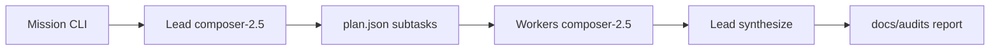

# Cursor Swarm (Agent Swarm–style, Composer 2.5)

This repo runs a **local replica** of [Agent Swarm](https://github.com/desplega-ai/agent-swarm) using the **Cursor Agent CLI** only — no Claude Code, no Docker stack from desplega-ai.

| Agent Swarm (upstream) | Vertiege Cursor Swarm |
|------------------------|------------------------|
| Lead + workers in Docker | Lead + workers via `agent` subprocess |
| Claude / Codex / opencode harness | **Cursor CLI only** |
| Model per provider | **`composer-2.5` only** (hard-coded) |
| Presets: dev, research, solo | Same preset names in `scripts/swarm/presets.json` |
| `POST /api/tasks` | `scripts/swarm/swarm.sh run "…"` |
| Dashboard at app.agent-swarm.dev | Artifacts under `.swarm/runs/<id>/` |

## Prerequisites

- [Cursor Agent CLI](https://cursor.com/docs/cli) on `PATH` (`agent --version`)
- Node.js 18+
- Logged-in Cursor session (or `CURSOR_API_KEY` for automation)

## Quick start — codebase audit

```bash
cd ~/Vertiege
./scripts/swarm/swarm.sh audit
# or
./scripts/audit-codebase.sh
```

Report: `docs/audits/YYYY-MM-DD-cursor-swarm-audit.md`  
Run state: `.swarm/runs/<timestamp>/` (`plan.json`, worker logs, `report.md`)

## Quick start — UI/UX audit (Forui, light/dark, theming)

```bash
./scripts/audit-ui-ux.sh
# equivalent: ./scripts/swarm/swarm.sh audit-ui
```

Report: `docs/audits/YYYY-MM-DD-cursor-swarm-ui-ux-audit.md`

Static baseline (2026-05-24): [2026-05-24-cursor-swarm-ui-ux-audit.md](audits/2026-05-24-cursor-swarm-ui-ux-audit.md)

## Presets (mirrors upstream)

| Preset | Agents | Use case |
|--------|--------|----------|
| `research` | lead → researcher → reviewer | Audits, analysis (default for `audit`) |
| `dev` | lead → 2× coder | Implementation tasks |
| `solo` | 1× coder | Simple single-agent jobs |

```bash
# Custom mission
./scripts/swarm/swarm.sh run --preset research "Review RLS for world_audit_log"

# Read-only (default)
./scripts/swarm/swarm.sh run --preset dev --mode ask "Map router redirects for world routes"

# Allow edits (coders may change files)
./scripts/swarm/swarm.sh run --preset dev --mode plan "Fix channel deep link routes"
```

## Flow



1. **Lead** decomposes the mission into JSON subtasks (`dependsOn` respected).
2. **Workers** run in order (researcher, then reviewer, etc.).
3. **Lead** merges outputs into one markdown report.

## Model policy

Only `composer-2.5` is used. `AUDIT_MODEL` and other model env vars are ignored with a warning.

## Not replicated (upstream-only)

- Slack / GitHub / email ingress
- Vector memory DB and hosted dashboard
- Docker-isolated worker containers
- MCP HTTP API on port 3013

For full multi-channel orchestration you still need upstream Agent Swarm with a supported harness (not Cursor CLI today).

## Files

- `scripts/swarm/swarm.mjs` — orchestrator
- `scripts/swarm/presets.json` — preset definitions
- `scripts/swarm/agents/*.md` — role prompts (from official templates, simplified)
- `scripts/audit-codebase.sh` — thin wrapper → `swarm.sh audit`
