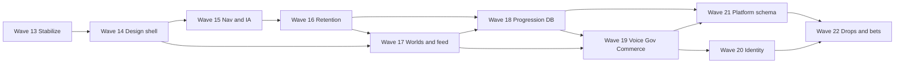

# Waves 13–22 — Master plan (124 items)

**Created:** 2026-05-30  
**Status:** Wave 20 code shipped (2026-05-30); Wave 6 UAT deferred.  
**Baseline:** Waves 0–12 code largely shipped on `develop`; Wave 6 device UAT and live store receipts remain open.  
**Cross-refs:** [wave-status.md](wave-status.md), [roadmap.md](../roadmap.md), [quiet-ux-principles.md](../../guides/quiet-ux-principles.md), [navigation-map.md](../../guides/navigation-map.md), [store-receipt-hardening.md](../../operations/store-receipt-hardening.md).

---

## Executive summary

This plan sequences **all 124** research backlog items into **10 waves (13–22)** so each wave:

1. Ships behind **automated checks** (`flutter test`, `flutter analyze`, CI verify + APK).
2. Prefers **client-only or additive migrations** before **drops and consolidations**.
3. Runs **device smoke** only at wave boundaries (not after every PR).
4. Uses **feature flags / Remote Config** for risky behavior until Wave 22 cleanup.

**Do not** run schema-heavy waves (18, 21) on production without a **staging project** (item 88) or a repair plan.

---

## Global rules (every wave)

| Rule | Why |
|------|-----|
| One wave = one or more PRs to `develop`; merge only when CI green | Avoid stacking broken migrations |
| Migrations: `supabase db diff` locally → `db push` staging → smoke RPCs → then prod | RLS mistakes are hard to roll back |
| **No drops** until Wave 22 unless grep proves zero imports | Prevents analyzer surprises mid-wave |
| **Quiet UX:** no new duplicate nav; one CTA per empty state | [quiet-ux-principles.md](../../guides/quiet-ux-principles.md) |
| **Pay-to-win:** never re-enable wealth tier SKUs without product sign-off | [roadmap.md](../roadmap.md) locked decision |
| After each wave: update [wave-status.md](wave-status.md) + tick items in this doc | Single source of truth |

### Gate checklist (must pass before starting next wave)

- [ ] `flutter test` — all green  
- [ ] `flutter analyze` — no errors  
- [ ] GitHub Actions: `verify`, `build-apk` green; `verify-ios` green on macOS runner  
- [ ] If wave touched SQL: `supabase db lint` (or advisor review) + RPC smoke script where applicable  
- [ ] If wave touched nav/deep links: run `test/router/` + manual cold-start for listed routes  
- [ ] If wave touched purchases: **no prod flag flip** until stub/live verify tested on TestFlight/internal track  

---

## Dependency flow (high level)

**Parallel allowed (same wave only):** UI tokens (14) + doc-only (13); analytics events (13) independent of Forui migration (14).

**Never parallel:** two migrations altering the same table; drop `offline_queue` (22) while outbox still dual-writes (21 must finish first).

---

## Research confirmations (better implementation)

| Topic | Research / practice | Vertiege decision |
|-------|---------------------|-------------------|
| Leaderboards | Duolingo cohorts, opt-out, anti-cheat ([blog](https://blog.duolingo.com/duolingo-leagues-leaderboards/)) | Wave 18: cohort cron + velocity cap; Wave 16: calm percentile copy |
| Streaks | Commitment loops, not grind ([blog](https://blog.duolingo.com/how-streaks-keep-duolingo-learners-committed-to-their-language-goals/)) | Wave 16: TZ-aware server + shield UX; no punitive popups |
| Gamification ethics | SDT: autonomy, competence, relatedness ([Springer](https://link.springer.com/article/10.1007/s11528-024-00968-9)) | Wave 16/22: low-pressure mode; drop nag patterns |
| Receipt verify | Apple App Store Server API v2; Play Developer API | Wave 19: live verify behind flag; keep stub for dev |
| Scheduled posts | Server-side publish at `scheduled_for`; client queue unreliable | Wave 21: table + cron/edge; do not publish from client only |
| Forui migration | Migrate screen-by-screen; keep auth Material if needed | Wave 14: world detail, chat, thread, campfire last in 14 |
| Postgres | Index columns used in RLS filters ([Supabase advisors](https://supabase.com/docs/guides/database/database-linter)) | Wave 21 dedicated migration |
| Accessibility | 48dp targets, dynamic type, contrast | Wave 14 batch, not scattered |
| Inline polls | Roadmap: capability-gated composer; feed may link out | Wave 17: link to polls screen first; inline only if RPC extended |

---

## Wave 13 — Stabilize & observe

**Theme:** Prove baseline; security and routing tests; no schema drops.  
**Risk:** Low | **Duration estimate:** 3–5 days

### Items (# from research backlog)

| # | Item | Implementation notes |
|---|------|----------------------|
| 111 | Wave 6 sign-off checklist | Run [wave-6-signoff-checklist.md](../../operations/uat/wave-6-signoff-checklist.md) on API 30 device; log in [issue-log.md](../../operations/uat/issue-log.md) |
| 114 | CI green on `develop` | Confirm Xcode 26.1+ for iOS; fix any drift |
| 22 | Deep link inventory | New doc `docs/operations/deep-link-matrix.md`: invite, post, notification, thread, campfire, resident |
| 25 | Notification routing tests | Extend `test/router/notification_navigation_test.dart` for all production types |
| 87 | RLS audit | `supabase db lint` + fix missing policies in **additive** migration `20260613130000_rls_audit_fixes.sql` |
| 104 | Service role audit | CI grep: no `service_role` in `lib/` |
| 105 | Integration test plan | Document `docs/operations/local-supabase-integration.md`; optional Docker job later (Wave 21) |
| 101 | Rate limit `verify_subscription_purchase` | Edge function: per-user throttle (in-memory + DB optional) |
| 102 | LiveKit token rate + room cap | Migration or edge: max tokens/hour per user |
| 103 | Webhook secret rotation doc | Extend [store-receipt-hardening.md](../../operations/store-receipt-hardening.md) |
| 112 | Funnel analytics events | `invite_completed`, `subscription_verified`, `voice_joined` in `analytics_events.dart` |
| 113 | Crashlytics breadcrumbs | worldId/channelId on voice errors |
| 115 | In-app What’s new | Remote Config key + one-shot dialog |
| 116 | Beta feedback deep link | Settings row → form URL |
| 7 | Error state standardization | Audit top 10 screens → `AppErrorState` + `userFacingLoadError` |
| 19 | Tab label Discover → Worlds | **Label only**; keep route `/explore` |

### Deliverables

- Deep link matrix doc + expanded router tests  
- RLS fix migration (staging first)  
- Edge rate limits (no behavior change for legit users)  

### Gate to Wave 14

Wave 6 UAT started (not necessarily 100% signed); CI green; no open P0 from UAT.

---

## Wave 14 — Design system & shell

**Theme:** Forui shells, tokens, accessibility baseline — **no** business logic rewrites.  
**Risk:** Medium (UI regressions) | **Estimate:** 5–8 days

| # | Item | Implementation notes |
|---|------|----------------------|
| 1 | `VHubPage` / `FScaffold` migration | Order: world detail tabs → chat room → thread → campfire; one PR per screen group |
| 2 | `v_context_colors` → theme tokens | Grep-driven pass on feed, world, identity |
| 3 | World detail scroll contract | Document in `docs/guides/world-detail-scroll.md`; fix nested scroll if UAT regresses |
| 4 | Functional haptics | `HapticFeedback.lightImpact` on claim, verify, council approve, voice connect |
| 5 | Skeleton / shimmer first paint | Standardize on `ScreenLoading`; remove duplicate spinners |
| 6 | Empty states one CTA | challenges, polls, league, governance queue |
| 8 | Touch targets 48dp | world rows, council, poll options |
| 9 | Dynamic type pass | Identity tier bar, honour chips |
| 10 | High-contrast preview | `VThemeSchemePicker` optional scheme |
| 11 | Reduce decorative glass | Lists → flat `VSurfaceCard` |
| 12 | Nexus bento “last visited” order | Local persistence `StorageService` |
| 14 | Feed deep-link highlight | Subtle border animation (no flash) |
| 18 | Pull-to-refresh semantics | Only parent scroll view refreshes |
| 21 | World “You are here” subtitle | tier, joined, prestige on world detail header |

### Research confirmation

- Migrate **one screen group per PR** with screenshot diff in PR description; avoids “big bang” Forui breakages.  
- Keep auth/splash on Material until Wave 22 if still stable.

### Gate to Wave 15

Device smoke: world tabs (Channels/Members), chat open, no grey void; `flutter test` green.

---

## Wave 15 — Navigation & information architecture

**Theme:** Quiet UX routing; docs; **no** schema.  
**Risk:** Low–medium | **Estimate:** 4–6 days

| # | Item | Implementation notes |
|---|------|----------------------|
| 20 | More → Help & legal | Move legal/support links from settings overflow |
| 23 | Back stack world → Nexus | GoRouter pop tests; fix wrong tab index |
| 24 | Search unified entry | Single behavior from Nexus + Identity headers → `ResidentSearchService` |
| 26 | Drop duplicate progression entry | League: Nexus shortcut + Identity stat only |
| 13 | World manage section anchors | Quiet jump chips: Economy / Social / Governance |
| 15 | Campfire full-screen minimal mode | Optional flag `campfire_immersive` (RC default off) |
| 17 | Shop segmented categories | Forui `FTabs` for cosmetics; single “coming soon” for boosts |
| 95 | Archive stale plan docs | Move `docs/plan` stubs → `docs/archive/` with redirect note in README |
| 97 | Reduce RC surface | Audit `feature_flags.dart`; default stable features `true` |
| 98 | Simplify dominion types in create-world | UI labels only; DB enum unchanged |
| 91 | Orphan academy/sanctuary screens | **Route** to archive/sanctuary paths or delete files after grep |

### Gate to Wave 16

[navigation-map.md](../../guides/navigation-map.md) updated; router tests for `/following`, `/allies`, world manage; no duplicate achievement links.

---

## Wave 16 — Onboarding & retention

**Theme:** Server-backed streaks and invites; calm competition copy.  
**Risk:** Medium (auth path) | **Estimate:** 5–7 days

| # | Item | Implementation notes |
|---|------|----------------------|
| 27 | Gate → first world auto-join | After The Gate, `routeAfterAuth` → joined world feed if member |
| 28 | First Steps persistence | Table `onboarding_funnel` or `profiles.onboarding_step` JSONB |
| 29 | Streak timezone-aware | RPC uses `profiles.timezone` or client-sent date key |
| 30 | Streak shield UX | Surface shields in daily quests + toast on consume |
| 31 | Re-engagement push A/B | Firebase Remote Config templates |
| 32 | Invite funnel analytics | Wire events from Wave 13 |
| 33 | Low-pressure: hide league shortcuts | When `leaderboard_opt_out`, hide bento league + season rank emphasis |
| 117 | Calm ranking UI | “Top 25% in cohort” vs raw rank |
| 118 | Social proof without dark patterns | “N residents active” not shame copy |
| 56 | Display title on posts | UI only — column exists (`display_title`) |
| 57 | Progression help sheets | Contextual sheets per gate (Lounge, treasury, polls) |

### Migration (additive)

`20260616120000_onboarding_streak_tz.sql` — `profiles.timezone`, `onboarding_funnel` or step column, streak RPC TZ fix.

### Gate to Wave 17

Invite flow: signed-out → auth → auto-join (existing) + land on world feed; streak test across midnight boundary in one TZ.

---

## Wave 17 — Worlds, feed & social

**Theme:** World UX depth; notifications for jobs; feed polish.  
**Risk:** Medium | **Estimate:** 6–9 days

| # | Item | Implementation notes |
|---|------|----------------------|
| 34 | Polls path from composer | Link “Poll” capability → `/explore/:id/polls` create; **defer** inline feed poll until RPC ready |
| 35 | Thread replies Forui | Thread screen shell + errors |
| 36 | Reaction sheet tab-aware | Grep remaining `showModalBottomSheet` → `showTabAwareModalBottomSheet` |
| 37 | World dossier collapse | Progressive disclosure news + channels |
| 38 | Member list search | Local filter `TextField` on members tab |
| 39 | Marketplace rep-gated browse | `QuietGateTile` with rep reason |
| 40 | Job application status push | `send-push` on accept/reject; notification row type |
| 41 | Archive world read-only banner | Manage-only entry; banner on world home |
| 42 | Constitution preview | Read-only sheet before join (public constitution fetch) |
| 43 | Feed “new posts” pill | Poll on focus or realtime channel; tap scroll top |
| 123 | Cross-world DM from profile | Resident profile → message CTA |
| 119 | Adaptive Nexus (RC) | Order bento cards by segment key |

### Migration (additive)

`20260617120000_job_application_notifications.sql` — notification type + trigger or RPC hook.

### Gate to Wave 18

World feed + manage smoke; job notification received on test device; poll create still via world polls screen.

---

## Wave 18 — Progression, seasons & fairness

**Theme:** Cohort ops, anti-cheat, team challenges — **schema before UI emphasis**.  
**Risk:** High | **Estimate:** 7–10 days

| # | Item | Implementation notes |
|---|------|----------------------|
| 49 | Season cohort weekly reset | `pg_cron` job: archive scores, new `season_cohorts` row |
| 50 | Fair matchmaking RPC | `ensure_season_cohort_membership` band by tier + activity |
| 51 | League vs season copy | Challenges screen + season screen headers |
| 52 | Team/world collective challenges | UI progress bar; seed already partial |
| 53 | Daily quests ↔ streak nudge | One line on streak widget when quest incomplete |
| 54 | XP velocity cap | Extend `award_activity_xp` guard migration |
| 55 | Hall of Ascension seasonal narrative | Copy + link to season archive |
| 80 | `featured_achievements` | `profiles.featured_achievement_ids uuid[]` max 3 |
| 82 | `season_cohort_scores` MV | Refresh on cron |
| 85 | `world_members.last_active_at` | Update on channel open / post |
| 81 | `coin_ledger` (start) | Append-only `coin_transactions` + read RPC |

### Migration

`20260618120000_progression_fairness.sql` — cron, MV, velocity cap, last_active, featured ids, coin ledger.

### Research confirmation

- Run cohort reset on **staging** with 3 test users before prod.  
- Anti-cheat: log-only mode first week (`xp_velocity_flagged`), then soft cap.

### Gate to Wave 19

Cron tested on staging; league/season screens show correct cohort; no XP award regressions in tests.

---

## Wave 19 — Voice, governance & commerce

**Theme:** Production-hardening voice and money paths.  
**Risk:** High | **Estimate:** 8–12 days

| # | Item | Implementation notes |
|---|------|----------------------|
| 44 | LiveKit reconnect backoff | Exponential retry + mini-bar “Reconnecting…” |
| 45 | Mic permission preflight | Rationale sheet before join |
| 46 | Voice channel occupancy | Presence or heartbeat count on channel list |
| 47 | Deafen vs mute clarity | Icons + one-line help |
| 48 | Background audio | Android FGS + iOS `AVAudioSession` category |
| 65 | Live Apple/Google receipt verify | Implement in edge function per [store-receipt-hardening.md](../../operations/store-receipt-hardening.md) |
| 66 | Enable edge verify staging | `receipt_edge_verify` RC true on staging only |
| 67 | Coin packs IAP | Consumable SKUs + server grant RPC |
| 68 | Cosmetic try-before-buy | Preview on avatar in shop |
| 69 | Subscription benefits screen | Tier comparison table |
| 70 | Restore “already owned” copy | Map RPC errors in `subscription_service.dart` |
| 73 | Audit log filters | Chips: treasury / rank / job / poll |
| 74 | Proposal notifications | Notify requester on approve/reject |
| 75 | Treasury proposed vs executed | Audit subtype or child table |
| 76 | Poll moderation RPC | Council close/delete + audit |
| 77 | Rank name in queue | Join `world_ranks` in governance list |
| 78 | Export audit CSV | Council-only; share sheet |

### Do **not** in same PR

Live receipt verify + deleting stub code — keep stub path for dev.

### Gate to Wave 20

Voice 10-min session without crash; restore purchases on TestFlight/internal track; governance filter smoke.

---

## Wave 20 — Identity & achievements

**Theme:** Public profile, verifier ops, achievement UX.  
**Risk:** Medium | **Estimate:** 6–8 days

| # | Item | Implementation notes |
|---|------|----------------------|
| 58 | Public profile share URL | `vertiege://residents/:id` + router; web fallback later |
| 59 | Featured achievements editor | Uses Wave 18 column; pick 3 in profile edit |
| 60 | Proof upload compression | `flutter_image_compress` before storage upload |
| 61 | Verifier SLA dashboard | Queue depth + median time (verifier role) |
| 62 | Badge PNG CI gate | Fail `validate_assets.sh` in CI if core set missing |
| 63 | Trophy case → bottom sheet | Tap opens sheet not full route |
| 64 | Allies vs following clarity | Section headers + copy |
| 16 | Verifier portal density mode | Compact list + batch actions (careful with audit) |
| 120 | Voice + text “Lounge” entry | Single manage row → text + Campfire when unlocked |
| 121 | Achievement stories | Optional moderated text on verified achievements |
| 122 | World charter templates | Pick template at create-world |
| 124 | Season narrative live ops | Read `global_seasons.narrative` on Nexus banner |

### Gate to Wave 21

Profile share cold start works; featured achievements persist; verifier metrics load <2s.

---

## Wave 21 — Platform schema, performance & offline

**Theme:** Big migrations on **staging**; scheduled posts; indexes; offline honesty.  
**Risk:** Highest | **Estimate:** 10–14 days

| # | Item | Implementation notes |
|---|------|----------------------|
| 88 | Staging Supabase project | Clone policies; document env switching |
| 79 | `scheduled_posts` + worker | Table + edge/cron publish; align with `create_post` RPC |
| 83 | `notification_preferences` | Per-type mute; settings UI |
| 84 | Index pass from Performance Advisor | Migration from advisor output |
| 86 | FTS on posts (optional) | Per-world post search; scope L if costly |
| 89 | Migration history doc | Note `20260604142207` vs `20260604143000` if both applied |
| 90 | `user_sessions` analytics (optional) | Privacy-safe aggregates only |
| 99 | HIBP doc | [manual-remaining.md](manual-remaining.md) — Pro gate |
| 100 | App Check | Firebase App Check on edge + sensitive RPCs |
| 105 | Integration tests local Supabase | CI job optional; min: smoke script |
| 106 | Image cache policy | `cached_network_image` max size |
| 107 | Feed keyset pagination | RPC `list_posts_cursor` |
| 108 | Realtime subscribe per active world | Unsubscribe on blur |
| 109 | Mutation outbox sync indicator | Quiet banner when queue non-empty |
| 110 | APK deferred achievement assets | On-demand or category packs |

### Migration batch

`20260621120000_platform_scheduled_prefs_indexes.sql` — split into 2–3 files if review is easier.

### Gate to Wave 22

Staging soak 48h; scheduled post publishes in test channel; feed pagination tested on world with 500+ posts.

---

## Wave 22 — Consolidation, drops & product bets

**Theme:** Remove debt; merge navigations; final regression.  
**Risk:** Medium (deletions) | **Estimate:** 6–10 days

| # | Item | Implementation notes |
|---|------|----------------------|
| 92 | Drop `PostComposer` / `CreatePostScreen` | Grep zero imports → delete |
| 93 | Drop `offline_queue.dart` | All paths → `mutation_outbox_service` only |
| 94 | Drop Boosts/Passes shop UI | Remove sections, not disabled buttons |
| 96 | Consolidate progress hub | Single `/progress` with tabs: Quests / World / Season / League |
| 71 | Drop wealth tier SKUs | Remove from `StoreService` |
| 72 | Coin history UI | Uses Wave 18 ledger |
| 34b | Inline polls (optional) | Only if RPC `create_post` supports poll payload |
| 10 | High-contrast theme ship | If preview validated in 14 |
| 15 | Campfire immersive default | Flip RC if stable |
| 119b | Adaptive Nexus default on | After 17 validation |
| 117b | Calm ranking default | Remove raw rank where opted in |
| 123b | Polish DM entry | From 17 |

### Final regression

- [ ] Wave 12 re-smoke: badges + world tabs ([roadmap.md](../roadmap.md))  
- [ ] `./scripts/release_smoke_api30.sh`  
- [ ] Wave 6 sign-off complete  
- [ ] README version = `pubspec.yaml`  

### Gate to release candidate

All 124 items ticked in checklist below; `main` promotion policy per team.

---

## Full item checklist (124)

Use this table to mark completion. **Wave** = primary owner wave.

| # | Wave | Done |
|---|------|------|
| 1 | 14 | ☐ |
| 2 | 14 | ☐ |
| 3 | 14 | ☐ |
| 4 | 14 | ☐ |
| 5 | 14 | ☐ |
| 6 | 14 | ☐ |
| 7 | 13 | ☐ |
| 8 | 14 | ☐ |
| 9 | 14 | ☐ |
| 10 | 14/22 | ☐ |
| 11 | 14 | ☐ |
| 12 | 14 | ☐ |
| 13 | 15 | ☐ |
| 14 | 14 | ☐ |
| 15 | 15/22 | ☐ |
| 16 | 20 | ☐ |
| 17 | 15 | ☐ |
| 18 | 14 | ☐ |
| 19 | 13 | ☐ |
| 20 | 15 | ☐ |
| 21 | 14 | ☐ |
| 22 | 13 | ☐ |
| 23 | 15 | ☐ |
| 24 | 15 | ☐ |
| 25 | 13 | ☐ |
| 26 | 15 | ☐ |
| 27 | 16 | ☐ |
| 28 | 16 | ☐ |
| 29 | 16 | ☐ |
| 30 | 16 | ☐ |
| 31 | 16 | ☐ |
| 32 | 16 | ☐ |
| 33 | 16 | ☐ |
| 34 | 17/22 | ☐ |
| 35 | 17 | ☐ |
| 36 | 17 | ☐ |
| 37 | 17 | ☐ |
| 38 | 17 | ☐ |
| 39 | 17 | ☐ |
| 40 | 17 | ☐ |
| 41 | 17 | ☐ |
| 42 | 17 | ☐ |
| 43 | 17 | ☐ |
| 44 | 19 | ☐ |
| 45 | 19 | ☐ |
| 46 | 19 | ☐ |
| 47 | 19 | ☐ |
| 48 | 19 | ☐ |
| 49 | 18 | ☐ |
| 50 | 18 | ☐ |
| 51 | 18 | ☐ |
| 52 | 18 | ☐ |
| 53 | 18 | ☐ |
| 54 | 18 | ☐ |
| 55 | 18 | ☐ |
| 56 | 16 | ☐ |
| 57 | 16 | ☐ |
| 58 | 20 | ☐ |
| 59 | 20 | ☐ |
| 60 | 20 | ☐ |
| 61 | 20 | ☐ |
| 62 | 20 | ☐ |
| 63 | 20 | ☐ |
| 64 | 20 | ☐ |
| 65 | 19 | ☐ |
| 66 | 19 | ☐ |
| 67 | 19 | ☐ |
| 68 | 19 | ☐ |
| 69 | 19 | ☐ |
| 70 | 19 | ☐ |
| 71 | 22 | ☐ |
| 72 | 22 | ☐ |
| 73 | 19 | ☐ |
| 74 | 19 | ☐ |
| 75 | 19 | ☐ |
| 76 | 19 | ☐ |
| 77 | 19 | ☐ |
| 78 | 19 | ☐ |
| 79 | 21 | ☐ |
| 80 | 18 | ☐ |
| 81 | 18 | ☐ |
| 82 | 18 | ☐ |
| 83 | 21 | ☐ |
| 84 | 21 | ☐ |
| 85 | 18 | ☐ |
| 86 | 21 | ☐ |
| 87 | 13 | ☐ |
| 88 | 21 | ☐ |
| 89 | 21 | ☐ |
| 90 | 21 | ☐ |
| 91 | 15 | ☐ |
| 92 | 22 | ☐ |
| 93 | 22 | ☐ |
| 94 | 22 | ☐ |
| 95 | 15 | ☐ |
| 96 | 22 | ☐ |
| 97 | 15 | ☐ |
| 98 | 15 | ☐ |
| 99 | 21 | ☐ |
| 100 | 21 | ☐ |
| 101 | 13 | ☐ |
| 102 | 13 | ☐ |
| 103 | 13 | ☐ |
| 104 | 13 | ☐ |
| 105 | 13/21 | ☐ |
| 106 | 21 | ☐ |
| 107 | 21 | ☐ |
| 108 | 21 | ☐ |
| 109 | 21 | ☐ |
| 110 | 21 | ☐ |
| 111 | 13 | ☐ deferred |
| 112 | 13 | ☐ |
| 113 | 13 | ☐ |
| 114 | 13 | ☐ |
| 115 | 13 | ☐ |
| 116 | 13 | ☐ |
| 117 | 16/22 | ☐ |
| 118 | 16 | ☐ |
| 119 | 17/22 | ☐ |
| 120 | 20 | ☐ |
| 121 | 20 | ☐ |
| 122 | 20 | ☐ |
| 123 | 17/22 | ☐ |
| 124 | 20 | ☐ |

---

## PR strategy (avoid breaking `develop`)

| Pattern | Example |
|---------|---------|
| **Feature flag default off** | Immersive Campfire, live receipt verify, adaptive Nexus |
| **Additive SQL only** | Waves 13–21; no `DROP COLUMN` until 22 |
| **Behind RPC version** | New `list_posts_cursor` while keeping old list for one release |
| **Dual-write period** | `last_active_at`: client update + server trigger; remove client later |
| **One screen per PR** | Forui migration in Wave 14 |
| **Rollback** | Revert PR; for migrations use `repair` + forward fix, not `db reset` on prod |

---

## Estimated timeline

| Waves | Calendar (1 dev, focused) |
|-------|---------------------------|
| 13–15 | ~3 weeks |
| 16–18 | ~4 weeks |
| 19–21 | ~5 weeks |
| 22 + RC | ~2 weeks |
| **Total** | **~14 weeks** (parallel QA/UAT overlaps) |

Add 2–3 weeks if staging project and live receipts wait on store credentials.

---

## What stays manual

See [manual-remaining.md](manual-remaining.md): Wave 6 device UAT, Firebase re-register if package changes, HIBP on Pro, store console setup for IAP.

---

## Changelog

| Date | Change |
|------|--------|
| 2026-05-30 | Initial master plan for items 1–124 → Waves 13–22 |
| 2026-05-30 | Wave 13 implemented in repo (UAT #111 deferred) |
